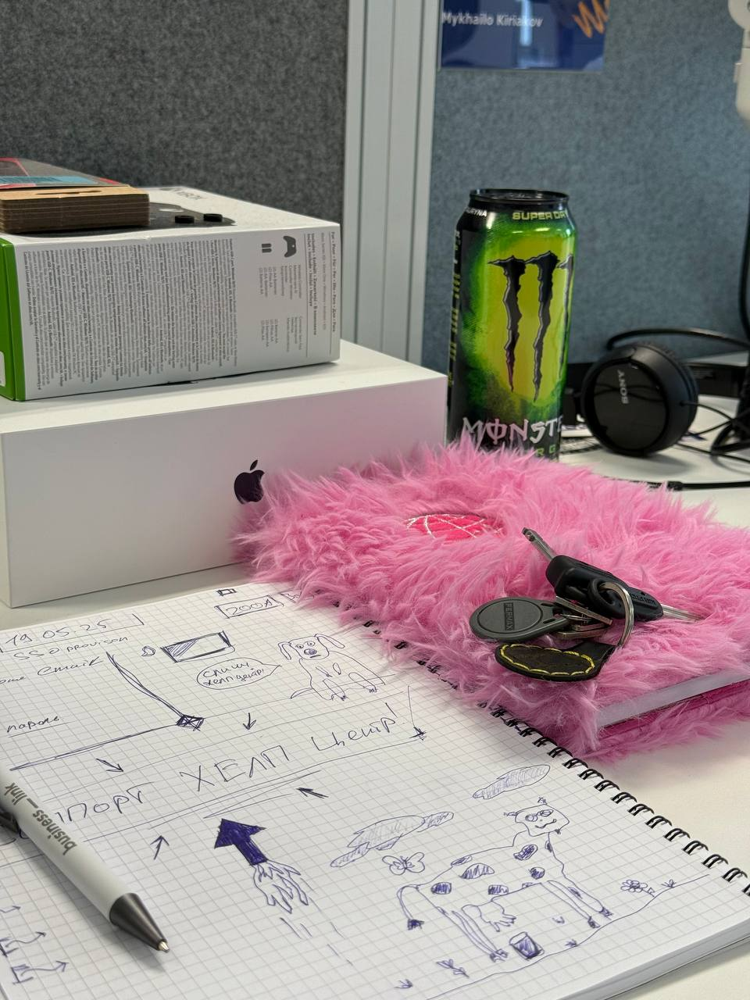
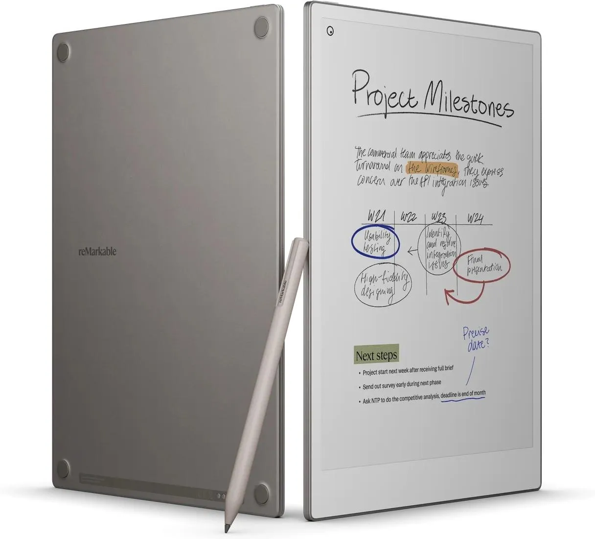
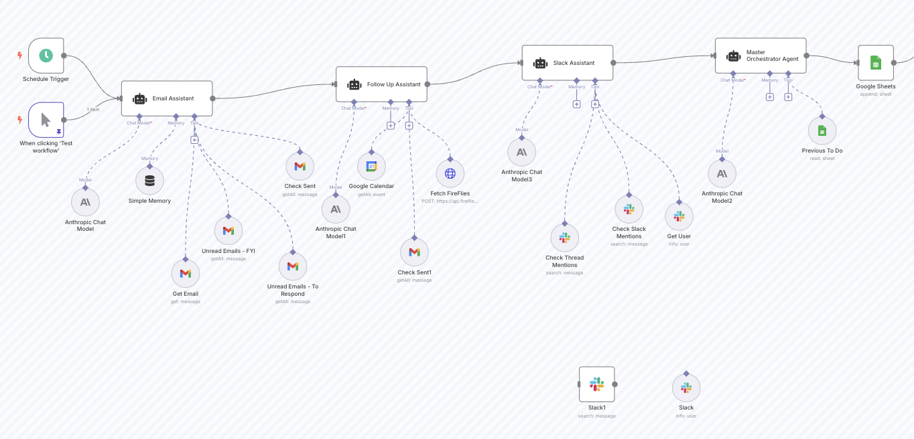

Зараз я працюю в умовах постійної зміни контексту. Мені постійно треба бути на різних зустрічах з різними людьми, та часто зустрічі не мають ні хвилини перерви та відбуваються просто стик в стик. Тому без нотатків можна загубитися в екшенах чи думках. Переважно я веду нотатки старим надійним методом - у звичайному блокноті. Але який процес далі? він різний і хаотичний, про щось я забуваю і ніколи не повертаюсь, але переважно повертаюсь і намагаюсь розібратись.
І часто без контексту важко пригадати що за запис в блокноті та про що він. Типу "Розібратись з A\B тестом". Добре якщо я маю дату цього запису, то я можу хоча б провести паралель і відновити ширший контекст. Але все це виглядає не дуже ефективно. 

<!--truncate-->

Мені подобається e-ink notetaker-и, типу reMarkable чи Supernote. Але вони не мають гарних інтеграцій з зовнішнім світом. Тобто це буквально девайси щоб писати рукою в цифровому вигляді **ЗРУЧНО**! Хочу підкреслити, саме ЗРУЧНО. Бо на умовному айпаді писати НЕ зручно(хіба що малювати +-).

Так от. Що ми маємо? Умовний reMarkable з записами від руки, мій Google Workspace в котрому календар, Google Meets(котрий теж записує за допомогою Gemini meetings notes), slack, gmail. І купу різних LLM і AI тулзів. Чому б не мати такий пристрій котрий все це об'єднає в один воркфлоу? Я ж написав ноутси, gemini написав ноутси, ми знаємо коли я це написав і під час якої події. Можна розібрати все це на екшени, якісь навіть виконати, про якісь створити нагадування.
От ти приходиш на роботу, а на столі в тебе вже білий лист reMarkable з датою. Ти туди все пишеш і воно все синхронізується з тим що відбувається з автором. Персональні нотатки до персонального акаунту, робочі - в робочий. Теоретично все це можна зробити через n8n автоматизацію, бо reMarkable має можливість робити бекапи в гуглдрайв. А завдяки всій цій синхронізації можна піти далі - Тебе зустрічає не пустий лист електронного нотатника, а вже відкритий, заповнений і пріоритетизований список справ на день. 
А може взагалі ти прокидаєшся по будильнику котрий був розрахований на основі показників здоров'я і данних про сон, данних про пробки на дорогах, справах на ранок. Приємний голос AI асистента вітає тебе, розповідає про погоду і адженду дня, рекомендує вдягнути футболку, бо сьогодні буде спекотно. І це ж не рокет сайнс, всі данні і технології вже є, просто їх треба зібрати в один воркфлоу. 

