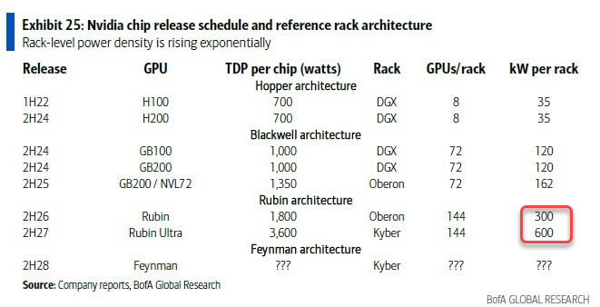

––
slug: ai-shit
title: ШІ-бульбашка на стероїдах
authors: ut3usw
tags: [ai, openai, personal]
comments: true
––

# Чому наступна криза народиться не на Уолл-стріт, а в дата-центрах

Авантюра на $3 трильйони
-------------------------------

Революція штучного інтелекту –– це не просто технологічний зсув. Це найбільша і, мабуть, найшаленіша інвестиційна лихоманка за всю історію. До 2030 року людство планує вбухати в інфраструктуру ШІ близько $3–4 трильйони. Тільки у США капітальні витрати на обчислення вже дали понад 1.1% зростання ВВП у першій половині 2025-го, випередивши навіть споживчі витрати.  

Поки ринок зосереджений на експоненціальному зростанні обчислювальних потужностей і можливостей, він ігнорує фатальну ваду: вся ця екосистема є дивом фінансової інженерії, побудованим на кругових залежностях, нестійкій економіці та неминучому зіткненні з жорсткими фізичними обмеженнями нашої глобальної енергетичної мережі. Бум ШІ –– це не просто спекулятивна бульбашка, що нагадує 2000 рік, а системно крихка структура з відлунням кризи 2008 року, де найбільший ризик полягає не у відсутності інновацій, а у відсутності електроенергії.

Позолочена екосистема: Анатомія кругової поруки
-----------------------------------------------

### Мережа взаємного страхування

Щоб зрозуміти крихкість нинішнього буму, необхідно проаналізувати його фінансову архітектуру. Це не традиційний ланцюг постачання, а складна мережа взаємних зобов'язань, де успіх кожного учасника залежить від безперервного потоку капіталу в системі. Візуальним якорем для цього аналізу слугує схема капітальних потоків від Morgan Stanley, що розкриває складні взаємозв'язки.

У гравітаційному центрі цього нового промислового комплексу знаходиться OpenAI. Попри своє некомерційне походження та величезні збитки, компанія стала сонцем, навколо якого обертаються інші планети. Найбільшим сателітом є Microsoft, чиї відносини з OpenAI є симбіотичними. Інвестиції Microsoft у розмірі $13 мільярдів значною мірою переробляються назад у Microsoft як оплата за обчислювальні послуги Azure. Це створює замкнений цикл, де інвестиційні долари негайно з'являються як дохід, штучно роздуваючи історію зростання хмарного підрозділу Microsoft і виправдовуючи початкові інвестиції.

Для диверсифікації обчислювальних потужностей та створення важелів впливу OpenAI підписала гігантські довгострокові контракти з іншими інфраструктурними супутниками, такими як Oracle та CoreWeave. Йдеться про угоди на $300 мільярдів з Oracle та $22 мільярди з CoreWeave, які майже повністю залежать від майбутньої життєздатності OpenAI. Ці угоди подаються ринку як стабільний, довгостроковий дохід, але насправді є концентрованими ставками на єдину, високоризикову компанію. За даними Morgan Stanley, близько 66% майбутніх контрактних зобов'язань Oracle і 40% CoreWeave залежать від OpenAI.

Домінантність Nvidia, постачальника ключового обладнання, посилюється не лише через продаж чіпів, але й через участь у фінансуванні власних клієнтів. Наприклад, Nvidia володіє понад 5% акцій CoreWeave. Ця система «взаємно гарантованого процвітання» функціонує як фінансовий вічний двигун. Вона призначена для підтримки імпульсу та роздування оцінок через самопідсилювальні капітальні потоки, що маскують фундаментальну збитковість у її ядрі.

### RPO –– нові CDO

Ключовим фінансовим інструментом, що лежить в основі цієї структури, є зобов'язання щодо виконання, що залишилися (Remaining Performance Obligations, RPO). Це багатомільярдні зобов'язання, які юридично є "нескасовуваними", але в реальності легко переглядаються, коли настають проблеми.

Ринок розглядає ці RPO як гарантовані, безризикові потоки доходів, подібно до того, як перед кризою 2008 року розглядалися іпотечні свопи з рейтингом ААА. Непрозорість цих контрактів приховує екстремальну концентрацію ризику. Загальна вартість зобов'язань за купівлю та оренду інфраструктури операторами гіпермасштабованих дата-центрів досягла $330 мільярдів та $340 мільярдів відповідно, і всі ці витрати окупляться лише за умови постійного зростання попиту на ШІ.

Логіка цієї замкненої системи виглядає так:

1.  Microsoft інвестує в OpenAI.
2.  OpenAI використовує ці гроші для оплати послуг Microsoft Azure, збільшуючи дохід Azure і підтверджуючи правильність інвестицій Microsoft.
3.  Для диверсифікації OpenAI підписує масивні RPO з Oracle та CoreWeave.
4.  Oracle та CoreWeave використовують ці RPO як заставу для залучення мільярдних боргів на будівництво дата-центрів, наповнених графічними процесорами Nvidia.
5.  Nvidia, своєю чергою, інвестує в CoreWeave, фактично допомагаючи фінансувати купівлю власних чіпів.

Результатом є замкнений цикл, де попит, дохід та інвестиції генеруються та переробляються всередині невеликої групи компаній. Це створює *ілюзію* величезного, органічного ринку, але насправді це теплична квітка –– неймовірно яскрава, але винятково крихка і залежна від безперервного надходження зовнішнього капіталу для покриття величезних збитків.

Відлуння 2000 року: Вендорне фінансування та ілюзія попиту
-----------------------------------------------

### Повторення сценарію доткомів

Фінансовий сценарій буму ШІ не є новим, це вдосконалена версія стратегій бульбашки доткомів, що використовує більш складні інструменти та правила бухгалтерського обліку для досягнення тієї ж мети. Аналітики Morgan Stanley відкрито вказують на повернення "стратегій вендорного фінансування минулих епох", коли продавці допомагають фінансувати купівлю покупцем їхніх товарів. Інвестиції Nvidia у своїх клієнтів та фінансові схеми Microsoft є сучасними версіями практик, які використовували такі компанії, як Nortel та Lucent, що роздували доходи, позичаючи гроші клієнтам, які потім купували їхню продукцію.

### Бухгалтерія для оптимістів

Окрім прямого фінансування, існують і більш тонкі бухгалтерські практики, що нагадують "креативний облік" епохи доткомів. Найважливішим прикладом є подовження термінів амортизації графічних процесорів (GPU). Гіперскейлери, такі як Microsoft і Google, подвоїли термін корисного використання серверів у своїх балансах з приблизно 3 до 6 років.

Ця бухгалтерська зміна має величезний вплив: вона штучно знижує щорічні амортизаційні витрати, тим самим збільшуючи звітний прибуток та видиму рентабельність інвестованого капіталу (ROIC) від їхніх багатомільярдних програм капітальних витрат. Однак це суперечить реальності швидкого технологічного старіння та високого рівня відмов GPU при інтенсивних навантаженнях ШІ. Досвід інженерів Google показує, що GPU при завантаженні 60--70% витримують 1--2 роки, максимум 3 роки, а Meta під час тренування Llama 3 зафіксувала щорічний рівень відмов GPU у 9%.

| Метрика | Епоха доткомів (прибл. 2000) | Епоха буму ШІ (прибл. 2025) |
| --- | --- | --- |
| **Ключовий протагоніст** | Cisco / Nortel | Nvidia / Microsoft |
| **Концентрація клієнтів** | Висока (наприклад, 2 топ-клієнти Lucent = 23% доходу) | Екстремальна (наприклад, 4 топ-клієнти Nvidia = 46% доходу) |
| **Ключовий фін. інструмент** | Вендорне фінансування / "Порожній" дохід | RPO / Вендорне фінансування / Хмарні кредити |
| **Бухгалтерський трюк** | Агресивне визнання доходу | Подовжені терміни амортизації активів |
| **Основний наратив** | "Інтернет змінить усе" | "ШІ змінить усе" |
| **Системна вразливість** | Телекоми будують надлишкові потужності на основі фантомного попиту | Дата-центри будують надлишкові потужності на основі субсидованого попиту та одного клієнта |

Основна проблема полягає в тому, що капітальні витрати на ШІ величезні, а рентабельність інвестицій невизначена і віддалена в часі. Щоб виправдати ці витрати перед акціонерами, компанії повинні демонструвати високу короткострокову прибутковість. Подовженя терміну амортизації GPU вартістю $40,000 з 3 до 6 років вдвічі зменшує щорічні витрати у звіті про прибутки та збитки. Це потужний, негрошовий важіль для збільшення прибутку на акцію. Одночасно вендорне фінансування гарантує, що попит на ці GPU залишається високим, що підтверджує масштабне виробництво. Це створює петлю зворотного зв'язку: бухгалтерські зміни роблять інвестиції більш прибутковими, що виправдовує більші витрати, які, своєю чергою, полегшуються вендорним фінансуванням, що стимулює дохід виробника чіпів і підтверджує весь цикл. Це саме той тип проциклічного, наративного фінансування, який визначав пік доткомів.

Міраж прибутковості: Проблема OpenAI на $100 мільярдів
------------------------------------------------------

### Нерозв'язуване рівняння

У центрі цієї крихкої системи знаходиться OpenAI, і її фінансова модель є ключем до розуміння системного ризику. Хоча заголовки святкують прогнозоване "потроєння" доходу OpenAI до $12.7 мільярдів у 2025 році, ця цифра тьмяніє на тлі її структури витрат.

У 2024 році OpenAI витратила $9 мільярдів, щоб втратити $5 мільярдів. На 2025 рік, з прогнозованими витратами на обчислення лише у Microsoft у розмірі $13 мільярдів, плюс інші величезні угоди та операційні витрати, загальні видатки можуть перевищити $28 мільярдів. Це ставить компанію на шлях до приголомшливих збитків у **$14+ мільярдів** за 2025 рік.

Згідно зі звітом Bloomberg, OpenAI не очікує досягнення позитивного грошового потоку доти, доки не досягне **$125 мільярдів доходу** у 2029 році. Це не бізнес-план; це заклик до десятиліття майже ідеального виконання та безперервних, масивних капітальних вливань.

| Метрика | 2024 (Факт/Оцінка) | 2025 (Прогноз) | 2026 (Прогноз) |
| --- | --- | --- | --- |
| **Дохід** | $3.7 мільярда | $12.7 мільярда | $29.4 мільярда |
| **Витрати на обчислення (Microsoft)** | ~$5 мільярдів (загалом) | ~$13 мільярдів | >$20 мільярдів (оцінка) |
| **Загальні витрати (оцінка)** | ~$9 мільярдів | ~$28 мільярдів | >$40 мільярдів (оцінка) |
| **Чистий збиток (оцінка)** | ~-$5 мільярдів | ~-$15 мільярдів | ~-$10-15 мільярдів (оцінка) |
| **Горизонт прибутковості** | Н/Д | 2029 @ $125 млрд ARR  | 2029 @ $125 млрд ARR |

Бізнес-модель OpenAI більше схожа не на технологічну компанію, що масштабується, а на державний інфраструктурний проєкт, як-от програма "Аполлон". Вона є фундаментально нерентабельною на самостійній основі і функціонує як науково-дослідний підрозділ, що спалює капітал для Microsoft та ширшої екосистеми ШІ. Її виживання повністю залежить від її стратегічної важливості для її спонсорів, а не від власної фінансової життєздатності.

Звичайний бізнес, що масштабується, бачить, як його граничні витрати зменшуються зі зростанням. OpenAI, навпаки, бачить, як її граничні витрати *зростають* зі зростанням, оскільки кожен новий користувач і кожна потужніша модель вимагають більше найдорожчого ресурсу: часу обчислень на GPU. Компанія потрапила в пастку: щоб виправдати свою оцінку і продовжувати залучати капітал, вона повинна демонструвати експоненціальне зростання користувачів і доходів. Але саме це зростання прискорює спалювання готівки до астрономічних рівнів. Це означає, що OpenAI ніколи не зможе "вирости" до прибутковості в рамках поточної парадигми. Прибутковість може бути досягнута лише через фундаментальний, на порядок величини, прорив в алгоритмічній ефективності або обвал вартості енергії/обчислень –– жодне з яких не очікується найближчим часом.

Велика стіна фізики: Коли експоненційний ШІ зустрічає лінійну мережу
--------------------------------------------------------------------

### Кінцеве вузьке місце

Справжнім, непереборним обмеженням для буму ШІ є не капітал, не таланти і не регулювання, а енергія. Вся фінансова модель індустрії ШІ базується на тихому, невисловленому припущенні: що енергія є рясним, відносно дешевим і масштабованим товаром. Це припущення є фундаментально хибним.

Прогнози попиту вражають. Глобальний попит на електроенергію з боку дата-центрів має більш ніж подвоїтися до 2030 року, досягнувши приблизно 945 ТВт-год, що більше, ніж усе споживання Японії. У США дата-центри можуть споживати до 12% або навіть 21% усієї електроенергії до 2030 року. Це зростання майже повністю зумовлене ШІ, оскільки кожен 1 ГВт нових обчислювальних потужностей ШІ коштує $50 мільярдів для розгортання.

Цей експоненціальний ріст попиту контрастує з лінійною, повільною реальністю будівництва енергетичної інфраструктури. Проєкти з розширення мереж займають 5-15 років для отримання дозволів і будівництва. Терміни постачання критично важливих компонентів, таких як високовольтні трансформатори, подвоїлися або потроїлися до кількох років. Будівництво нових електростанцій (відновлюваних, газових чи атомних) –– це процес, що триває десятиліття.

Саме тут підтверджується ключова теза: "Коли бум ШІ почне тонути не в конкуренції, а у власних рахунках за електроенергію –– це і буде момент істини". Коли попит перевищить пропозицію в ключових регіонах (таких як Вірджинія, Техас, Аризона), ціни на електроенергію різко зростуть, а комунальні підприємства будуть змушені відмовляти або затримувати запити на підключення нових дата-центрів, зупиняючи фізичне розширення.

Енергія –– це єдиний ресурс, який неможливо створити за допомогою інженерії чи фінансування в короткі терміни. Це робить її остаточним арбітром майбутнього буму ШІ. Розрахунки рентабельності інвестицій у трильйони, вкладені в дата-центри, залежать від високих коефіцієнтів використання та передбачуваних операційних витрат. Найбільшою операційною витратою є електроенергія. Власний ріст індустрії ШІ створює безпрецедентний шок попиту на мережу, яка не була для цього розроблена. Базова економіка диктує, що коли попит зростає експоненціально, а пропозиція –– лінійно, ціна товару (електроенергії) має стрімко зростати. Таким чином, успіх галузі активно руйнує одну з ключових умов для власної прибутковості. Це фатальна, системна петля зворотного зв'язку. Фінансові моделі зламаються не тому, що ШІ не працює, а тому, що вартість його живлення стане непомірною, що знищить маржу і зробить неможливим повернення початкових капітальних вкладень.

Ефект доміно: Стрес-тест 2027 року та паралелі з 2008 роком
-----------------------------------------------------------

### Моделювання ланцюгового розриву

Система може почати руйнуватися, якщо OpenAI та Microsoft не зможуть продемонструвати стійку рентабельність інвестицій до критичного періоду 2026--2027 років. Ось правдоподібний сценарій:

1.  **Спусковий гачок:** Великий інвестор (наприклад, SoftBank) відмовляється від нового раунду фінансування OpenAI, або акціонери Microsoft повстають проти нескінченного потоку капітальних витрат без чіткої прибутковості. Зростання використання ChatGPT зупиняється.
2.  **Перше доміно (OpenAI/Microsoft):** Microsoft змушена списати свої інвестиції в OpenAI. Вона різко скорочує свої плани капітальних витрат на ШІ, що викликає шокову хвилю по всьому ланцюгу постачання.
3.  **Друге доміно (Інфраструктурні провайдери):** Оскільки OpenAI не може виконати свої зобов'язання щодо використання, величезні RPO з Oracle та CoreWeave опиняються під загрозою. Вони змушені йти на переговори або оголошувати дефолт. Ціни на їхні акції обвалюються, а їхня здатність обслуговувати борги, взяті на будівництво, ставиться під сумнів.
4.  **Третє доміно (Nvidia та кредитори):** Раптова зупинка будівництва дата-центрів спричиняє надлишок GPU. Замовлення скасовуються. Історія зростання Nvidia випаровується за одну ніч. Кредитори, які надавали борги під заставу GPU, виявляють, що їхня застава коштує копійки, що викликає кредитну кризу на ринку кредитування технологічної інфраструктури.
5.  **Поширення:** Обвал акцій "Magnificent Seven" та їхніх постачальників матиме широкий ринковий вплив, оскільки вони зараз становлять значну частину індексних фондів та пенсійних портфелів, що призведе до ширшого економічного спаду.

### Чому це більше схоже на 2008, а не на 2000 рік

Крах доткомів був переважно бульбашкою на ринку акцій. Компанії без доходу збанкрутували, інвестори втратили гроші, але ширша фінансова система не була під загрозою. Нинішній бум ШІ, як і житлова криза 2008 року, побудований на **боргах та непрозорих, взаємопов'язаних фінансових інструментах.**

-   **RPO як CDO:** Ризик у багатомільярдних портфелях RPO є концентрованим і неочевидним, подібно до того, як ризик у забезпечених боргових зобов'язаннях (CDO) був прихований за рейтингами ААА. Усі припускають, що контрагент платоспроможний, доки це не виявляється не так.
-   **Борг під заставу GPU як субпрайм-іпотека:** Новий ринок кредитів під заставу GPU аналогічний ринку субпрайм-іпотеки. Це нова форма кредитування під заставу активів, де справжня довгострокова вартість базового активу (GPU, що швидко знецінюється) є вкрай невизначеною. Обвал цін на GPU зробить цей борг нікчемним.
-   **Системний леверидж:** Вся структура має високий рівень левериджу. Провайдери дата-центрів активно позичають під обіцянку майбутніх доходів від OpenAI. Один збій може спричинити каскад дефолтів, що загрожує самим кредиторам.

Критична паралель з 2008 роком полягає не в конкретному класі активів, а в *структурі системного ризику*. Небезпека криється в поєднанні високого левериджу, фінансових інструментів, що приховують концентрований ризик (RPO), та колективної віри в "нову парадигму", де старі правила оцінки та управління ризиками більше не застосовуються. У 2007 році фінансова система вірила, що ціни на житло ніколи не впадуть на національному рівні. Це припущення лежало в основі всього ринку MBS/CDO. У 2025 році фінансова система вірить, що попит на обчислення для ШІ є нескінченним і зростатиме експоненціально вічно. Це припущення лежить в основі всього ринку RPO/боргів під заставу GPU. Криза 2008 року була викликана тим, що основне припущення виявилося хибним. Ціни на житло впали. Криза ШІ може бути викликана тим, що її основне припущення виявиться хибним. Енергетичне вузьке місце доведе, що попит на обчислення не може зростати експоненціально вічно, оскільки енергія для його живлення є обмеженою та дорогою.

Висновок: Навігація циклом хайпу –– бум, бульбашка чи крах?
----------------------------------------------------------

Бум ШІ є реальним, але фінансова структура, що його підтримує, –– це картковий будиночок. Він характеризується круговим фінансуванням, нестійкою юніт-економікою та небезпечним ігноруванням фізичних обмежень нашої енергетичної інфраструктури. Він поєднує спекулятивний запал бульбашки доткомів із системним ризиком фінансової системи перед 2008 роком.

### Три сценарії на 2030 рік

1.  **М'яка посадка (Сценарій оптиміста):** Прориви в енергетиці (наприклад, термоядерний синтез, малі модульні реактори) або алгоритмічній ефективності з'являються вчасно. Рентабельність інвестицій у ШІ починає матеріалізуватися в корпоративних прибутках, дозволяючи галузі поглинути високі витрати. Бульбашка м'яко здувається, оскільки інвестиції раціоналізуються.
2.  **Повторення доткомів (Корекція оцінок):** Енергетичне вузьке місце змушує до болісного протверезіння. Фінансова інженерія руйнується, що призводить до різкої корекції ринку на 50--70% для ключових гравців. Спекулятивні стартапи ШІ зникають. Однак технологічні гіганти (Microsoft, Google, Amazon) витримують шторм, консолідують свою владу, і з попелу виникає більш стійкий, повільний розвиток ШІ.
3.  **Велика стагнація (Зима ШІ):** Енергетична криза виявляється непереборною в середньостроковій перспективі. Витрати на електроенергію стають непомірно високими, роблячи більшість застосувань ШІ нерентабельними в масштабі. Обіцяні приріст продуктивності не з'являються в широкому масштабі в економіці. Трильйони інвестицій списуються як безповоротні витрати, що призводить до тривалого періоду розчарування та зупинки прогресу –– "Зими ШІ", викликаної не відсутністю уяви, а відсутністю інфраструктури.

Майбутнє ШІ вирішуватиметься не в лабораторії в Кремнієвій долині чи на торговельному майданчику в Нью-Йорку. Його вирішуватимуть оператори мереж, комунальні комісії та сувора реальність фізики. Фінансова турбіна все ще обертається за інерцією, але закони термодинаміки залишаються непереможними. Рахунок за революцію ШІ наближається, і він буде вимірюватися в гігаватах.

## Посилання

1) [Is AI already driving U.S. growth?](https://am.jpmorgan.com/us/en/asset-management/adv/insights/market-insights/market-updates/on-the-minds-of-investors/is-ai-already-driving-us-growth/)
2) [OpenAI Is A Systemic Risk To The Tech Industry](https://www.wheresyoured.at/openai-is-a-systemic-risk-to-the-tech-industry-2/)
3) [AI Capex Amid 2025 Bull Market: What's Next?](https://www.morganstanley.com/insights/articles/ai-spending-bull-market-2025)
4) [Circular Financing: Does Nvidia's $110B Bet Echo the Telecom Bubble?](https://tomtunguz.com/nvidia_nortel_vendor_financing_comparison/)
5) [The AI Boom vs. the Dot-Com Bubble: Have We Seen This Movie Before?](https://www.researchaffiliates.com/content/dam/ra/publications/pdf/1038-ai-boom-dot-com-bubble-seen-this-before.pdf)
6) [Why Wall Street Analysts Say We're Not in an AI Bubble](https://www.investopedia.com/wall-street-analysts-ai-bubble-stock-market-11826943)
7) [OpenAI to Hit $12.7 Billion in Revenue This Year.](https://www.saastr.com/bloomberg-openai-to-hit-12-7-billion-this-year-but-wont-be-profitable-until-125-billion/)
8) [Data center energy consumption will double by 2030: more than 450 TWh of additional renewable energy will be required to sustain its growth](https://strategicenergy.eu/data-center/)
9) [AI is set to drive surging electricity demand from data centres while offering the potential to transform how the energy sector works](https://www.iea.org/news/ai-is-set-to-drive-surging-electricity-demand-from-data-centres-while-offering-the-potential-to-transform-how-the-energy-sector-works)
10) [Powering the US Data Center Boom: Why Forecasting Can Be So Tricky](https://www.wri.org/insights/us-data-centers-electricity-demand)
11) [AI has high data center energy costs — but there are solutions](https://mitsloan.mit.edu/ideas-made-to-matter/ai-has-high-data-center-energy-costs-there-are-solutions)
12) [AI to drive 165% increase in data center power demand by 2030](https://www.goldmansachs.com/insights/articles/ai-to-drive-165-increase-in-data-center-power-demand-by-2030)
13) [The AI Bubble Is a Ticking Time Bomb. If It Pops, so Will the U.S. Economy](https://www.realitystudies.co/p/ai-bubble-pop-ticking-time-bomb-economic-crash-recession-depression)
14) [Origins of the Crisis](https://www.fdic.gov/media/18636)
15) [Ten Years of Evidence: Was Fraud a Force in the Financial Crisis?](https://www.aeaweb.org/articles?id=10.1257/jel.20201602&&from=f)
16) [AI Could Affect 90% of Occupations](https://www.morganstanley.com/insights/articles/ai-workplace-outlook-2H-2025)
17) [One Third of Companies Plan to Spend More than $25 Million On AI in 2025 Amid Widespread Optimism for Autonomous Agents](https://www.bcg.com/press/15january2025-ai-optimism-autonomous-agents)
18) [Superagency in the workplace: Empowering people to unlock AI's full potential](https://www.mckinsey.com/capabilities/mckinsey-digital/our-insights/superagency-in-the-workplace-empowering-people-to-unlock-ais-full-potential-at-work)