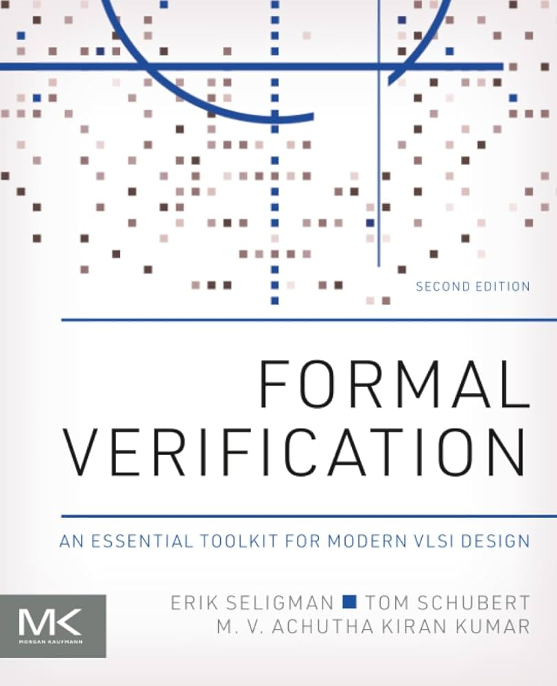

вам не потрібні скіли

нещодавно читав про Thiele Machine, цікавий твіст на машину тюрінга який додає щось типу "душі" в обчислення. прикольна кролячя нора. але мене це штовхнуло подумати про практичну штуку.

<!--truncate-->

всі ці скіли, правила, специфікації які ми згодовуємо LLM щоб вона краще кодила.. вони не фіксять кореневу проблему. коренева проблема в тому що LLM генерує код який *виглядає* статистично правильним. а коли даєш їй тести, вона радісно підкрутить тести під те що нагенерила. плани, специфікації, детальні промпти, це все просто ще більше тексту де модель може галюцинувати або втратити нитку. більше поверхні для того щоб все поїхало.

тому я почав дивитись на формальну верифікацію. конкретно TLA+ для написання специфікацій і Lean для їх доведення.

чому це відрізняється від просто "кращого промптінгу". в Lean є proof kernel. це маленький детермінований чекер який або приймає твій доказ, або відхиляє. ніякого "майже правильно". ніякого статистичного вгадування. LLM фізично не може пробрехатись через Lean proof, ядро просто скаже ні. та сама історія з TLA+, TLC model checker вичерпно перевіряє твої інваріанти проти всіх досяжних станів. модель чекер не переконаєш красивими словами.

але ось де цікаво. я спробував генерувати тести з TLA+ специфікацій *до того* як будь який бізнес код існує. LLM яка пише тести взагалі не бачить імплементацію. потім окремо, бізнес код генерується в рамках обмежень теореми Lean. два повністю ізольовані контексти. генератор тестів і генератор коду нічого не знають один про одного.

це не TDD. в TDD ти пишеш тести на основі свого *розуміння* того що код має робити. тут тести приходять з математичної моделі системи. вони кодують інваріанти і властивості, а не приклади вхідних даних і очікуваних результатів. TDD тест каже "коли я викликаю f(2) отримую 4". тест з TLA+ каже "для всіх досяжних станів ця властивість виконується і цей перехід валідний". покриття фундаментально інше тому що воно іде з *форми* системи, а не з уяви розробника про крайні випадки.

отже маємо: формальний доказ який не дає LLM відхилятись від цілі + бізнес тести написані до того як код взагалі почав існувати + повна ізоляція між генерацією тестів і генерацією коду. модель не може зґеймити те чого не бачить.

і тут сьогодні я бачу ось це: https://mistral.ai/news/leanstral
mistral щойно випустив Leanstral, опенсорс агент побудований спеціально для формальної верифікації в Lean 4. буквально вчора.

моя думка: всі ці скіли і спек файли які ми пишемо сьогодні, це перехідний період. протягом наступного року SOTA моделі стануть достатньо розумними і формальна верифікація стане нативною частиною код агентів. коли це станеться, це буде приблизно як колись C піднявся над асемблером. тобі все ще треба розуміти що під капотом, але ти працюєш на зовсім іншому рівні.

p.s. Мене трохи лякає що ідеї які я пишу декотрим в особисті потім через кілька тижнів стають реальністю. може вони це ключ до виходу з симуляції?

p.p.s. а ще подумайте про erlang/otp. він так довго чекав на свій момент і ось зараз встає з попелу. OTP буквально проєктували і готували для цього. він ідеально лягає на сучасний світ ai агентів. я навіть зробив кілька реалізацій сам, а потім прийшов openai з https://github.com/openai/symphony (elixir на BEAM) і інші хлопці випустили https://jido.run/blog/jido-2-0-is-here і робити своє стало якось не цікаво =(
