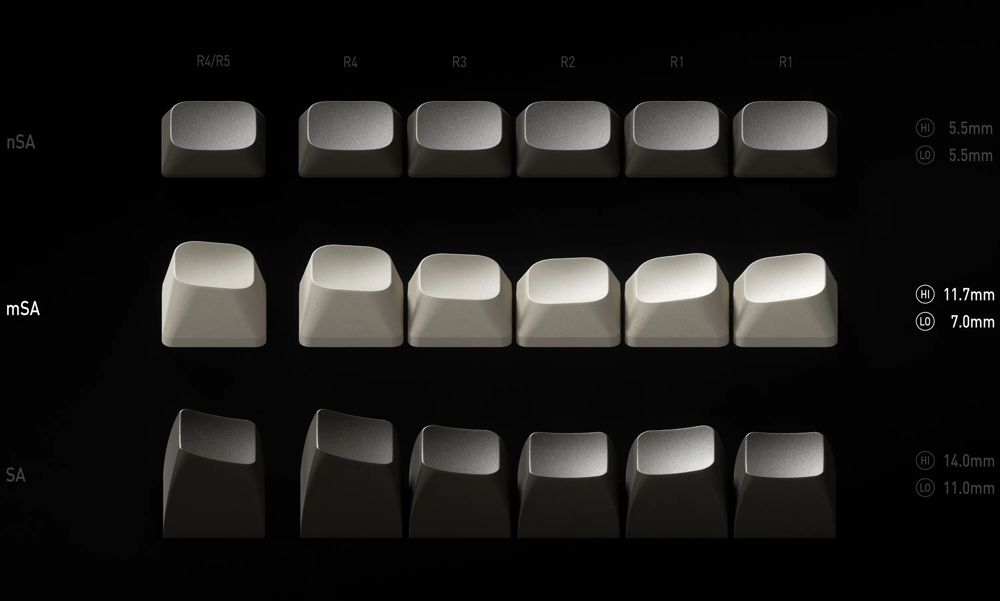
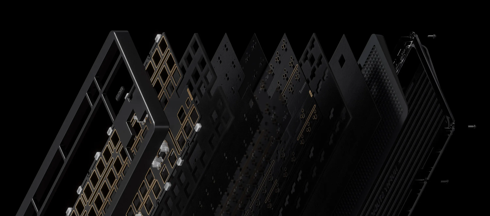

Я завжди скіптично відновився до механічних клавіатур. Вони великі, важкі, дорогі і незручні для перенесення. У мене була механічна клавіатура від hyperX. Я навіть не думав її міняти, але дружна захотіла собі клавіатуру і обрала [Kiiboom Jade 75](https://www.kiiboom.com/products/kiiboom-jade75). І тоді я познайомився з QMK, VIA і всіма приколами адекватних механічних клавіатур.
Провівши тижні досліджень і мук вибору low profile клавіатур я обрав NuPhy Gem80. Це не low profile клавіатура, але я встановив її штатні msa кейкапи і отримав компромісне для себе рішення. Бо якихось приємних low profile механічних клавіатур я так і не знайшов.

Ця клавіатура саме QMK based і позиціонується як клавіатура "збери сам", де NuPhy пропонує різні варіанти світчів, base plates і може продаватись взагалі без кейкапів пбо світчів. Вона безпровідна, має підтримку bluetooth і 2.4Ghz підключення, має вбудований акумулятор і підсвітку RGB. Я взяв лінійні raspberry switches, FR4 plate і msa кейкапи. Вийшло близько 200$ з доставкою.

Я разок потім спробував свою стару hyperx клавіатуру і тепер я не знаю як користувався нею. Але, наприклад, клавіатура мого Macbook все ще залишається зручною і десь на рівні з NuPhy Gem80. Але для десктопу ця клавіатура просто ідеальна.

### Прошивка

Я рекомендую назавжди забути про штатну прошивку від NuPhy. Китайці роблять її "на похуях" і просто забивають на всі фішки QMK. Я знайшов непогану прошивку і дуже її рекомендую вам: https://github.com/ryodeushii/qmk-firmware я її трохи модифікував, додав tap dance і інші індивідуальні приколи.