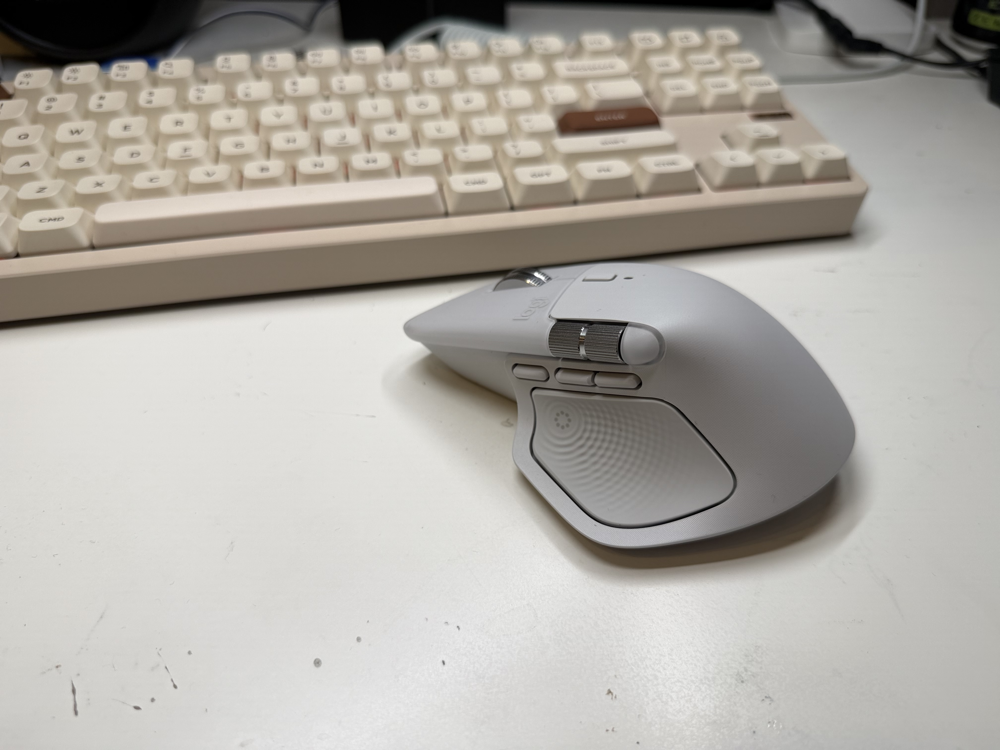
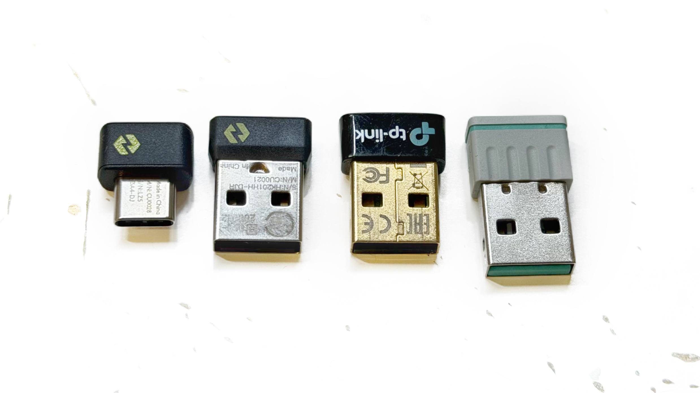

Після того як я придбав нову [клавіатуру](https://ut3usw.dead.guru/docs/belongings/logitech-k880.html) настав час оновити і мишу. Я довго дивився на **Logitech MX Master 4** і вирішив таки її брибрати. Вартість трохи кусається (половина вартості клавіатури), але, схоже, воно того вартувало.




Рідний софт під відовс і мак загалом працює нормально. Без проблем в продуктивності, але з купою сміття від logitech. Поставити плагіни без реєстрації заборонено, всюди телеметрія. Але хоча б працює адекватно.

Моя основна система - Arch Linux (btw!) і hyprland(:3). Тому мене цікавило як це все буде працювати разом. Особливо те що стосується хаптіку, і додаткових клавіш. А також що там з адаптером було не до кінця зрозуміло. Я брав звичайну версію бо у версії для Mac - відсутній донгл(котрий називається Logi Bolt, хай би вони повсирались). Різниці між Mac і не Mac версією миші ВЗАГАЛІ ніякої корім відсутності донглу. Комплектний донгл має USB-C роз'єм і це було важливо для мене бо мій KVM має лише USB-A порти. Тому я одразу не перевіряючи рідний - замовив оригінальний Logi Bolt USB-A(лонг сторі шорт - все працює, але треба запейрити новий донгл і мишу в РІДНОМУ софті на вінді або на маці).



## Linux!

По великому рахунку нова мишка з софтварної точки зору відрізняється від 3 версії - хаптіком і новою клавішою. Тому всі реалізації для 3 версії плюс мінус працюють з новою мишою.

* logiops: https://github.com/PixlOne/logiops/issues/520 нажаль не має підтримки для нової миші.
* Solaar: https://github.com/pwr-Solaar/Solaar/issues/2964 вже має повну підтримку. Але це сране лайно на python і це просто жахливий досвід саме користувача.

Я обрав Solaar, оскільки він має підтримку нової миші і в принципі з ним немає проблем в роботі мишею, але система конфігурації просто жахлива. Python в усі поля - це жахливо. Я налаштував не так багато опцій, але мені вже достатньо.


#### Конфіг:

```yaml
- 1.1.17
- _NAME: MX Master 4
  _absent: [hi-res-scroll, lowres-scroll-mode, onboard_profiles, report_rate, report_rate_extended, pointer_speed, dpi_extended, speed-change, backlight,
    backlight_level, backlight_duration_hands_out, backlight_duration_hands_in, backlight_duration_powered, backlight-timed, led_control, led_zone_, rgb_control,
    rgb_zone_, brightness_control, per-key-lighting, fn-swap, persistent-remappable-keys, disable-keyboard-keys, crown-smooth, divert-crown, divert-gkeys,
    m-key-leds, mr-key-led, multiplatform, gesture2-gestures, gesture2-divert, gesture2-params, sidetone, equalizer, adc_power_management]
  _battery: 4100
  _modelId: B04200000000
  _sensitive: {divert-keys: true, dpi: true, haptic-level: false, hires-scroll-mode: ignore, hires-smooth-invert: ignore, hires-smooth-resolution: ignore,
    thumb-scroll-invert: true, thumb-scroll-mode: false}
  _serial: '38383730'
  _unitId: '38383730'
  _wpid: B042
  change-host: null
  divert-keys: {82: 0, 83: 0, 86: 0, 195: 2, 196: 0, 416: 1}
  dpi: 1200
  force-sensing: {0: 4261}
  haptic-level: 100
  haptic-play: null
  hires-scroll-mode: false
  hires-smooth-invert: false
  hires-smooth-resolution: false
  reprogrammable-keys: {82: 82, 83: 83, 86: 86, 195: 195, 196: 196, 416: 416}
  scroll-ratchet: 2
  scroll-ratchet-torque: 75
  smart-shift: 12
  thumb-scroll-invert: true
  thumb-scroll-mode: false
```


#### Привила:

```yaml
%YAML 1.3
---
- MouseGesture: Mouse Up
- KeyPress:
  - Home
  - click
...
---
- MouseGesture: Mouse Down
- KeyPress:
  - End
  - click
...
---
- Key: [Haptic, released]
- Execute: walker -p "Apps..."
...

```

Але от проблема! в wayland не працює налаштування жестів/кліків миші в поєднанні з клавішами клавіатури (типу Meta + Mouse UP Gesture). Тому я обійшовся без них. Лише налаштував скрол воркспейсів вже силами hyprland.

```conf
bind = SUPER, mouse_left, workspace, -1
bind = SUPER, mouse_right, workspace, +1
```

І знову проблема! Як додати вібрації на події миші або системи? Вібромоторчик тут існує щоб працювати!

Для цього я зробив власну окрему реалізацію демона що реалізує власний IPC і слухає події hyprland IPC. Таким чином я можу "послати вібрацію" з будь якого місця використовуючи `echo "5" | nc -U $XDG_RUNTIME_DIR/mx4hyprland.sock`
Або налаштувати реацію на івенти hyprland: 

```toml
[events]
activewindowv2 = 1
workspace = 2
openwindow = 3
closewindow = 4
fullscreen = 5

[events.openlayer]
default = 1

[events.openlayer.args]
swaync-notification-window = 10
rofi = 6

[events.closelayer]
default = 1

[events.closelayer.args]
swaync-notification-window = 11
```

Репозиторій: https://github.com/assada/mx4hyprland

Я доречі зробив дві реалізації. На Python і на C++. Обидві працюють. Але реалізація на c++ чомусь вижирає 5мб рами... Мені здається це забагато є ідея спробувати реалізувати те саме на zig(в осноному джаст фо фан).
