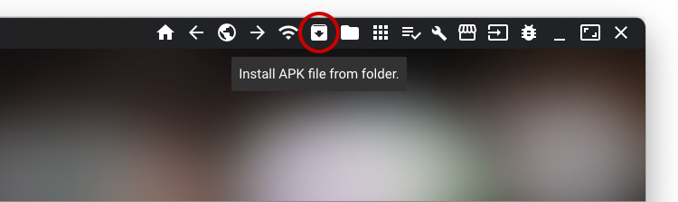

Доречі Meta Quest 3 працює на android 11(здається) і ви можете встановити будь-який android додаток на гарнітуру.

## Перші кроки

Після покупки Meta Quest 3 вам одразу необхідно встановити Meta Horizon на телефон і створити developer account на [Meta for Developers](https://dashboard.oculus.com/organizations/create/) і зареєструвати свій пристрій як розробницький. Вас очікує meta-hell де вас попросять тищу разів пройти авторизації, встановити 2fa, щось там понатискати. Але це дозволить вам встановлювати додатки не з офіційного магазину. Вам потрібна лише організація. Додаток можна не створювати.

Далі налаштовуємо Meta Horizon і з включеною гарнітурою відкриваємо налаштування і вмикаємо developer mode. У мене вийшло одразу, але можуть бути приколи. Перезавантажуємо клавіатуру, перевіряюмо що організація була творена в тому ж аккаунті до якого прив'язана гарнітура. І пробуємо знову і знову. 

## SideQuest

SideQuest це щось типу homebrew стору для Meta Quest. Він дозволяє встановлювати додатки не з офіційного магазину, а також має купу різних корисних інструментів для роботи з гарнітурою.

Зареєструйте аккаунт на https://sidequestvr.com/

1. Йдемо на https://sidequestvr.com/download і качаємо додаток для комп'ютера. Встановлюємо його і запускаємо. Логінимось в аккаунт.
2. Підключаємо гарнітуру до комп'ютера через USB кабель. Гарнітура буде інколи запитувати чи довіряти комп'ютеру. Погоджуємося (там є пункт "завжди довіряти цьому комп'ютеру").
3. На сайті sidequest обираємо "SideQuest VR App" і проходимо весь процес. Вам потрібен chrome based браузер(для роботи webserial).
4. В принципі це все. Вам ще потрібно це зпейрити додаток на ПК і на гарнітурі. Там стандартний процес з кодом.

## QGO - Quest Games Optimizer

https://anagan79.itch.io/quest-games-optimizer

Цей додаток має купу готових профілей оптимізації для різних ігор на Meta Quest. Він дозволяє підвищити продуктивність в іграх шляхом зниження графіки, роздільної здатності і інших параметрів. Або навпаки! Дуже рекомендую його встановити.

Купуємо додаток на itch.io і встановлюємо його через SideQuest як APK. Там теж буде адок з дозволами, тому звертайте увагу на те що питає гарнітура і якщо згодні, то "завжди дозволяти".

## BeatSaber 

Ну і як без BeatSaber? Це найпопулярніша гра на Meta Quest.

https://mbf.bsquest.xyz/ 

там все просто. знову webserial через підключену до usb гарнітуру.

## Android Apps

https://sidequestvr.com/app/44866/aurora-store