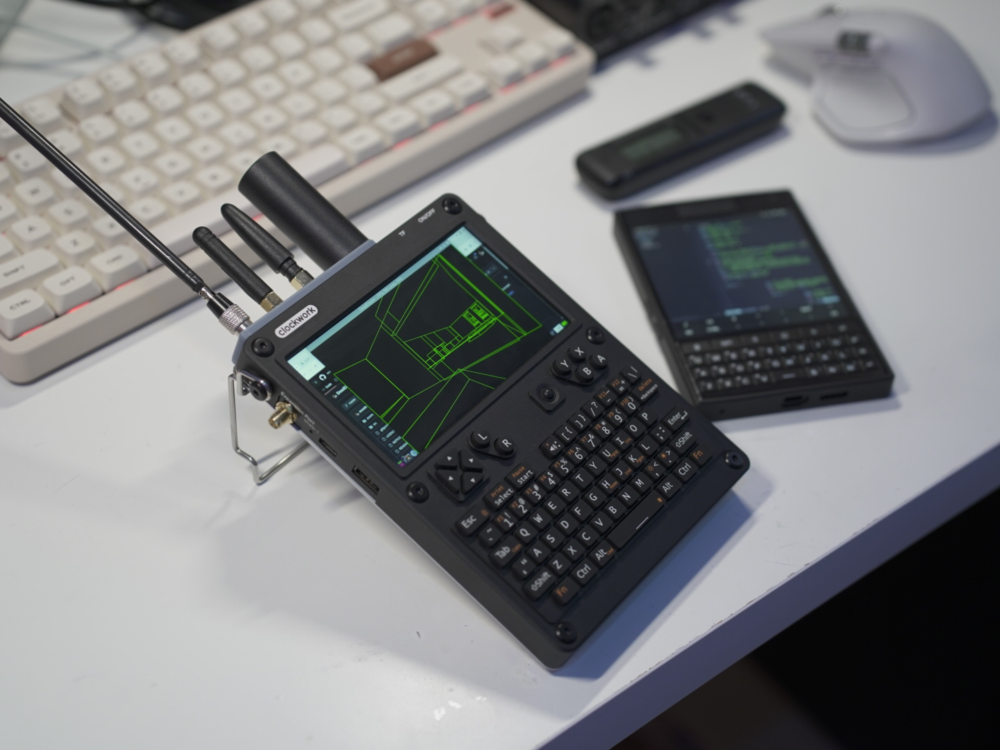
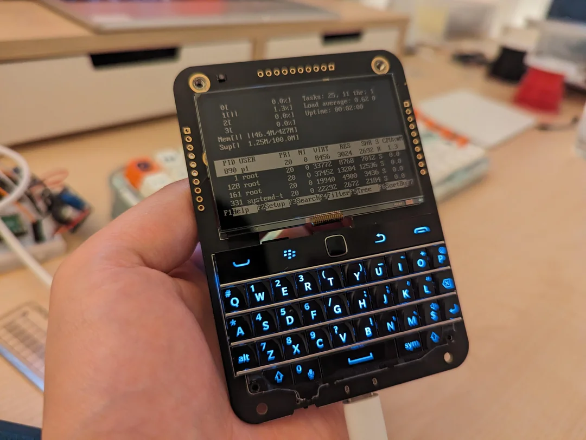
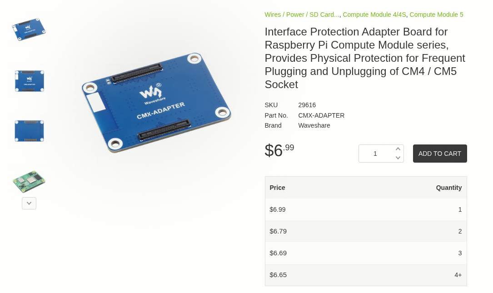
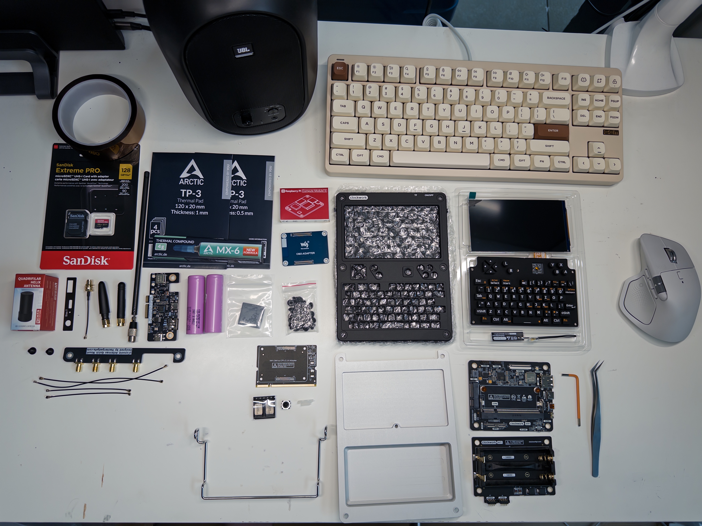

## Історія

Колись SQFMI випустили прикольний пристрій на RPI Zero. Називався він Beeper чи то Beepery чи Beepy чи то як. Вони потім його переіменували здається. По суті це був екран, клавіатура і конроллер заряду для RPI Zero на одній прикольній платі.



Я йдуже довго чекав його доставку, але він прийшов! Я все зібрав, встановив систему 5 хвилин потикав. Був дуже щасливий і вже думав що я з ним буду робити далі. А поки я думав - вирішив поставити на зарядку. Це останній раз коли я його бачив живим. Він одразу випустив білий димок духу і помер. Виявилось при виробницітві китайці поставили фіговий танталовий конденсатор, чи ще щось десь браковане(можливо дебільний контроллер заряду, котрий в гуглі ОДРАЗУ знаходиться як той що має дуже великий відсоток браку). Короче вже не важливо. радість була БУКВАЛЬНО пів години-годину. Потім він просто згорів у мене в руках.

:::info Під запис
Виникає питання чому я не відремонтував. Я намагався! Я навіть замовив контроллер заряду! І він навіть десь у мене є! Але він в типорозмірі котрий для мене складний і більше того - по ту сторону плати приклеєна клавіатура, котру треба ДУЖЕ обережно відірвати щоб не перегріти. Бо сам по собі контроллер припаяний ще й всім пузом для теплопровідності. Короче skill issues! АЛЕ! Я собі пообіцяв що колись це зроблю.
:::

Але з того дня мене не покидала думка про такий формфактор.

Потім на просторах інтернету я знайшов uConsole. Дуже схожа ідея, але розміри в 3 рази більші. Але занадто пізно вже було і не встиг поки вони реальнно мали запаси з першого батчу. Офіційний сайт писав **In Stock** але обіцяли доставку протягом 90 днів. Я замовив. Потім одразу замовив AIO комплект розширення від HackerGadgets. І так вийшло шо AIO expansion прийшов через місяць, а uConsole так і висів в очікуванні відправки (і вже 7 місяців продовжує висіти).

На сабредіті я прочитав що якийсь чеський магазин распбері барахла завжди їх має в наявності. Короче після ще кількох місяців очікування я все є вирішив замовити з Чехії. Разом з цим я там же замовив **CM5 16Gb Without eMMC with WiFi** спеціально під нього. Комплект того що я замовив я напишу нижче. І віно все приїхало!

## BOM

### Core

Значить почнемо з вибору. У вас є два стільця... CM4 і CM5. CM4 - під нього був офіційно спроектований uConsole. Під його живлення і терморежим. З CM4 менше проблем в контексті драйверів. Але це минуле покоління. Воно повільніше і навіть офіційна система від Clockwork більше не підтримується. CM5 - умовно нова, потужна але гаряча версія распбері. У неї є проблеми з драйверами і живленням. НІЧОГО критичного. Є нюанси, але воно всеодно працює. Основна проблема - охолодження. і мікро проблема - при просадці батарейки коли напруга сідає нижче умовних 50% то саме на CM5 динаміки почнуть дуріти, пищати, хрипіти і все інше. Як тільки підключається зарядка - одразу все зникає.

Не купейте eMMC версії. натрахаєтесь з пріорітетом буту! НЕ КУПУЙТЕ БЕЗ ВАЙФАЯ натрахаєтесь з донглами.

Я обрав CM5. Тому далі все буде +- про CM5. Але також валідне і для CM4

### Охолодження

З охолодженням складніше. Оригінальна ідея uConsole полягає в тому що задня магнієва кришка прилягає до чіпу распбері через термопрокладку. Через трохи іншу посадку CM5 це не виходить ефективно зробити так само. Але рішення є! Це ріщення - [проставка (Waveshare CMX Adapter)](https://www.waveshare.com/cmx-adapter.htm) що піднімає плату вище. Завдякі якій проміжок між кришкою і чіпом майже відсутній. Якраз такий, куди можна покласти 0.5мм термопрокладку.



Також ходять легенди що пасивне охолодження для nvme ssd дисків приклеєне прямо на кришку покращує теплообмін, але я хз, це виглядає не зручно.

Ну і для САМИХ вибагливих - кастомна друкована кришка з активним куллером. Це якесь знущання, але, може, комусь воно і підійде. Пошукайте в інтернеті є кілька прикольних варіантів по кастомнним кришкам. Дехто навіть робив технічний отвір в рідній кришці щоб туди вліз активний куллер.

Але з моїм рішенням через адаптерй "спейсер" і ячкісною термопрокладкою я отримую стабільні 41 градус в простої і до 55 градусів при активному(але звичайному) використанні.

### Живлення

Далі вам потрібні аккумулятори 18650 дві штуки. Краще брати гарні дорогі, без захисту, з пласким піном. Такі котрі колись купували для вейпів. Щось типу по 3000мАг на одному.

Доречі! HackerGadgets випустили оновленні плати для uConsole. Навіть зробили зручний роз"єм для підключення LiPo пакетів. Кажуть можна знайти LiPo пакет на 10000мАг що ідеально влазить в копус.

### Память

Флешка. Тут комьюніті рекомендує брати конкретні флешки.
| **Модель карти** | **Об'єм** | **Статус** | **Примітки** |
| --- | --- | --- | --- |
| **TeamGroup (Nintendo Switch Edition)** | 128GB | **Gold Standard** | Рекомендація Rex (автор системи для CM5). Працює *без* редагування EEPROM. |
| **SanDisk Extreme** | 512GB | Відмінно | Працює стабільно. Кажуть, що вона "поводиться набагато краще", ніж Samsung. |
| **SanDisk High Endurance** | 128GB | Відмінно | Завантажилась з першої спроби на CM5. |
| **Lexar Pro Plus** | 64GB | Добре | Запрацювала відразу на новому CM5 без проблем. |
| **Будь-яка дешева картка** | **32GB** | **Інструмент** | Малі карти (≤32GB) мають простіші таймінги. Ідеальні для прошивки EEPROM, якщо велика карта не стартує. |

З цими картами комюніті мало проблеми (чорний екран, або взагалі не бутається) до моменту внесення правок в EEPROM.

| **Модель карти** | **Об'єм** | **Статус** | **Симптоми / Рішення** |
| --- | --- | --- | --- |
| **Samsung Evo Select** | 512GB | **Проблемна** | "Навіть не ввімкнула підсвітку екрану після 10 хвилин". |
| **Samsung Pro Plus** | 512GB | Змішаний | Спочатку не працювала. Запрацювала тільки після оновлення завантажувача/EEPROM. |
| **Kingston Endurance** | 256GB | Погано | Постійні помилки при запису образу або завантаженні. |
| **Generic / No-Name** | Будь-який | Ризиковано | CM5 дуже чутливий до якості живлення та таймінгів. Краще уникати. |


Я взяв **SanDisk Extreme**  на 128GB. Але певно треба було брати 512 %) Все спрацвало майже ідеально. Але проблема в тому що драйвер дисплею ініціалізується в саму останню чергу тому перший бут **РЕАЛЬНО** довгий. Просто лишаємо на 20хв і чекаємо. А якщо у вас є HDMI - можете підключити uConsole до зовнішнього екрану і моніторити прогрес.

----

Це в принципі все основне. З цим ви готові до повної збірки. Збірка проста зрозуміла, просто гортайте інструкцію. Але не забудьте що WIFI антену треба крипіти саме на модуль якщо у вас CM5. Для CM4 антена кріпиться на саму материнську плату uConsole! Також варто зазначити, що оця антена котру пропонують приклеїти на корпус - повна фігня. Дуже рекомендую від неї відмовитись. В інтернеті пропонують різні адаптери під SMA стандартні вайфай виносні антени. Пошукайте моделі і роздрукуйте. в AIO board (нижче) є окрема виносна антена що вирішує усі питання.




## uConsole RTL-SDR/LoRa/GPS/RTC/USB Hub All-In-One Extension Board

Актуальний лінк: https://hackergadgets.com/products/uconsole-aio-v2
Я купляв ще першу версію.

З цим аддоном нема що загалом розповізти. Все працює. Все чітко встановлюється. Ніяких питань немає. Ну типу все як має бути.

Головний його плюс - наявність зовнішньої WIFI антени.

Якщо у вас встановлена ОС від Rex то вам просто треба встановити всі пакети для повної підтримки усії модулів в системі:

```bash
sudo apt update && sudo apt --install-recommends install hackergadgets-uconsole-aio-board -y && sudo apt install meshtastic-mui -y
```

Оригінальний пост: https://forum.clockworkpi.com/t/hackergadgets-aio-board-package/17875


## Система

Загалом вибору нема. Вибір один - система від Rex. Оригінальний пост - https://forum.clockworkpi.com/t/bookworm-6-12-y-for-the-uconsole-and-devterm/15847

Працює і на CM4 і на CM5. Є різні варіації системи. Я обрав DragonOS бо там багато додаткових радіоаматорських приколів. Це зручно. Авжеж Trixie.

Для історії скачати тут(офіційна лінка від автора): https://drive.google.com/drive/folders/1tw2uPVPsFDhQ5Onx4mlllYexUDmDp0eK

[Рідна система](https://github.com/clockworkpi/uConsole) котру пропонують оригінальні автори - мертва і не актуальна. Там є корисні скрипти для 4g модему і прошивка клавіатури.

Берете флешку і через rpi-imager прошиваєте її. Коли вам запропонує застосувати кастомні налаштування - ВІДМОВЛЯЙТЕСЬ! НЕ ТРЕБА ВЗАГАЛІ НІЧОГО НАЛАШТОВУВАТИ! Це 100% зламає перший запуск.

Потім вставляєте в роз"єм на uConsole і чекаєте. Довго. Бажано з підключеним зовнішнім живленням.

### Перший запуск

Одразу після першого запуску нам треба оновити eeprom і налашутвати запуск з флешки!

Відкриваємо термінал і дивимось версію

```bash
vcgencmd version
```

якщо 2025-01-06 і старіше то треба оновлюватись (в моєму випадку була 2025-12-30)

оновлюємо якщо треба.

```bash
sudo rpi-eeprom-update -a
```

Тепер трохи відредагуємо бут конфіг

```bash
sudo rpi-eeprom-config -e
```

```ini
[all]
BOOT_UART=1

# Switch off PMIC outputs on HALT
POWER_OFF_ON_HALT=1

# Default BOOT_ORDER for provisioning
# SD -> NVMe -> USB -> Network
BOOT_ORDER=0xf461

# Try boot on SDCard repeatedly
SD_BOOT_MAX_RETRIES=2

# Slow down SDCard SDR Mode on bootloader
SD_QUIRKS=1
```

рестартуємо

```bash
sudo reboot
```

З основного це все. Насправді, якщо у вас все вантажиться без проблем то команди вище не потрібні.

### Оновлення прошивки клавіатури

Клавіатура в uConsole це окремий пристрій на STM32. Вона прошивається через dfu режим окремо.

Оновити прошивку важливо! Бо тоді у вас з"являється адекватний скрол режим через Fn+Trackpad! Без цього режиму скрол це якесь пекло.

Відкриваємо термінал.

```bash
# Качаємо оригінальну прошивку
wget https://github.com/clockworkpi/uConsole/raw/master/Bin/uconsole_keyboard_flash.tar.gz

# Розпаковуємо архів
tar zxvf uconsole_keyboard_flash.tar.gz

# Встановлюємо dfu-utils
sudo apt update && sudo apt install -y dfu-util

# Прошиваємо
cd uconsole_keyboard_flash
sudo ./flash.sh
```

Якщо все добре то ви побачите прогрес бар. І після цього клавіатура оновлена і одразу має працювати без рестарту!

## Різне корисне

### Скрипт моніторингу температури

```bash
#!/bin/bash

vcgencmd get_config int | egrep "(arm|core|gpu|sdram)_freq|over_volt"
for src in arm core h264 isp v3d; do echo -e "$src:\t$(vcgencmd measure_clock $src)"; done
for id in core sdram_c sdram_i sdram_p ; do echo -e "$id:\t$(vcgencmd measure_volts $id)"; done
vcgencmd measure_temp
throttled="$(vcgencmd get_throttled)"
echo -e "$throttled"
if [[ $throttled != "throttled=0x0" ]]; then
    echo "WARNING:  You are being throttled.  This is likely because you are undervoltage.  Please connect your PI to a better power supply!"
fi
```

### Андерклок

:::warning УВАГА!
Це данні зібрані з різних постів на форумі комьюніті. ВСЕ  НА СВІЙ СТРАХ І РИЗИК!
:::


`nano /boot/firmware/config.txt`

#### Balance
```ini
gpu_mem=256
gpu_freq=500
arm_freq=1800
```

#### Aggresive
```ini
arm_freq=1000
arm_freq_min=500
gpu_freq=800
gpu_freq_min=500
```
### Оверклокінг

УВАГА! Буде пекло!

```ini
over_voltage_delta=50000
arm_freq=2800
gpu_freq=1000
```

### Аудіо нюанси CM5

Побічним ефектом високого споживання енергії CM5 є "виття котушки" або статичний шум від динаміків, коли заряд батареї падає нижче 50%. Це апаратна проблема, пов'язана з падінням напруги, що впливає на аудіотракт.

Підключення пристрою до 3,5-мм роз'єму для навушників зупиняє шум від динаміків

Або ви можете вимкнути контакт GPIO, який викликає це:
`sudo pinctrl set 11 op dl`
Щоб відновити, `sudo pinctrl set 11 op dh`

### Калібрування AXP228
uConsole використовує AXP228 в якості PMU. При новій установці або після заміни батареї індикатор відсотку заряду батареї може бути неточним. Контролер потребує ручного циклу калібрування, щоб визначити ємність встановлених елементів.

Процедура кліброки:

1. Зарядити до 100%: Переконайтеся, що пристрій повністю заряджений.
2. Активувати режим калібрування: `echo 1 | sudo tee /sys/class/power_supply/axp20x-battery/calibrate` Ви можете перевірити, чи активне калібрування, прочитавши значення. Значення 48 вказує на те, що клібрування продовужється.
3. Розрядити: Повністю розрядити пристрій, доки він не вимкнеться.
4. Перезарядити: Зарядити пристрій знову до 100%, коли він увімкнений.

Якщо рівень заряду батареї падає нижче 50-40% до завершення калібрування, uConsole може відключитися через падіння напруги на CM5.


### Посилання

Я скачав всю тему про систему Rex`a з форуму і запихнув в ШІ. Він трохи загрегував мені інструкцію. Там багато води, але загалом він посилається на реальні повідомлення реальних користувачів: https://gist.github.com/assada/71a1aa6d086e59dc9876b780bcc5d6c9
