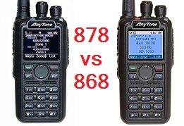
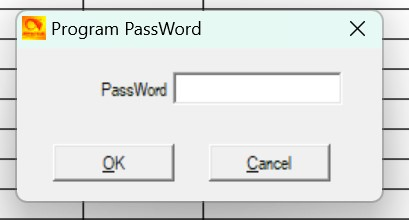
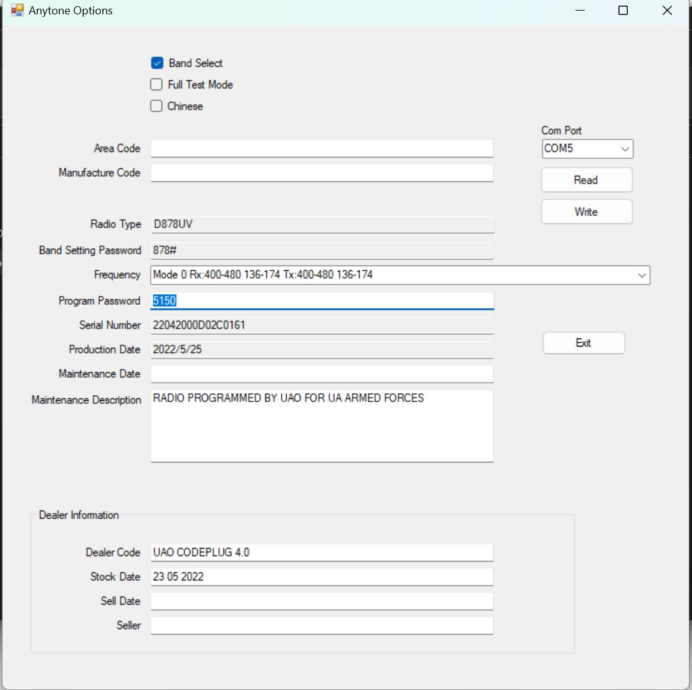

> Перекладено, доповнено і адаптовано ut3usw з [статті](https://anytonetechzone.byethost7.com/878techmods.htm?) vk7zja

# Модифікації, поради та технічна інформація для AnyTone AT-D878UV AT-D878UV-II AT-D878UV-II PLUS AT-D868UV та BTech DMR-6X2
(частково стосується також Alinco DJ-MD5 та Radioddity GD-AT10G)

## Загальні застереження для всіх користувачів:

* Версії codeplug, CPS-програмного забезпечення для програмування та прошивки радіостанції **повинні збігатися по номеру версії**. Якщо ні - відбуваються дуже дивні збої. Ви повинні **ПЕРЕБУДОВУВАТИ codeplug** щоразу після встановлення нової версії CPS чи прошивки. Це забезпечує узгодженість даних, що передаються в рацію.
* З цієї ж причини я **не раджу використовувати чужі codeplug-и**. Навіть якщо це здається зручним, ви не можете знати, під яку версію вони були створені, і чи будуть вони коректно працювати з прошивкою вашої радіостанції. CPS не покаже це, окрім дуже старих версій codeplug-ів. Збережіть собі нерви й **перебудовуйте codeplug перед тим, як записати його у радіостанцію**.
* **Будьте дуже уважні**: не натискайте випадково кнопку PTT (Push to Talk), коли рація підключена через USB-кабель або стоїть у зарядці. У такому випадку випромінювання може наводитись на кабель чи зарядний пристрій і **пошкодити обладнання** - як саму радіостанцію, так і зарядку. Таке вже траплялося з власниками 878-х.
* Не залишайте USB-кабель підключеним, якщо у вас активні канали, здатні передавати автоматично (наприклад, APRS, roaming чи функція lone worker) (подяка Jerry Kuhn).
* Тримайте радіостанцію на відстані не менше 30 см від мобільного телефона, бездротового телефона чи Wi-Fi-пристроїв.
* Будьте обережні при записі нестандартних даних у радіостанцію під час виконання деяких модифікацій нижче. Якщо інструкції виконані некоректно, можна **вивести рацію з ладу**.

## Запобігання зависанню радіостанції та вирішення більшості проблем

Є кілька дій, які допоможуть уникнути зависання рації. Ті ж самі кроки можуть вирішити багато дивних проблем, наприклад: уповільнення сканування, самовільна передача, «підвисання», некоректна робота функцій тощо. Дотримуйтесь порад у цьому порядку:

### Правило 1: Перебудуйте codeplug

99,9% проблем викликані залишковими даними у файлі codeplug. Створення нового codeplug із «чистих» даних усуває більшість помилок та зависань. Не скорочуйте процес!

1. Переконайтеся, що версія CPS збігається з версією прошивки у вашій рації.
2. У CPS завантажте поточний codeplug та експортуйте всі дані (Tool > Export > Export All).
3. Зайдіть у Optional Settings і запишіть усі параметри або зробіть скріншоти. Якщо ви використовуєте шифрування - збережіть ключі (вони не експортуються автоматично).
4. Виконайте RESET радіо - це критично! Інакше старі проблемні дані не будуть стерті.
5. У CPS зчитайте «чисте» радіо (так, воно буде порожнім - це нормально).
6. Імпортуйте збережені дані з кроку 2.
7. Внесіть параметри з Optional Settings та ключі шифрування вручну.
8. Запишіть перебудований codeplug у радіостанцію.
9. Якщо у вас були кастомні картинки (заставка, фон) - завантажте їх заново.
10. Збережіть новий codeplug і використовуйте тільки його, старий файл - видаліть.
11. Повторюйте цю процедуру **після кожного оновлення прошивки**.
12. Codeplug від старішої CPS може «ніби працювати», але саме ця невідповідність часто й викликає більшість проблем.

### Правило 2: Вимкніть GPS

Якщо не використовуєте GPS для APRS - відключіть. Навіть у фоновому режимі він навантажує процесор рації.

### Правило 3: Вимкніть Roaming

Roaming сильно навантажує процесор. Якщо він вам не потрібен - вимикайте. Ніколи не використовуйте GPS та Roaming одночасно.

### Правило 4: Використовуйте опцію Data ACK disable

Якщо рація зависає на певному каналі чи частоті, причиною може бути прийом нестандартних даних DMR Tier II. У такому випадку процес «заплутується» і зависає. Це можна вимкнути в CPS (для проблемних каналів, включно з VFO) або через меню радіо:
Menu > Settings > Chan Set > DataAck Forbid > On.

### Правило 5: Вимкніть енергозбереження
Функція економії енергії час від часу викликає проблеми. Батарея у цих рацій і так тримає добре, тому краще залишати power save вимкненим.

### Правило 6: Не використовуйте Sub-Channel без потреби
Якщо воно вам не потрібне - тримайте Sub-Channel вимкненим.

Якщо дотримуватись цих шести правил, радіостанція не буде зависати. Я користуюсь 878 вже понад два роки - жодного зависання.

## Чи AnyTone AT-D878UV і BTech DMR-6X2 однією й тією ж рацією?

З технічної точки зору апаратної частини - так, це абсолютно однакові пристрої. Єдина різниця полягає у прошивці, яка додає DMR-6X2 додаткові функції, а також у незначних відмінностях у вмісті флеш-пам’яті. Навіть було продемонстровано, що прошивку від BTech DMR-6X2 можна завантажити в AnyTone AT-D878UV.

## Відмінності між AnyTone AT-D868UV, AT-D878UV та AT-D878UV-II?

### Функціонал
- **AT-D878UV** має більше можливостей у порівнянні з **AT-D868UV**:
    - APRS-передача у FM
    - Roaming (автоматичний перехід на ретранслятор із найсильнішим сигналом)
    - Опціонально - модуль Bluetooth або додаткова пам'ять для запису аудіо
    - Нова кольорова схема екрану
    - Функція *talker alias*

- **AT-D878UV-II**:
    - Додає APRS-прийом у FM (можна бачити інші APRS-станції навколо себе)
    - Пам’ять контактів збільшена до **500 000 ID** (проти 200 000 у 878)

#### Візуальні відмінності
- **868** верхня кнопка помаранчева
- **878** верхня кнопка блакитна
- **878-II** верхня кнопка салатова

### Апаратні версії
1. **Ранній 868 (V1)** - MCU GD32F303VE (512 КБ flash, 64 КБ SRAM), прошивка *V1 868*.
2. **868 V2 (перша ревізія)** - той самий GD32F303VE, але оновлена плата, прошивка *V2 868*.
3. **868 V2 (друга ревізія) та 878** - MCU GD32F303VG (1024 КБ flash, 96 КБ SRAM), працюють із прошивкою *V2 868* або *878*.

> Більшість порад та модифікацій сумісні з усіма ревізіями.

### Додаткові зміни в AT-D878UV-II
- Flash-пам’ять збільшена з 1 Гб до 2 Гб
- Нова плата для Bluetooth та прийому FSK-сигналів (аналоговий FM APRS)

## Історія "Пароль прошивки AnyTone D878UVII PLUS"

Саме з покупкою цієї рації у мене виникла неприємна історія.

Вирішив я погратись в DMR + mmdvm і замовити собі 878. Знайшов перед сном оголошення на ОЛХ з найнижчою ціною але з відміткою "Новий" я зробив замовленя і заснув.  На наступний день я вирішив подивитись що за продавець і побачив низьку оцінку на ОЛХ. Добре ще замовлення було "ОЛХ доставкою" і я мав змогу перевірити рацію у відділені Нової Пошти.

Рація прийшла. Я перевірив. Все добре. Прийшов додому і вирішив прошити рацію під свої потреби. І тут все почалось %)

Одразу при спробі прочитати прошивку з рації я отримав вікно запиту пароля.

Одразу після цього я пішов питати у продавця чи дійсно рації нові і чи ніхто їх не шив. У відповідь отримав що рації нові з Китаю у коробці 10 штук і у нього ще є якщо треба.

Почав гуглити бо може там стандартний пароль. Звернувся до товариша радіоаматора, а вже він знайшов довлі корисний Community сайт [Веб-Архів](http://web.archive.org/web/20230318060532/https://hamradio.joomla.com/anytone-dmr.html) (сайт помер, але у веб-архіві доступний) там же був знайдений пдф файл [CPS_Programming_password_lock.pdf](https://fs.dead.guru/share/anytone878/CPS_Programming_password_lock.pdf) що якраз описує мою ситуацію з блокуванням програмування рацію за допомогою пароля.

Виявилсоь що можна послати АТ команди та легко отримати цей пароль. А GUI з пдфки вище робить це одним кліком. (варто зазначити що посилання всередені пдфки вже не активні. А скачати софт для зчитування данних можна тут: [для прошивки v3.02](https://up1.dead.guru/#8a0fws5OJQ38LwiOG40smw) фбо [для прошивки v3.08](https://fs.dead.guru/share/anytone878/AT_Options%20v3.08/))

І... Найцікавіше. Ця рація вже була прошита для ЗС України волонтерами. `RADIO PROGRAMMED BY UAO FOR UA ARMED FORCES`

Тобто чисто теоритично я купив крадену волонтерку. Або ні. Я написав органцізації UAO (котру знайшов) щоб прояснили ситуацію яким чином їх рації з"явились на ОЛХ, але вони відповіли що ніколи не займались раціями і не розуміють про що я...

## Корисні посилання

* [Як змусити рацію звучати як Motorola та інші цікаві тонові послідовності](https://anytonetechzone.byethost7.com/878techmods.htm?i=1#TPTchirp)
* [Різні файли ](https://pnwdigital.net/files/)
* [APRS через МКС](http://web.archive.org/web/20230206162314/https://dk3ml.de/2019/07/22/how-to-work-the-aprs-digipeater-on-the-international-space-station-iss/) або [тут](http://web.archive.org/web/20230601013308/https://issfanclub.eu/2019/04/29/aprs-via-iss-tips-for-successful-operation/) або [тут](http://web.archive.org/web/20230318060532/https://amsat-uk.org/beginners/how-to-work-the-iss-on-aprs-packet-radio/)
* [Список станцій почутих через МКС](http://ariss.net/)
