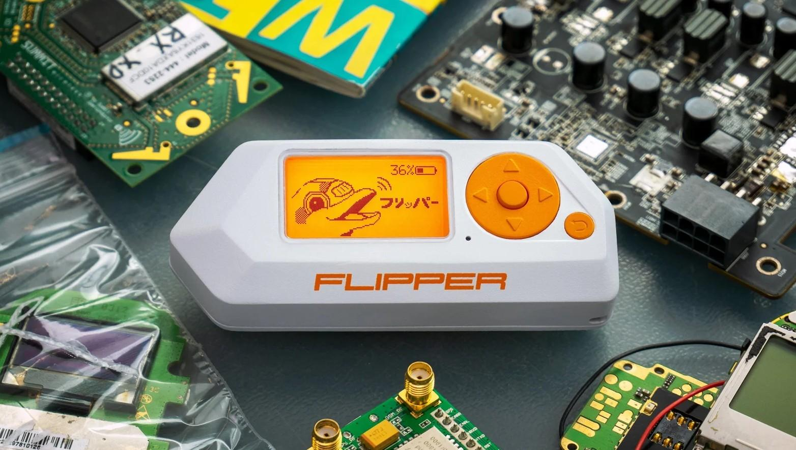
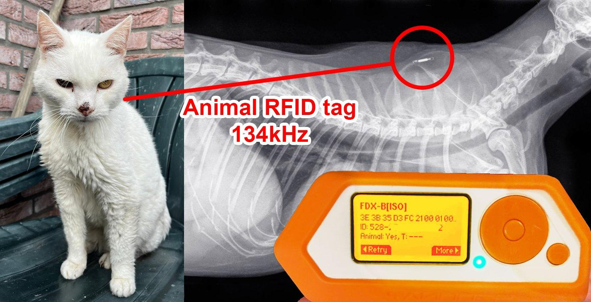
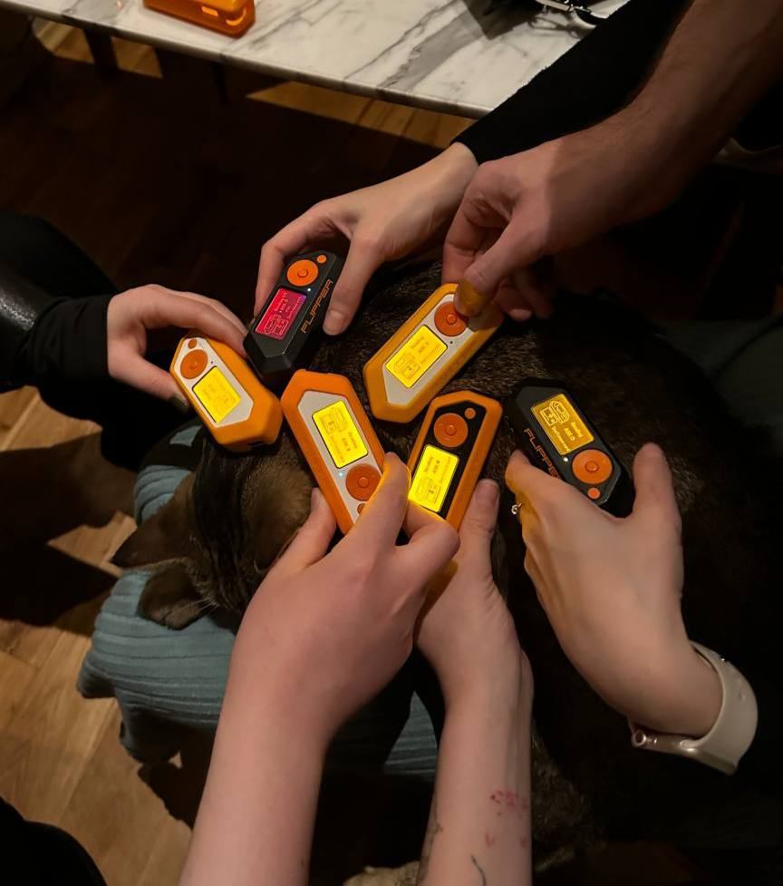

# Flipper Zero

> Сраний російський продукт. нажаль.

Flipper Zero — опенсорс тамагочі-лайк пентест девайс. Нагадує меншу версію **HackRF** разом з портапаком.

**Усередині знаходиться:**
* антена RFID (125 кГц (AM/PSK/FSK, 134 кГц теж можна)
* модуль Sub-1 ГГц CC1101
* NFC ST25R3916 (13.56 МГц)
* IrDA: TX/RX 800-950 nm, TX power: 300 мВт
* Bluetooth 5.0
* GPIO (12шт, ADC, SPI, UART, I2C, PWM (3.3V, 5V tolerant))
* вібромотор, динамік та акумулятор ємністю 2000 мАг

Пристрій побудований на базі STM32WB55 з 1 МБ флеш-пам'яті та 256 КБ оперативної пам'яті. Також для Flipper Zero є мобільні програми для Android та iOS, за допомогою яких можна налаштовувати гаджет.

В останніх прошивках пофіксили deep sleep STMки і тепер працює місяць без підзарядки. Вбудована RTOS система дозволяє писати будь-які додатки з використанням всієї переферії на пристрої. Для розуміння можливостей опишу кілька додатків і юз кейсів.

Завдяки тому що Flipper Zero має GPIO ви завжди маєте під рукою USB->UART\i2c тул. PWM тестер, LoRA термінал. Також можна під"єднати WiFi dev board фбо ESP32 і отрмати можливість працювати з WiFi (спуфінг, скан, etc) наприклад через https://github.com/justcallmekoko/ESP32Marauder

Я зберігаю всі свої rfid та nfc картки на девайсі і загалом сканаю все що потрапляє мені під руку. Ніколи не знаєш коли знадобиться гостьова картка доступу в офіс сусіда %)

Загубив пульт від телевізора? Не проблема. Бісить екрани реклами в аеропорту? Викни їх!

Дуже рекомендую одразу перейти на кастомну прошивку типу https://github.com/DarkFlippers/unleashed-firmware
Всі кастомні прогивки базуються на офіційній тому сумісність майже зберігається.

Також рекомендую бібіліотеку файлів https://github.com/UberGuidoZ/Flipper тут можна знайти багато вже збережених результатів скану.
Ну і не забувайте заглянути в класичний https://github.com/djsime1/awesome-flipperzero
