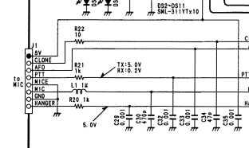
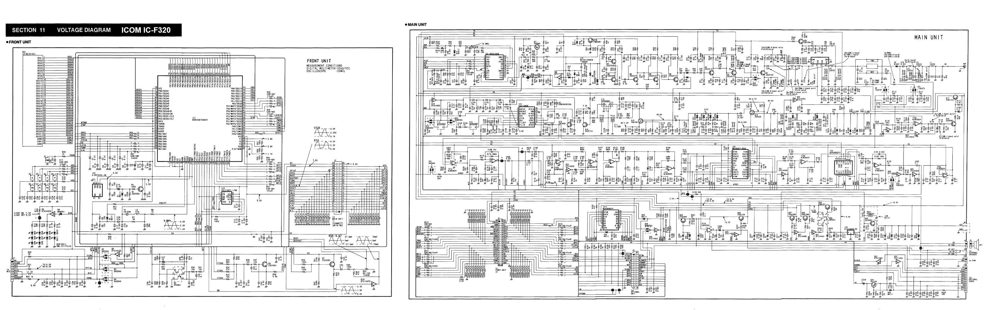
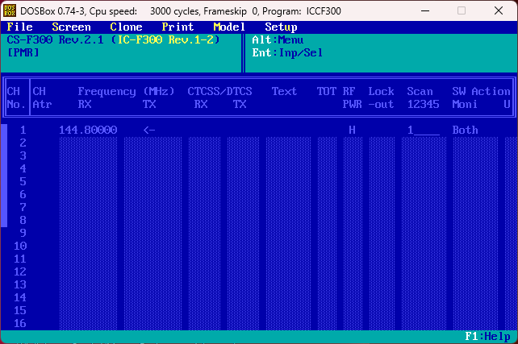

# Icom IC F300 reverse engineering project


## Мотивація
Програмне забезпечення Icom CS для ряду моделі IC-F300 родом з 1997 року, працює лише під DOS і не корисніше, ніж xxb. Група ентузіастів отримала в своє розпорядження два Icom IC-F320-6 після таксопарку в невідомому стані.
Після тестів виявилось що обидва трансівера працездатні і можуть бути використані в якості APRS igate точок.
Задумано працювати з ними через [Direwolf](https://github.com/wb2osz/direwolf) і для цього потрібно:

1) Реалізувати PTT через GPIO на Raspberry Pi
2) Вивести мікрофон і динамік на зовнішній роз'єм аудіокарти Raspberry Pi
3) По можливості прошивати їх не маючи фізичного доступу до трансмітера

Перші два пункти дуже прості і були загалом виконані на колінці за вечір.
Останній пункт зовсім не обов'язковий, але дуже цікавий виключно з точки зору розваги.

## Інструменти
В якості USB TTL конвертера був використаний якийсь китайський клон PL2303. Працює на windows 11 без проблем.

**Схема розпіновки RJ45 роз'єму трансмітера:**


1. 8V
2. CLONE
3. AFO
4. PTT
5. MIC -
6. MIC +
7. GND
8. HANGER



:::info
В якості USB TTL/UART можна використати Flipper Zero.
:::

Для збірки кабелю вам також знадобиться діод 1N4148 чи щось подібне.
Нас цікавить лище земля і CLONE піни з рації.

* GND до GND вашого USB TTL чи Flipper Zero.
* CLONE напряму до RX піна USB TTL чи Flipper Zero.
* CLONE через діод до TX піна USB TTL чи Flipper Zero.

Для моніторингу(сніфінгу) протоколу оригінального прошивальщика і рації був використаний проект [com0com](https://sourceforge.net/projects/com0com/) і [hub4com](https://sourceforge.net/projects/com0com/files/hub4com/).

```powershell
REM use hub4com-2.1.0.0-386
REM com0com setup:
REM
REM COM11 real device you want to "man in the middle"
REM virtual pair:  COM5 CNCB0
REM virtual pair:  COM7 CNCB1
REM
REM hook COM 11 to real device, hook COM5 to application, hook COM7 to monitoring app - eg.realterm

hub4com --route=0:1,2 --route=1:0,2 --octs=off --baud=9600 \\.\COM11  \\.\CNCB0 \\.\\CNCB1
```

Для запуску оригінального прошивальщика використовувався [DOSBox](https://www.dosbox.com/). Я пробував майже все(різні реалізації dos, VirtualBox, virtualbox з windowsxpX86 та інше), але спрацював лише цей варіант. Треба лише прокинути serial порт.

Мій конфіг для DOSBox: [dosbox-0.74-3.conf](https://assada.dead.guru/storage/images/1691749618_dosbox-0.74-3.conf)

Там нас цікавить лише дві категорії:

**Налаштування портів:**

```nginx
[serial]
serial1=directserial realport:COM5
```
і **автозапуск прошивальщика:**

```nginx
[autoexec]
MOUNT G C:\Users\I\Downloads\cs-f300
G:
ICCF300.EXE
```

Автозапуск не обов'язковий, але дуже зручний.

## Повна схема рації


## Приклади прошивок



* Абсолютно пуста прошивка: [EMPTY.ICF](https://assada.dead.guru/storage/secret_files/EMPTY_2023_08_11_12_23_23.ICF)
* Прошивка з першим каналом RX\TX 144.800MHz в 1 каналі і High Power: [144800_0.ICF](https://assada.dead.guru/storage/secret_files/144800_0_2023_08_11_12_19_45.ICF)
* Прошивка з першим каналом RX\TX 144.800MHz в 1 каналі і L1 Power: [144800LO.ICF](https://assada.dead.guru/storage/secret_files/144800LO_2023_08_11_12_20_11.ICF)
* Прошивка з першим каналом RX\TX 144.800MHz в 1 каналі і L2 Power: [144800L2.ICF](https://assada.dead.guru/storage/secret_files/144800L2_2023_08_11_12_20_32.ICF)
* Прошивка з першим каналом RX\TX 144.800MHz в 1 каналі, 142.500MHz в 9 каналі, 172.950MHz в 31 каналі і High Power для всіх каналів: [1C9C31C.ICF](https://assada.dead.guru/storage/secret_files/1C9C31C_2023_08_11_12_21_10.ICF)
* Якась жоска прошивка розбита по банкам, багато системних налаштувань з реальної рації: [OUR.ICF](https://assada.dead.guru/storage/secret_files/OUR_2023_08_11_12_24_30.ICF)

## Деякі результати роботи

* 1) Початок реверсу файлу прошивки: https://git.dead.guru/ut3ums/IC-CS-X/src/branch/trunk/README.org
* 2) Перший варіант прошивальщика: https://git.dead.guru/assada/icf300

## Оригінальні файли від Icom

* [f310_320_service.pdf](https://assada.dead.guru/storage/images/1691350338_f310_320_service.pdf) - оригінальний сервіс-мануал до рацій F310/320
* [CS-f300.zip](https://assada.dead.guru/storage/images/1691350430_cs-_f300.zip) - софт для прошивки рації під DOS
