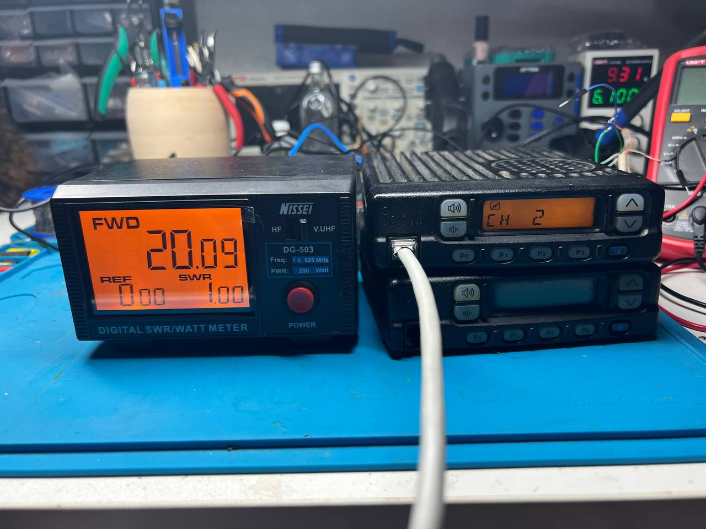
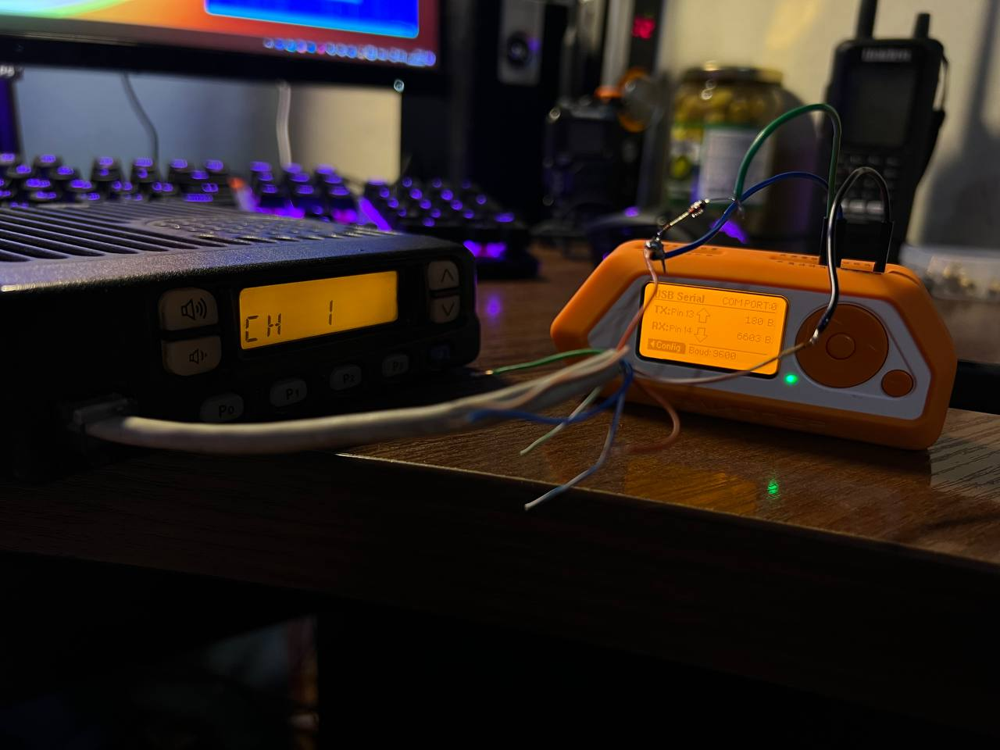

:::warning
Читайте нову, розширену версію цієї статті тут: [hardware/icom-ic-f300-reverse.md](/docs/hardware/icom-ic-f300-reverse)
:::

## Корисні файли для прошивки

[f310_320_service.pdf](https://assada.dead.guru/storage/images/1691350338_f310_320_service.pdf) - оригінальний сервіс-мануал до рацій F310/320

[CS-f300.zip](https://assada.dead.guru/storage/images/1691350430_cs-_f300.zip) - софт для прошивки рації під DOS

## Підготовка до прошивки

Для прошивки вам знадобиться USB TTL(я використовую Pl2303) перехідник чи Flipper Zero. Також вам потрібен буде восьмижильний Ethernet кабель з роз'ємом RJ-45. Я використовував стандартну для RJ-45 розпіновку - **T-568B**.

Розпіновка для рації (відносно **номеру** жили в коннекторі зі схеми вище) виглядає так:

1. 8V
2. CLONE
3. AFO
4. PTT
5. MIC -
6. MIC +
7. GND
8. HANGER

Для збірки кабелю вам також знадобиться діод 1N4148 чи щось подібне.
Нас цікавить лище земля і CLONE піни з рації.

* GND до GND вашого USB TTL чи Flipper Zero.
* CLONE напряму до RX піна USB TTL чи Flipper Zero.
* CLONE через діод до TX піна USB TTL чи Flipper Zero.

Кабель готовий. Тепер портібно під'єднати кабель до рації і вашого USB TTL чи Flipper Zero.

:::info
Софт існує лише під DOS. Я використовував Dosbox на Windows 11.
:::

На компютері краще встановити драйвера до USB TTL чи Flipper Zero і Dosbox. Запускаємо перший раз досбокс він в консолі покаже де створив свій конфіг файл. Закриваємо досбокс і відкриваємо файл-конфіг тектовим редактором, знаходимо serial категорію і додаємо туди порт USB TTL чи Flipper Zero. Зберігаєм файл.

Знову запускаємо Dosbox. Маунтим папку з прошивальщиком в систему. `mount G C:\Users\assada\Downloads\CS-F300`
Переходимо в папку з прошивальщиком `G:` і запускаємо `ICCF300`. Далі все вже +- стандартно.

На linux в мене не вайшло зовсім. На Virtualbox з втановленним Windows XPx86 в мене вийшло лише з Pl2303. А от на Windows 11 вийшло і з Pl2303 і з Flipper Zero.

З питань пишіть в IRC `#dead@irc.dead.guru`
