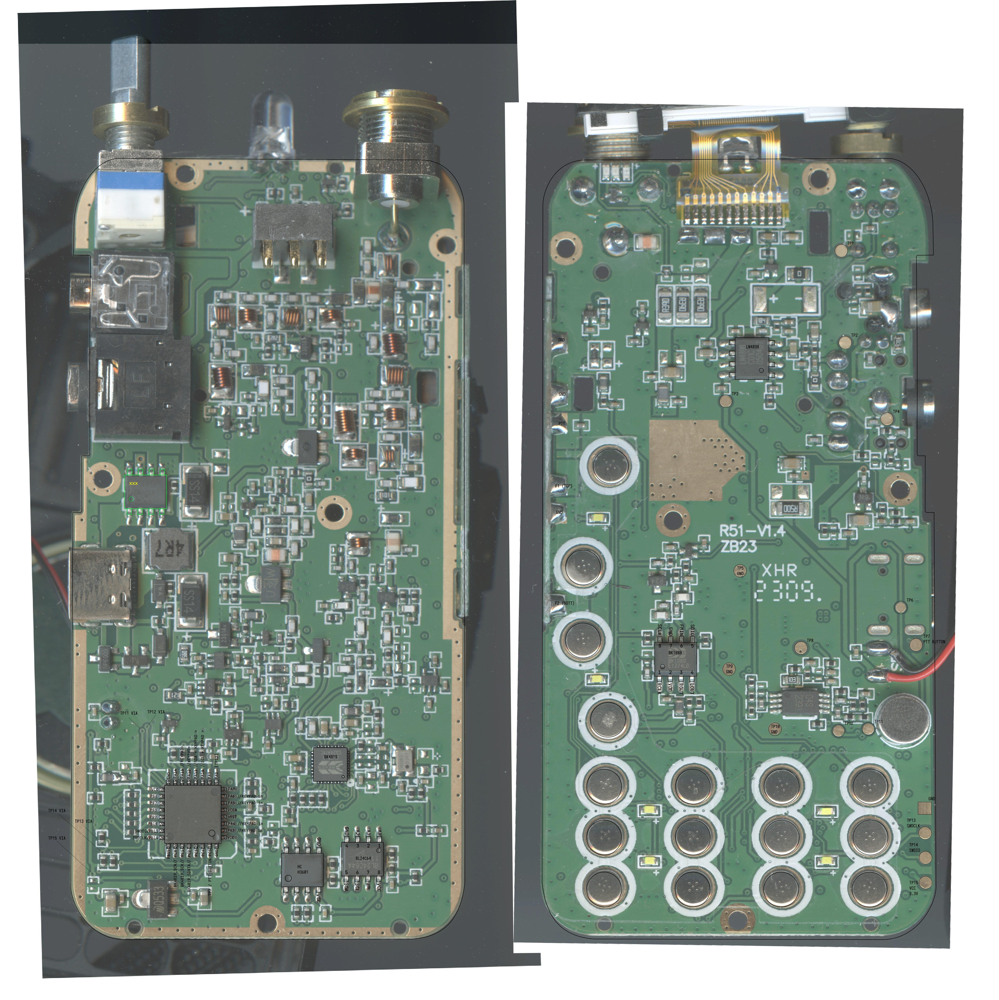
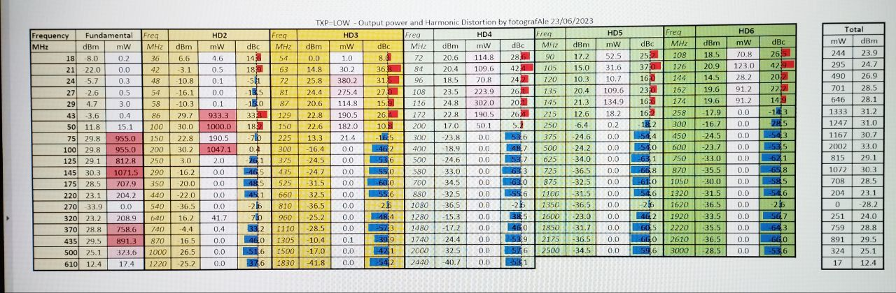
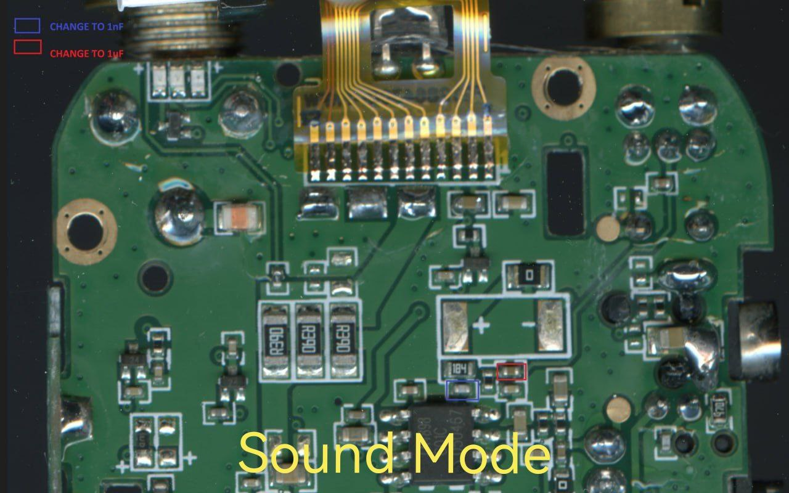

# Quansheng UV-K5

## Загальна інформація

Продається також під брендом Anysecu.

Рація побудована навколо BK4819. Тому працює загалом як баофенг та інші схожі дешеві рації. Якість відповідна.

Важко сказати що це хороша рація. Скоріше це щось накшталт DEV board для BK4819, або інструмент для експериментів з радіо. Цікава заміна для Baofeng UV-5R, але не більше.

## Прошивка

Проста і доступна схемотехника дозволила швидко дослідити рацію і модифікувати прошивку для неї. Процес документовано на [GitHub](https://github.com/amnemonic/Quansheng_UV-K5_Firmware) там же можна знайти лінки на вже зібрані прошивки. Я для совєї рації використав https://github.com/Tunas1337/UV-K5-Modded-Firmwares прошивку, а саме версію що відкриває частотний діапазон з 18МГц до 850Мгц.

## Інші модифікації

