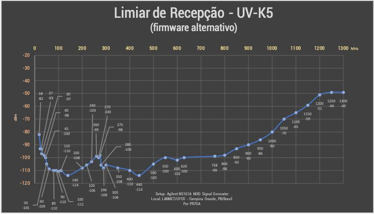

# Quansheng UV-K5

## Загальна інформація

:::caution

Зверніть увагу рації серії Quansheng UV-Kx не є професійними радіостанціями, їхні можливості обмежені. Приймач зовсім не має налаштованого смугового фільтрування, тому відкритий для всіх сигналів в широкому діапазоні частот.

Але це прикольна іграшка за свою ціну з котрою весело гратися.

:::

Продається також під брендом Anysecu.

Рація побудована навколо BK4819. Тому працює загалом як баофенг та інші схожі дешеві рації. Якість відповідна.

Важко сказати що це хороша рація. Скоріше це щось накшталт DEV board для BK4819, або інструмент для експериментів з радіо. Цікава заміна для Baofeng UV-5R, але не більше.

Використання радіо в умовах високої інтенсивності радіочастотних сигналів найімовірніше зробить прийом пеклом (режим AM страждатиме набагато більше, ніж FM), оскільки приймач просто не має великого динамічного діапазону, що призводить до спотворення звуку AM при сильніших прийнятих сигналах. На рівні програмного забезпечення більше нічого не можна зробити, щоб це поліпшити.

## Прошивка

Проста і доступна схемотехника дозволила швидко дослідити рацію і модифікувати прошивку для неї. Процес документовано на [GitHub](https://github.com/amnemonic/Quansheng_UV-K5_Firmware) там же можна знайти лінки на вже зібрані прошивки. Я для совєї рації використав https://github.com/Tunas1337/UV-K5-Modded-Firmwares прошивку, а саме версію що відкриває частотний діапазон з 18МГц до 850Мгц.

Ще кілька лінок на прошивки:
* https://github.com/DualTachyon/uv-k5-firmware
* https://github.com/OneOfEleven/uv-k5-firmware-custom
* https://github.com/piotr022/UV_K5_playground

Також можна "збдувати" свою прошивку і прошитись прямо в браузері тут: https://whosmatt.github.io/uvmod/

## Інші модифікації

