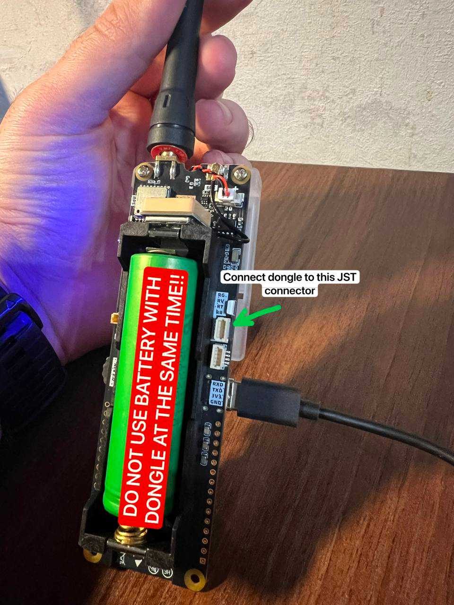

# LILYGO T-TWR Plus


**T-TWR Plus v2.0** — це цифрове радіо, розроблене та виготовлене LILYGO відповідно до пропозицій команди OpenRTX. Цей пристрій базується на мікроконтролері ESP32S3 у поєднанні з радіо-модулем SA868S.

Є VHF та UHF версії. І обидві ці версії існують в OpenEdition варіанті. Пристрої OpenEdition постачаються з незапрограмованим SA868S, хоча це не впливає на можливість прошивки OpenRTX.

## Характеристики

* **MCU:**  ESP32-S3-WROOM-1-N16R8
* **Baseband:** SA868S (специфікація: https://www.nicerf.com/item/2w-embedded-walkie-talkie-module-sa868)
* **Display:** 128x64 B/W OLED (SH1106)
* **GPS:** L76K GNSS
* **RGB LED:** WS2812C

## Прошивка OpenRTX

Будьте уважні з версіями. Вони можуть змінитись з моменту написання цієї статті.

### Підготовка

Перш за все нам потрібно прошити радіомодуль для підтримки специфічних для OpenRTX функцій. Для цього нам знадобиться UART до USB адаптер. Я використовував CP2102, але будь-який інший також підійде.

:::danger

**УВАГА** Не підключайте одночасно USB та UART. Це може призвести до пошкодження пристрою.
ТАКОЖ **НЕ ПІДКЛЮЧАЙТЕ** UART і батарейку одночано. Всі дії нижче виконуйте **ТІЛЬКИ** при відключеному USB та батарейці.

:::

**Cхема підключення:**

```
UART_GND o-------------o T-TWR_RG
UART_VCC o-------------o T-TWR_RV (НЕ ПІДКЛЮЧАЙТЕ ОДНОЧАСНО З USB!)
UART_RX  o---------+---o T-TWR_RT
UART_TX  o----|<|--/
UART_RTS o----|<|------o T-TWR_RR
```
`|<|` - це діод. Підходить і **1N4148** і 1N5817 обидва працюють. В моєму випадку я знайшов дома лише 1N4148.


Нас цікавить верхній JST пін позаду плати.




### Прошивка радіомодуля

1. Підключіть UART до USB адаптера до комп'ютера.
2. `git clone https://github.com/msalau/rl78flash`
3. `cd rl78flash`
4. `make`
5. `wget https://github.com/OpenRTX/sa8x8-fw/releases/download/v1.3.0/sa8x8-fw-sa868s-vhf.s37`
6. `./rl78flash -i /dev/ttyUSB0 -m 3 -a sa8x8-fw-sa868s-vhf.s37 -v`

Ми маємо отримати такий результат:


### Прошивка OpenRTX

1. Відклюйте UART від USB адаптера. **ЦЕ ОБОВ'ЯЗКОВО!**
2. Підключіть USB-C T-TWR до комп'ютера.
3. `mkdir tinyuf2 && cd tinyuf2`
4. `wget https://github.com/adafruit/tinyuf2/releases/download/0.16.0/tinyuf2-lilygo_ttgo_t_twr_plus-0.16.0.zip`
5. `unzip tinyuf2-lilygo_ttgo_t_twr_plus-0.16.0.zip`
6. `wget https://github.com/OpenRTX/OpenRTX/releases/download/v0.3.6/openrtx_ttwrplus_v0.3.6.uf2`
7. `esptool.py --chip auto write_flash 0x0 combined.bin`

Окей. Ми прошили бутлоадер. І тепер після перезавантаження ми маємо побачити таке:


І просто маємо закинути `openrtx_ttwrplus_v0.3.6.uf2` файл, що раніше завантажили в цю "папку". І він автоматично прошивається.

### Корпус

Найкращий корпус що я знайшов: https://github.com/OpenRTX/ttwrplus-case
Друкується без підтримок і на максимальній швидкості.


Це все. Далі - більше! =)
