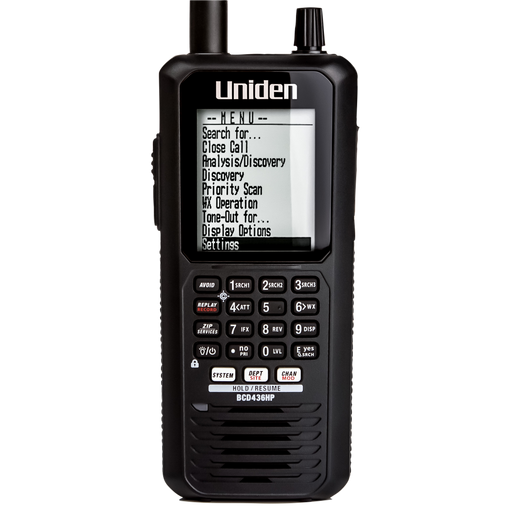
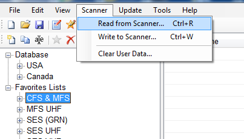
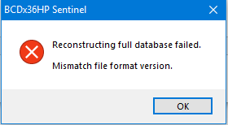
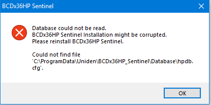
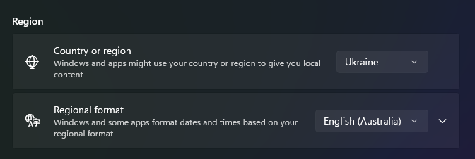
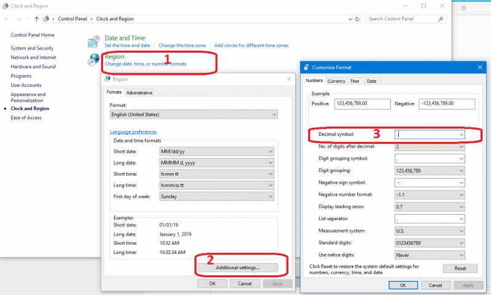

# Uniden BCD436HP/536HP Digital Scanner

Скануючий приймач з функцією декодування цифрових сигналів стандарту APCO25 Phase 1, 2, DMR *(купується ліцензія окремо)* та вбудованим диктофоном. Працює від 3х АА батарейок або аккумуляторів того ж формату і має вбудовану зарядку.
Діапазон частот на прийом, МГц: 25-1300

> Є пропуски частот, вони ж «дірки». Але це швидше психологічна проблема, яка сильно роздута неспеціалістами. Справа в тому, що в «дірках» практично відсутні вузькосмугові сигнали радіозв'язку так як на ці діапазони практично не випускаються цивільні радіостанції. Практичні збитки від «дірок» наближені до нуля.

Загалом продук СИЛЬНО орієнтований на ринок США і Канади. І це буквально у всьому. Але для нашої частини світу це не дуже заважає чи якимось чином обмежує.

## Софт
Основний софт для "програмування" сканеру є Uniden Sentinel. Абсолютно проклята програма що працює лише на Віндоус і має декілька критичних багів, любить ламати всі ваші налаштування і загалом виглядає як типовий виключно інженерний продукт.

Варто зауважити що Uniden Sentinel це редактор текстових файлів. Загалом можна напряму редагувати файли налаштувань через ваш улюблений vim.

### Баг що звів мене з розуму
При першому запуску Uniden Sentinel я отримав доволі дивне повідомлення про помилку. Також сипались помилки при спробі записати зміни в сканер.

Короче кажучи проблема в тому як Sentinel формує зміст бази данних. Ці тіпи беруть поточну локалізацію Windows і дістають формат розділення цілої і дробової частини. Для США і багатьох країн це символ крапки `.` а для декотрих це кома `,`. Тому якщо у вас стоїть Українська локаль і відповідний формат - велкам ту хел.

Вирішення просте. Просто змініть формат на будь-який який найближчий до Австралії.

Або є більш простий і зручний для всіх варіант - просто змінити саме символ в налаштуваннях формату. Правда для мене цей варіант вирішив проблему лише до першого перезавантаженння. А потім почався треш де вже зміна формату не допомогла. Також не рятувало повне перевстановлення програми. Бо, блять, анінсталлєр не видаляє всі свої файли котрими він засирає систему і там залишаються зламані бази данних. Тому треба видалити руками ВСЕ що залишилось.

Типу десь тут:
* `C:\programdata\Uniden\BCDx536HP_Sentinel\Database`
* `C:\Users\<user>\AppData\Local\Uniden`

Більше можна прочитати тут: https://forums.radioreference.com/threads/sd-card-file-error-could-not-find-file-d-bcdx36hp-hpdb-hpdb-cfg.380648/

## Корисні посилання
* http://new.marksscanners.com/536/436_536.shtml
* DMR ключ купити можна тут: https://uniden.com.au/product/scanner-upgrade/