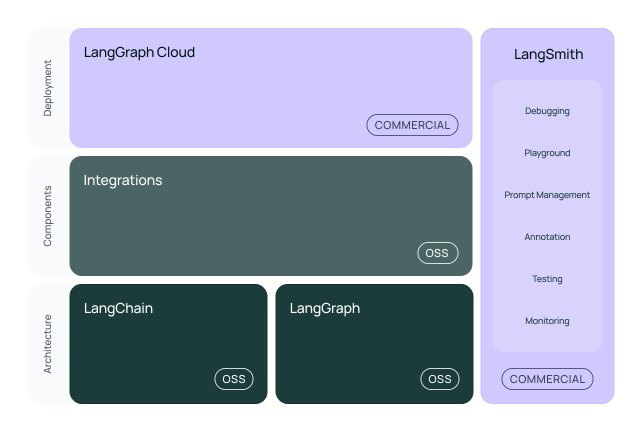

# LangGraph

**LangGraph** — це частина екосистеми [LangChain](https://www.langchain.com/), бібліотека з відкритим кодом, яка допомагає зручно будувати, запускати й керувати кількома AI-агентами або ланцюгами LLM. Вона дає інструменти для створення складних AI-процесів, які можна легко масштабувати та оптимізувати.

## LangЩо?



Екосистема **LangChain** включає декілька компонентів із назвами, які легко сплутати. Давайте розберемось, що є що:


### LangChain
(Безкоштовний, [OSS](https://en.wikipedia.org/wiki/Open-source_software))

Фреймворк з відкритим кодом для створення застосунків на основі великих мовних моделей (LLM). LangChain дозволяє будувати ланцюжки («chains») із різних компонентів: підказок, моделей, пам'яті, та інтеграції з іншими сервісами. Ядром LangChain є LangChain Expression Language ([LCEL](https://python.langchain.com/docs/concepts/lcel/)), декларативна мова виразів для зручної оркестрації компонентів.


### LangGraph
(Безкоштовний, [OSS](https://en.wikipedia.org/wiki/Open-source_software))

LangGraph — це бібліотека оркестрації, побудована поверх LangChain (з використанням [LCEL](https://python.langchain.com/docs/concepts/lcel/)), яка дозволяє створювати складні workflow-графи. Вона ідеально підходить для створення агентів із циклічними процесами, умовною логікою та гнучким контролем усіх ваших воркфлоу. LangGraph легко інтегрується з усіма компонентами LangChain, доповнюючи його додатковими можливостями.

Загалом назва говорить сама за себе. Будуйте додаток як граф, і запускайте його в продакшені. AI Agent as a Graph.

### LangGraph Platform
(Комерційна платформа)

LangGraph Platform — це платна керована платформа для розгортання й масштабування агентів LangGraph у продакшені. Вона бере на себе керування станом агентів, зберігає історію взаємодії, забезпечує моніторинг та підтримує запуск запланованих завдань (cron). Для тестування і невеликих проєктів доступний безкоштовний тариф із обмеженнями.

Хочу зазначити що платформа не обов'язкова. Ви можете ПОВНІСТЮ ігнорувати її існування і використовувати LangGraph або LangChain без неї, але вам потрібно буде самостійно реалізувати обробку запитів, SSE, зберігання стану та інші функції, які надає LangGraph Platform (тобто все що робить `langgraph-cli`).

### LangSmith
(Комерційна платформа, Умовно-безкоштовна)

LangSmith — це платформа спостереження (observability) для додатків на базі **LangChain** і **LangGraph**. Вона дозволяє зручно логувати, аналізувати та оцінювати запити до LLM і кроки роботи агентів, автоматизуючи процес дебагу й оптимізації. LangSmith є хмарним сервісом із безкоштовним базовим тарифом та платними варіантами для команд і великих проєктів. 

Також можна ігнорувати, або використовувати безкоштовні альтернативи (наприклад https://docs.arize.com/phoenix). Але LangSmith дійсно зручний. Часто без трейсінгу дуже важко виявити проблему.

### LangServe
(Безкоштовний, [OSS](https://en.wikipedia.org/wiki/Open-source_software), **deprecated**)

LangServe — застаріла бібліотека на базі FastAPI для швидкого створення REST API над ланцюжками LangChain. LangServe офіційно більше не розвивається, його замінила більш гнучка та потужна LangGraph Platform. Рекомендується мігрувати на LangGraph для всіх нових проєктів, оскільки LangServe отримує лише критичні оновлення й виправлення помилок.

Але вам нічого не заважає загорнути LangGraph в FastAPI і створити REST API самостійно.


## Швидкий старт

### Вимоги

Наразі CLI підтримує тільки Python версії **3.11** і вище. Тому вам потрібно встановити Python 3.11 або вище. (https://formulae.brew.sh/formula/python@3.13)

```
$ python3 --version
Python 3.13.2
```

#### LangSmith

LangSmith — це платформа для моніторингу та оцінки, що дозволяє командам налагоджувати, тестувати та контролювати продуктивність AI-застосунків. Вона безкоштовна і **не є обов'язковою**. LangGraph і LangChain незалежні від LangSmith і можуть використовуватись без неї (безкоштовно).

[Зареєструватись у LangSmith](https://smith.langchain.com/)

Після реєстрації встановіть змінну середовища `LANGSMITH_API_KEY`.

```
$ export LANGSMITH_API_KEY=<ваш-api-ключ-langsmith>
```

#### OpenAI API

Ви можете зареєструвати акаунт на [OpenAI](https://platform.openai.com/api-keys) та встановити змінну середовища `OPENAI_API_KEY`.
Не забудьте закинути 5$ на свій рахунок.

```
$ export OPENAI_API_KEY=<ваш-api-ключ-openai>
```

### Створіть новий venv

```
$ mkdir langgraph-quickstart
$ cd langgraph-quickstart
$ python3 -m venv .venv
```

### Активуйте venv

```
$ source .venv/bin/activate
```

або для fish shell:

```
$ source .venv/bin/activate.fish
```

### Встановіть LangGraph CLI

```
$ pip install -U "langgraph-cli[inmem]"
```

### Створіть новий проект LangGraph

```
$ langgraph new
```
Вкажіть шлях до проекту (буде створено нову папку). Оберіть шаблон, я звжди обираю `ReactAgent`

### Встановіть залежності

```
$ cd ./<назва-вашого-проєкту>
$ pip install -e .[dev]
```

### Змінні середовища

1. Створіть файл `.env`.

```bash
cp .env.example .env
```

2. Визначте необхідні API-ключі у вашому файлі `.env`.
3. Визначте тут змінну `LANGSMITH_API_KEY`, якщо хочете використовувати LangSmith, або залиште її у змінних середовища вашої системи.

### Запуск сервера LangGraph

```
$ langgraph dev
```

### Поради

- Використовуйте `langgraph dev` для запуску dev сервера.
- Ви можете вимкнути venv командою `deactivate`.
- Ви можете активувати venv командою `source .venv/bin/activate`.
- Ви можете встановити залежності командою `pip install -e .[dev]` для розробки або `pip install -e .` для продакшену, або ж окремо `pip install <назва-пакета>`.
- GUI для чату LangGraph: https://github.com/langchain-ai/agent-chat-ui або https://github.com/AmrAnwar/LangGraph-UI-SDK?tab=readme-ov-file#using-cd

## Ключові концепти LangGraph

### Stateful Graph
LangGraph працює з концепцією графа зі станом, де кожна нода графа є кроком у ваших обчисленнях. Граф зберігає стан, який передається та оновлюється в процесі виконання обчислень. Станів може бути декілька, і вони можуть бути різними для різних нод.

### Nodes
Ноди є основними елементами вашого LangGraph. Кожна нода відповідає певній функції або обчислювальному кроку. Ви визначаєте ноди для виконання конкретних задач, таких як обробка введення, прийняття рішень або взаємодія з зовнішніми API. 

### Edges
Зв'язки з'єднують вузли у вашому графі, визначаючи послідовність виконання обчислень. LangGraph підтримує умовні зв'язки(conditional edges), що дозволяють динамічно визначати наступну ноду для виконання залежно від поточного стану графа.

## Типові труднощі

### Керування станом
Може бути складно зрозуміти, як передається і оновлюється стан у графі. Пам’ятайте, що кожна нода отримує поточний стан, може його змінити і передає далі в наступну ноду.

### Умовні переходи
Налаштування умовних переходів вимагає уважності — потрібно чітко визначити умови й відповідність результатів наступним нодам. Переконайтесь, що ключі, які повертає функція умов(condition function), відповідають ключам у мапі умовних переходів(conditional edge mapping).

### Глухі кути
Кожна нода у графі має вести або до іншої ноди, або до ноди END. Якщо у ноді немає жодного вихідного переходу, він вважається глухим кутом — потрібно додати перехід, щоб уникнути помилок.

## Що далі?

А що далі? Далі творіть. Відкривайте файл графу, подивіться на tools.py, оцініть системний промпт. Далі ви можете використовуючи CLI langgraph згенерувати docker файли і запустити сервер у продакшені! (але не забудьте про те, що це платна фіча. Інакше вам треба реалізовувати invoke і всі інші функції самостійно).

Також є БЕЗКОШТОВНИЙ курс https://academy.langchain.com/courses/intro-to-langgraph що допоможе вам краще зрозуміти, як це все працює і надасть приклади застосування. ДУЖЕ рекомендую!