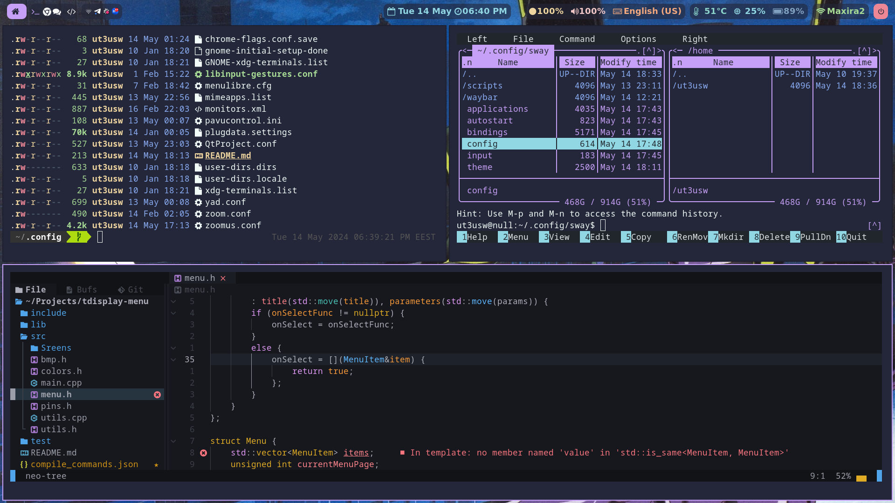

# dotfiles

Короче щось мене замучала депресія і я згадав про i3. Але я живу в світі [wayland](https://wayland.freedesktop.org/) і тому i3 не [працює](https://github.com/i3/i3/discussions/5845). Але чуваки підсуєтились і зробили [sway](https://github.com/swaywm/sway) що сумісний з конфігами i3. І я вирішив спробувати. Це були два дні пекла по збірці всього цього для сраного Debain 12 після чого я ще більше ненавиджу Debain.

## Мотивація
TBA

## Що таке sway?
TBA

## Що не так з Debian?
TBA

## Що у мене вийшло?

https://git.dead.guru/assada/dotfiles