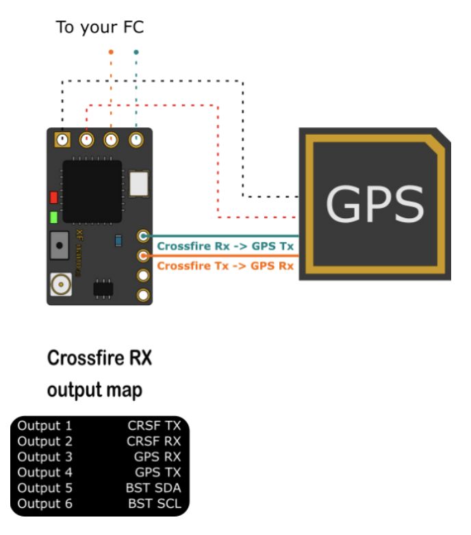
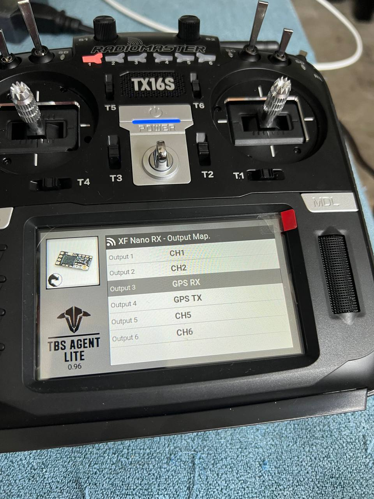
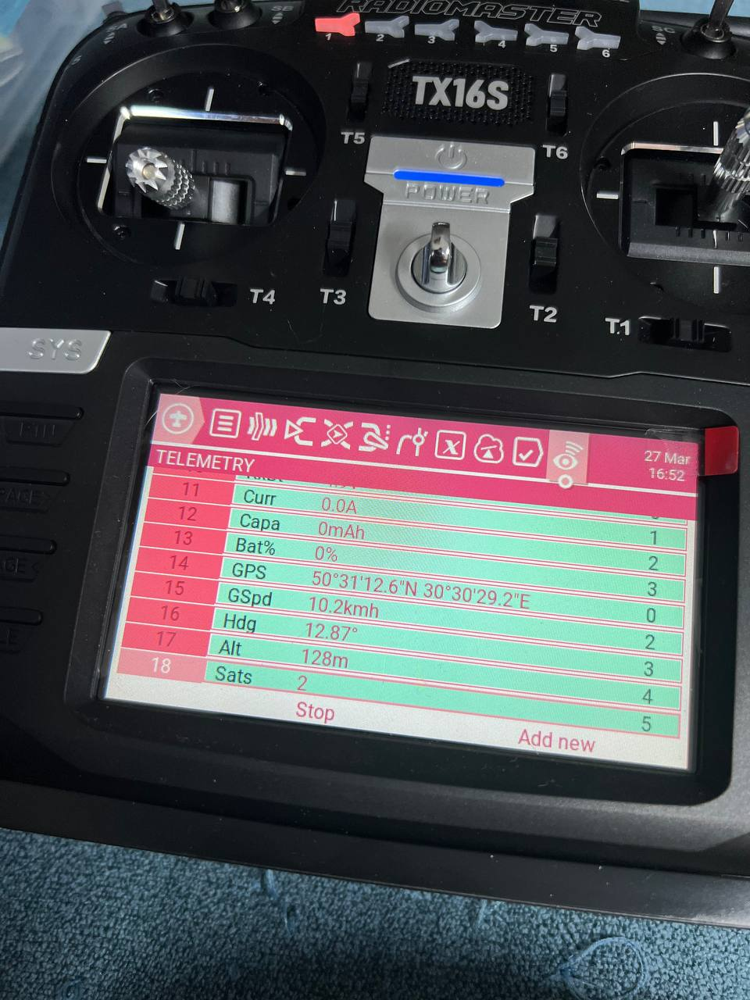
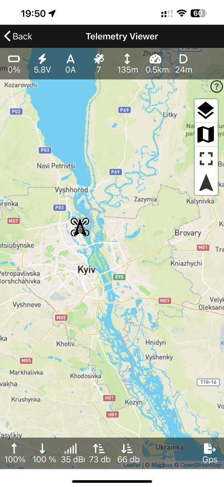

# TBS Crossfire

* **TBS CrossFire** - Система радіо управління, яка розробляється компанією TBS. https://www.team-blacksheep.com/products/prod:crossfire Головна перевага - висока швидкість передачі даних на великі відстані. Недолік - висока ціна.

Чиатйие більше в [rc/general.md](/docs/rc/general)

## Підключення GPS до TBS Crossfire Nano RX
У мене вийшло підключити **Ublox Matek M10, GNSS & COMPASS M10-5883** модуль згідно з мануалом crossfire.

Однак при налаштуванні nano rx, а саме перемиканні 3 і 4 каналів виник дивний баг де один перемикач каналу скидав налаштування іншого. Побороти поки не вийшло(треба спробувати руками прошити RX модуль). Тому я взяв інший екземпляр nano rx і підключив GPS до нього.

### Налаштування виходів nano rx

> Варто зауважити що GPS модуль підключається до **3** і **4** каналу RX тим самим ми втрачаємо можливість використовувати TBS SmartAudio для виводу телеметрії на FPV системи.

Після підключення на пульті відображається телеметрія з GPS модуля.

## Телеметрія
Для перегляду телеметрії можна використати **TBS Agent** на телефоні.

## Радіо

### Терміни

*«канал»* - використовувані частоти розміщені рівномірно одна від одної, тому я припускаю, що є логічна нумерація каналів, при цьому канал 0 має найнижчу зареєстровану частоту.
«аплінк» - дані, відправлені від передавача / дистанційного керування до квадрокоптера
«даунлінк» - дані, отримані від квадрокоптера

### Логіка

У більшості режимів протокол Crossfire використовує канали 0-49 для передачі даних до приймача, потім переключається на 50 каналів вгору, і приймач відповідає на каналах 50-99. Потім передавач переходить до наступного каналу згідно з послідовністю хопів. Цей процес повторюється 150 разів, а потім вся послідовність повторюється знову.

### Приклад послідовності хопів
Отже, у цьому прикладі передавач відправляє свої дані на каналі 0, переходить на канал 50 і чекає, щоб приймач підтвердив отримання даних та відправив телеметрію. Потім передавач переходить на канал 18, відправляє свої дані вгору і чекає на каналі 68 (18+50) на відповідь від приймача. Після того, як всі канали в цій послідовності були оброблені, процес починається знову з каналу 0.

Проте, в режимах RACE використовується той самий канал як для аплінку, так і для даунлінку даних, але використовуються канали 0-99 для перескоків.

Точні частоти також можуть бути частиною початкового біндінгу, тому моя теорія може бути неправильною. Буду також тестувати її на інших налаштуваннях. Уся ця комунікація відбувалася в режимі FSK модема LoRa зі зсувом частоти 42,48 кГц та швидкістю передачі 85,1 кбод.

Ось частоти, які використовує моє обладнання:

| 0 | **868** | **915** | **868 RACE** | **915 RACE** | **868 CE** | **915 AU** |
|---|---|---|---|---|---|---|
| Fmin [MHz] | 860.165 | 902.165 | 860.165 | 902.165 | 863.093 | 915.165 |
| Fmax [MHz] | 885.905 | 927.905 | 885.905 | 927.905 | 868.581 | 927.905 |
| Channels Rx/Tx or shared | 50/50 | 50/50 | 100 | 100 | 50 | 50 |
| Spacing [kHz] | 260 | 260 | 260 | 260 | **112** | 260 |
| FreqShift [kHz] | 42.48 | 42.48 | 42.48 | 42.48 | 42.48 | 42.48 |
| Bitrate [kBaud] | 85.1 | 85.1 | 85.1 | 85.1 | 85.1 | 85.1 |

## Ще один цікавий факт

Коли використовується 8-канальний режим, передавач відправляє дані каналів 0-7 в кожному пакеті.
Якщо використовується 12-канальний режим, тоді передавач відправляє дані каналів 0-3 в кожному пакеті, а канали 4-7 і 8-11 чергуються, зменшуючи їх частоту оновлення до половини.

Пакет альтерації позначений у першому байті аплінк даних (встановлений 5-й біт).

Щодо таймінгів, передача пари RX/TX кожні 6,666 мс очікується через частоту 150 Гц. Пакет даунлінку отримується не пізніше, ніж через 2,6 мс після завершення передачі аплінк пакету. Цей період коротший, оскільки пакет даунлінку має кілька байтів менше. 