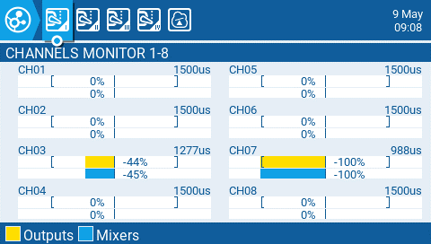
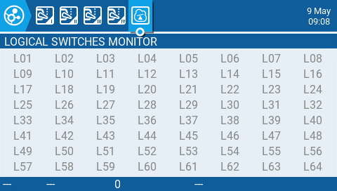

Channel Monitor показує як вихідне значення (верхня смуга), так і значення міксу (нижня смуга) для кожного з 32 радіоканалів, які розподілені на 4 сторінках по 8 каналів.

5-та сторінка Channel Monitor — це монітор Logical Switches. На цій сторінці ви побачите статус (активовано/не активовано) всіх Logical Switches. Активовані Logical Switches підсвічуються.

---

Джерело: [EdgeTX User Manual 2.11](https://github.com/EdgeTX/edgetx-user-manual/blob/2.11/color-radios/channel-monitor.md), ліцензія [CC BY-SA 4.0](https://creativecommons.org/licenses/by-sa/4.0/). Український переклад підготовлений для dead.md.
