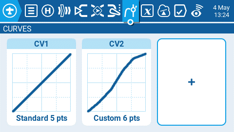
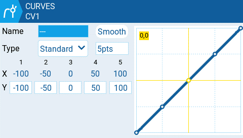

Екран **Curves** у Model Settings дозволяє вам визначати кастомні криві для використання на екранах Inputs, Mixes або Outputs. Екран кривих відображатиме всі налаштовані кастомні криві з графічним представленням кожної кривої, кількістю точок та типом кривої.

Вибір існуючої кастомної кривої відобразить наступні опції:

* **Edit** - Відкриває сторінку налаштування кривої.
* **Preset** - Дозволяє встановити криву на одне із заданих значень нахилу (від -45 до 45 градусів із кроком 15 градусів). Крива матиме 5 точок, а згладжування за замовчуванням не ввімкнено.
* **Mirror** - Віддзеркалює вибрану криву.
* **Clear** - Очищає всі значення вибраної кривої.

Натискання кнопки з плюсом для створення нової кривої надасть вам наступні опції:

* **Edit** - Відкриває сторінку налаштування кривої.
* **Preset** - Дозволяє встановити криву на одне із заданих значень нахилу (від -45 до 45 градусів із кроком 15 градусів). Крива матиме 5 точок, а згладжування за замовчуванням не ввімкнено.

Вибір **Edit** для налаштованої або неналаштованої кривої відкриє екран налаштування кривої та відобразить наступні опції:

* **Name** - Ім'я кривої. Можливі лише 3 символи.
* **Type** - Тип кривої: Доступні варіанти **Standard** та **Custom**
  * **Standard** - Точки горизонтальної осі є фіксованими значеннями, що базуються на кількості точок. Точки вертикальної осі можна налаштовувати.
  * **Custom** - Як горизонтальна, так і вертикальна осі можуть налаштовуватися.
* **Number of Points** - кількість точок у кривій
* **Smooth** - Коли ввімкнено, з'єднує точки вигнутими лініями замість прямих
* **Verticle point values** - Налаштуйте значення точок, щоб створити бажану криву.

:::info
Позиції стіків відображаються жовтим кольором на кривій. Рух стіками керування оновлюватиме позицію стіка на кривій у реальному часі.
:::

---

Джерело: [EdgeTX User Manual 2.11](https://github.com/EdgeTX/edgetx-user-manual/blob/2.11/color-radios/model-settings/curves.md), ліцензія [CC BY-SA 4.0](https://creativecommons.org/licenses/by-sa/4.0/). Український переклад підготовлений для dead.md.
