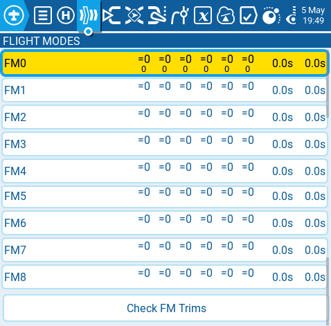
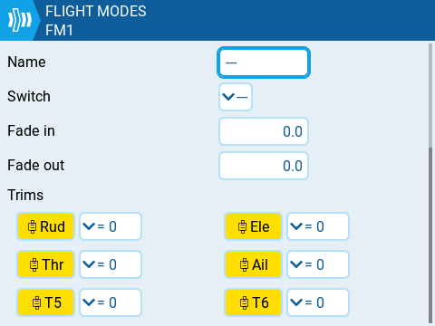

Польотні режими (Flight modes) дозволяють мати різні налаштування тримів для кожного польотного режиму. Після налаштування кількох польотних режимів ви можете регулювати налаштування тримів у кожному з них, не впливаючи на налаштування тримів в інших польотних режимах (якщо вони не налаштовані інакше). Можна використовувати до 9 польотних режимів, причому Flight Mode 0 є польотним режимом за замовчуванням.

Екран **Flight Mode** відображає огляд кожного польотного режиму. Виділений польотний режим позначає активний польотний режим. Вибір польотного режиму переведе вас на сторінку конфігурації для цього польотного режиму.

**Check FM Trims:** Коли натиснуто кнопку перевірки тримів польотного режиму (check FM trims), трими для поточного польотного режиму тимчасово вимикаються. Це використовується для перевірки впливу тримів поточного польотного режиму на виходи (outputs).

Екран конфігурації польотного режиму має наступні опції:

**Name:** Власна назва для польотного режиму. Якщо налаштовано, ця назва відображатиметься в нижній центральній частині головного екрана між тримами.

**Switch:** Тригер для увімкнення цього польотного режиму. Це може бути перемикач (switch), потенціометр (pot), телеметрія, трим або логічний перемикач (logical switch). Ця опція не відображається для FM0, оскільки він завжди активний, якщо спеціально не увімкнено інший польотний режим.

**Fade in:** Поступова зміна значення трима при увімкненні цього польотного режиму. Вкажіть час у секундах (0.0 - 25.0) до завершення зміни значення.

**Fade out:** Поступова зміна значення трима при вимкненні цього польотного режиму. Вкажіть час у секундах (0.0 - 25.0) до завершення зміни значення.

**Trims:** Щоб налаштувати трими, виберіть трим, який ви хочете налаштувати, щоб переконатися, що він увімкнений (жовтий колір). Потім виберіть польотний режим (**0-8**), який надаватиме початкове значення трима, та модифікатор (**=** або **+**) з випадного меню. Якщо замість польотного режиму (0-8) вибрано **3P**, трим діятиме як 3-позиційний перемикач без фіксації (momentary switch).

Модифікатор — існує два можливих модифікатори значень: **=** та **+.** Модифікатор **=** використовує значення трима безпосередньо з вибраного польотного режиму. Модифікатор **+** використовує значення трима з вибраного польотного режиму, а потім додає значення трима з польотного режиму, який ви налаштовуєте.

_Приклад 1:_ Якщо ви налаштовуєте FM1 і встановлюєте значення =0, FM1 матиме значення трима, що дорівнює поточному значенню цього ж трима у FM0. У цьому випадку зміни, внесені до трима у FM1, також впливатимуть на трим у FM0 і навпаки.

_Приклад 2:_ Якщо ви налаштовуєте FM1 і встановлюєте значення +0, FM1 матиме значення цього ж трима у FM0 плюс будь-які зміни трима, зроблені під час перебування у FM1. У цьому випадку зміни, внесені до трима у FM1, не впливають на трим у FM0. Однак зміни значень трима у FM0 впливатимуть на значення трима у FM1.

:::info
Якщо трим вимкнено (білий колір) на сторінці налаштування Trims, ви взагалі не зможете регулювати його на головному екрані.
:::

---

Джерело: [EdgeTX User Manual 2.11](https://github.com/EdgeTX/edgetx-user-manual/blob/2.11/color-radios/model-settings/flight-modes.md), ліцензія [CC BY-SA 4.0](https://creativecommons.org/licenses/by-sa/4.0/). Український переклад підготовлений для dead.md.
