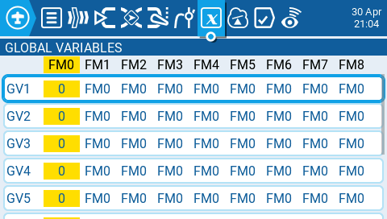
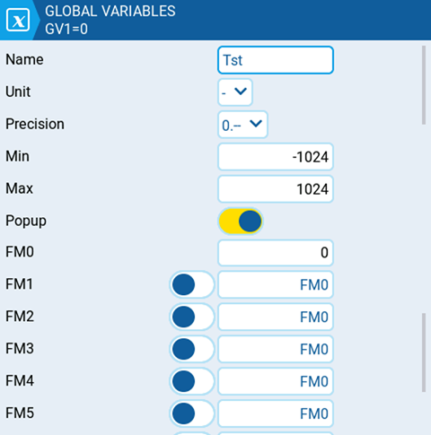
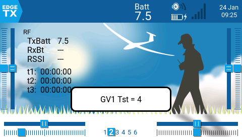

Глобальні змінні — це змінні, значення яких є спільними для всіх екранів конфігурації моделі. Їхні значення можна використовувати у налаштуваннях ваги, зсуву, диференціалу, експоненти, виходів та у порівняннях логічних перемикачів. Екран **Global Variables** у налаштуваннях моделі показує значення кожної глобальної змінної для кожного польотного режиму.

Вибір глобальної змінної на екрані глобальних змінних надасть вам наступні опції:

* **Edit** — відкриває екран конфігурації для вибраної глобальної змінної.
* **Clear** — очищає значення вибраної глобальної змінної для всіх польотних режимів.

Екран конфігурації глобальної змінної — це місце, де ви призначаєте значення та інші параметри конфігурації для глобальної змінної. Крім того, ви можете вибрати, як визначається значення глобальної змінної для кожного польотного режиму — значення задається вручну або успадковується від іншого вибраного польотного режиму. Він містить наступні параметри конфігурації:

* **Name** — назва глобальної змінної. Дозволяється використовувати три символи. Якщо залишити порожнім, як назва використовуватиметься стандартне значення GV#.
* **Unit** — (необов'язково) дозволяє додати позначку **%** до відображуваних значень, якщо вибрано. Це НЕ впливає на те, як розраховуються значення.
* **Precision** — дозволяє вибрати параметри точності чисел: цілі числа (**0.-**) та десяткові (**0.0**). Значення за замовчуванням — **0.-**
* **Min** — визначає мінімально допустиме значення для глобальної змінної.
* **Max** — визначає максимально допустиме значення для глобальної змінної.
* **Popup -** якщо увімкнено, під час зміни значення GV відображатиметься спливаюче повідомлення з новим значенням GV (див. зображення нижче).
* **FM0** — значення глобальної змінної для польотного режиму 0 (Flight Mode 0).
* **FM1 -> FM8** — залежно від того, увімкнено чи вимкнено перемикач, застосовується наступне:
  * Перемикач вимкнено — значення глобальної змінної для вибраного польотного режиму успадковується від польотного режиму, визначеного у випадаючому списку.
  * Перемикач увімкнено (підсвічено) — значення глобальної змінної для вибраного польотного режиму задається вручну в текстовому полі.

---

Джерело: [EdgeTX User Manual 2.11](https://github.com/EdgeTX/edgetx-user-manual/blob/2.11/color-radios/model-settings/global-variables.md), ліцензія [CC BY-SA 4.0](https://creativecommons.org/licenses/by-sa/4.0/). Український переклад підготовлений для dead.md.
