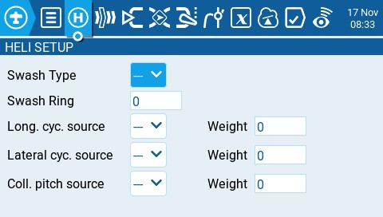

Сторінка **Heli Setup** у Model Settings — це додаткова сторінка, яка доступна у спеціально скомпільованих версіях EdgeTX. Сторінка налаштування гелікоптера часто використовується для мікшування загального кроку (CCPM), що застосовується у гелікоптерах з флайбаром, де приймач безпосередньо керує сервоприводами автомату перекосу. Більшості безфлайбарних гелікоптерів не потрібно налаштовувати цю сторінку. Виходами мікшера CCPM є CYC1, CYC2 та CYC3, які потрібно призначити на вихідний канал на екрані Mixes.

Сторінка налаштування гелікоптера має наступні параметри конфігурації:

* **Swash Type** - тип автомату перекосу для вашої моделі. Варіанти: **120, 120x, 140 та 90.**
* **Swash Ring** - встановлюйте ліміт кільця автомату перекосу лише за потреби. **1** = максимальний ліміт -> **100** або **0** = без ліміту.
* **Long. cyc. source** - виберіть джерело входу.
* **Lateral cyc.source** - виберіть джерело входу.
* **Coll. pitch source** - виберіть джерело входу.
* **Weight** - відсоткове значення ходу стіка, яке буде використовуватися.

---

Джерело: [EdgeTX User Manual 2.11](https://github.com/EdgeTX/edgetx-user-manual/blob/2.11/color-radios/model-settings/heli-setup.md), ліцензія [CC BY-SA 4.0](https://creativecommons.org/licenses/by-sa/4.0/). Український переклад підготовлений для dead.md.
