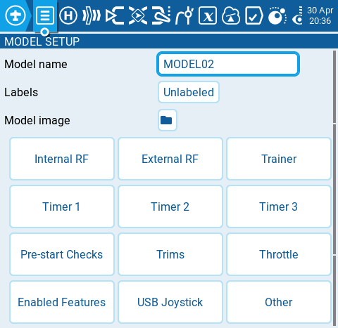

Екран **Model Settings** містить усі опції для налаштування вашої моделі. У верхній частині сторінки ви побачите іконки, які при виборі переведуть вас на різні сторінки налаштувань моделі. Екраном за замовчуванням для налаштувань моделі є екран [model-setup](model-setup/).

Іконки у верхній частині екрана включають (по порядку зліва направо):

* [Model Setup](model-setup/)
* [Heli Setup](heli-setup.md)
* [Flight modes](flight-modes.md)
* [Inputs](inputs-mixes-and-outputs/inputs.md)
* [Mixes](inputs-mixes-and-outputs/mixes.md)
* [Outputs](inputs-mixes-and-outputs/outputs.md)
* [Curves](curves.md)
* [Global Variables](global-variables.md)
* [Logical Switches](logical-switches.md)
* [Special Functions](special-functions.md)
* Custom Scripts
* [Telemetry](telemetry/)

---

Джерело: [EdgeTX User Manual 2.11](https://github.com/EdgeTX/edgetx-user-manual/blob/2.11/color-radios/model-settings/README.md), ліцензія [CC BY-SA 4.0](https://creativecommons.org/licenses/by-sa/4.0/). Український переклад підготовлений для dead.md.
