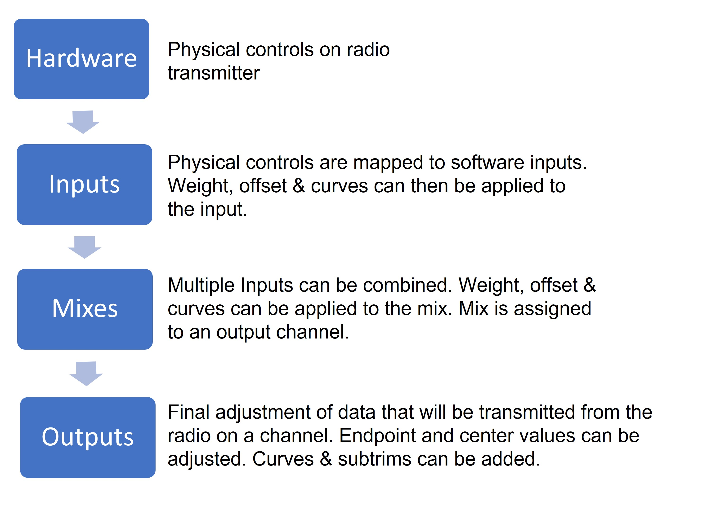
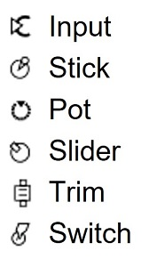

Щоб мати можливість підтримувати багато різних типів радіопередавачів, EdgeTX використовує універсальний потік даних керування, який можна застосувати до будь-якого пульта. У цьому потоці даних будь-які фізичні елементи керування пульта (стіки, перемикачі, слайдери, потенціометри) можуть бути призначені як вхідні сигнали (Inputs) у програмному забезпеченні. Ці Inputs можуть бути призначені безпосередньо або об'єднані з іншими Inputs у єдиний Mix. Ці Mixes можна змінювати, застосовуючи ваги (weights), зміщення (offsets) та криві (curves), після чого вони призначаються на канал для виводу (Outputs). Останні коригування даних керування (включаючи сабтримери, криві, кінцеві точки та центральні значення) виконуються перед остаточною відправкою даних керування на RF-модуль. Блок-схема нижче візуально підсумовує цей потік даних керування. Детальна інформація про цей потік наведена в наступних розділах [Inputs](mixes.md), [Mixes](mixes.md) та [Outputs](outputs.md).

EdgeTX використовує наведені нижче іконки для позначення різних типів джерел.

---

Джерело: [EdgeTX User Manual 2.11](https://github.com/EdgeTX/edgetx-user-manual/blob/2.11/color-radios/model-settings/inputs-mixes-and-outputs/README.md), ліцензія [CC BY-SA 4.0](https://creativecommons.org/licenses/by-sa/4.0/). Український переклад підготовлений для dead.md.
