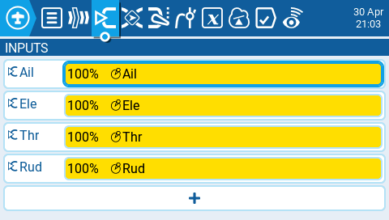
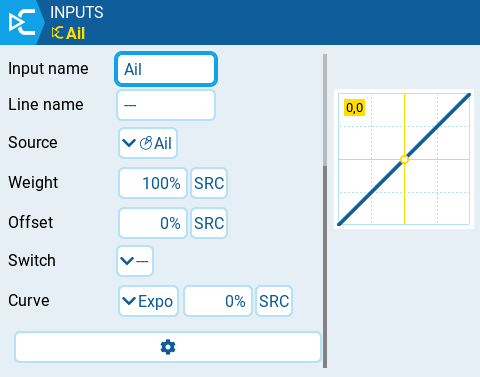
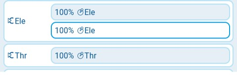
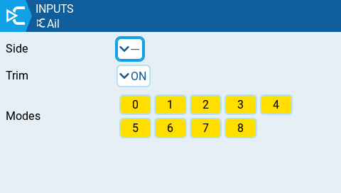

Екран **Inputs** у Model Settings — це місце, де ви призначаєте фізичні елементи керування пульта (наприклад: стіки, слайдери та потенціометри) на програмний вхід, який використовуватиметься пультом. Після призначення елемента керування до входів можна застосувати модифікатори, такі як Weight, Offset або Curve, які потім будуть застосовуватися скрізь, де використовується цей вхід. Хоча перемикачі також можна призначати як входи, зазвичай у цьому немає потреби, оскільки вихідні сигнали перемикачів рідко потребують модифікації за допомогою Weight, Offset або Curve. За замовчуванням EdgeTX автоматично призначить стіки вашого пульта на Aileron, Elevator, Throttle, Rudder на основі порядку каналів за замовчуванням, визначеного в [Radio Setup.](../../radio-settings/radio-setup/)

:::info
Ваші вхідні канали можуть мати інший порядок за замовчуванням залежно від налаштувань, визначених у [Radio Setup](../../radio-settings/radio-setup/).
:::

:::info
Розділ Inputs також часто називають "**Dual Rates"**, оскільки саме так він називався в попередніх версіях OpenTX.
:::

Натискання **кнопки** **+** покаже вам список доступних входів, які можна налаштувати. Після вибору входу відкриється сторінка налаштування для цього входу. Вибір існуючого входу надасть вам такі опції:

* **Edit** — відкриває сторінку налаштування для цього рядка входу.
* **Insert before** — вставляє новий рядок входу перед вибраним входом.
* **Insert after** — вставляє новий рядок входу після вибраного входу.
* **Copy** — копіює вибраний рядок входу.
* **Move** — вибирає рядок входу для переміщення. Вхід переміщується за допомогою однієї з команд вставлення після вибору нового рядка (тобто вирізати та вставити).
* **Delete** — видаляє вибраний рядок входу.
* **Paste before** — вставляє скопійований або переміщений рядок входу перед вибраним рядком входу.
* **Paste after** — вставляє скопійований або переміщений рядок входу перед вибраним рядком входу.

### Сторінка налаштування входу

Сторінка налаштування входу дозволяє редагувати параметри конфігурації входу. Праворуч від параметрів налаштування ви можете бачити графік у реальному часі, який показує, як ваші параметри вплинуть на нахил входу.

* **Input Name** — назва входу. Можна використовувати до чотирьох символів.
* **Line Name** — назва окремого рядка у вході. Кілька фізичних входів можна призначити на один вхід, додавши додатковий рядок входу під цим входом.

* **Source** — фізичний елемент керування, що використовується для входу. Окрім фізичних елементів керування, ви також можете вказати MAX (завжди повертає 100), MIN (завжди повертає -100), циклики (cyclics), перемикачі тримів, значення каналів та інше. Рух фізичним елементом керування після вибору джерела автоматично призначить його на цей вхід.
* **Weight** — відсоткове значення ходу стіка, яке буде використовуватися (часто називають "рейтами"). Окрім відсоткового значення, ви можете використовувати інші входи, фізичні елементи керування, MAX (завжди повертає 100), MIN (завжди повертає -100), циклики, перемикачі тримів, значення каналів та інше, використовуючи кнопку "SRC".
* **Offset** — значення, яке додається або віднімається від джерела входу. Окрім відсоткового значення, ви можете використовувати інші входи, фізичні елементи керування, MAX (завжди повертає 100), MIN (завжди повертає -100), циклики, перемикачі тримів, значення каналів та інше, використовуючи кнопку "SRC".
* **Switch** — перемикач, який активує рядок входу. Якщо перемикачі не визначені, він завжди активний.
* **Curve** — визначає тип кривої, яка буде використовуватися. Існують такі варіанти кривих:
  * **Diff** — множить на вказаний % лише діапазон вище або нижче середини (0). Окрім відсоткового значення, ви можете використовувати інші входи, фізичні елементи керування, MAX (завжди повертає 100), MIN (завжди повертає -100), циклики, перемикачі тримів, значення каналів та інше, використовуючи кнопку "SRC".
  * **Expo** — вхідне значення змінюється експоненціально. Збільшення % призведе до пологого нахилу біля середини (0). Зменшення % призведе до крутого нахилу біля середини (0). При 0% нахил буде лінійним. Окрім відсоткового значення, ви можете використовувати інші входи, фізичні елементи керування, MAX (завжди повертає 100), MIN (завжди повертає -100), циклики, перемикачі тримів, значення каналів та інше, використовуючи кнопку "SRC".
  * **Func** —

    | Function | Slope Behavior |
    | --- | --- |
    | `---` | Нахил буде лінійним. |
    | `X>0` | Діапазон нижче середини (0) завжди дорівнює 0. Вище середини (0) нахил лінійний. |
    | `X<0` | Діапазон вище середини (0) завжди дорівнює 0. Нижче середини (0) нахил лінійний. |
    | `|X|` | У діапазоні вище середини (0) реакція лінійна. Знак інвертується в діапазоні нижче середини (0). Крива малює V-подібний графік. |
    | `f>0` | Діапазон вище середини (0) завжди дорівнює +100. Діапазон нижче середини (0) завжди дорівнює 0. Вихідне значення завжди буде або 0, або +100. |
    | `f<0` | Діапазон вище середини (0) завжди дорівнює 0. Діапазон нижче середини (0) завжди дорівнює -100. Вихідне значення завжди буде або 0, або -100. |
    | `|f|` | Діапазон вище середини (0) завжди дорівнює +100. Діапазон нижче середини (0) завжди дорівнює -100. Вихідне значення завжди буде або +100, або -100. |
  * **Cstm** — призначає користувацьку криву. Дивіться [Curves](../curves.md) для отримання додаткової інформації про користувацькі криві.

:::info
Значення для Weight, Offset та % Curve також можуть бути визначені налаштованими глобальними значеннями (global values). Натискання кнопки **GV** відобразить список налаштованих глобальних значень для вибору.
:::

При виборі кнопки із шестірнею внизу екрана відобразиться наступне вікно опцій.

**Side** — визначає діапазон входу, для якого дійсне налаштування цього рядка. Якщо ви виберете `---`, воно буде дійсним у всьому діапазоні значень Source. Якщо ви виберете `x>0`, воно буде дійсним у верхній половині значень Source. Якщо ви виберете `x<0`, воно буде дійсним у нижній половині значень Source.

**Trim** — визначає, чи включати значення тримів у цей вхід. Крім того, ви можете вибрати інший трим для використання з цим входом.

**Modes** — визначає, для яких польотних режимів (Flight Modes) активний цей вхід.

---

Джерело: [EdgeTX User Manual 2.11](https://github.com/EdgeTX/edgetx-user-manual/blob/2.11/color-radios/model-settings/inputs-mixes-and-outputs/inputs.md), ліцензія [CC BY-SA 4.0](https://creativecommons.org/licenses/by-sa/4.0/). Український переклад підготовлений для dead.md.
