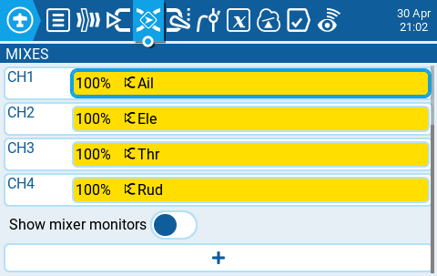
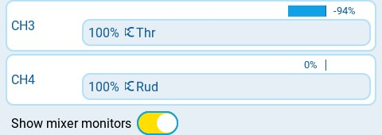
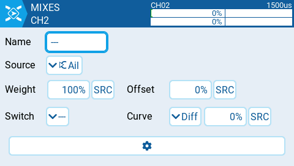
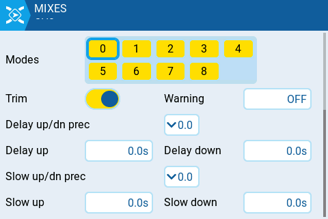

Екран **Mixes** у налаштуваннях моделі (Model Settings) — це місце, де кілька входів (Inputs) можна об'єднати в один «мікс каналу» (Channel Mix). Потім ці мікси призначаються радіоканалу для виведення. Це також місце, де перемикачі, крутилки або слайдери призначаються каналу для виведення. Подібно до розділу Inputs, міксу каналу також можна призначити вагу (weight), зміщення (offset) або криву (curve).

Натискання **кнопки** **+** створить новий мікс і відкриє сторінку конфігурації міксів. Вибір існуючого міксу надасть вам такі опції:

* **Edit** - відкриває сторінку конфігурації міксів для цього рядка міксу.
* **Insert before** - вставляє новий рядок міксу перед вибраним міксом.
* **Insert after** - вставляє новий рядок міксу після вибраного міксу.
* **Copy** - копіює вибраний рядок міксу.
* **Move** - вибирає рядок міксу для переміщення; мікс переміщується за допомогою однієї з команд вставки після вибору нового рядка (тобто вирізати та вставити).
* **Delete** - видаляє вибраний рядок міксу.
* **Paste before** - вставляє скопійований або переміщений рядок міксу перед вибраним рядком міксу.
* **Paste after** - вставляє скопійований або переміщений рядок міксу після вибраного рядка міксу.

**Show mixer monitors** - вибір цієї опції відобразить гістограму на каналах міксу, що показує поточне значення для цього каналу міксу.

У верхній правій частині сторінки конфігурації міксів знаходиться монітор каналу для вибраного рядка міксу. Він показує значення виходу (зверху) та міксу (знизу). Також доступні такі опції конфігурації:

* **Name** - назва міксу (необов'язково). Допускається до 6 символів.
* **Source** - джерело для міксу. Окрім Inputs, ви можете вибрати стіки, потенціометри (pots), слайдери, трими, фізичні та логічні перемикачі (Logical Switches), виходи мікшера гелікоптера (heli mixer outputs), значення каналів імпорту тренера (trainer import) та інші канали, використовуючи кнопку "SRC".
* **Weight** - відсоток значення джерела, який буде використано. Окрім відсоткового значення, ви можете вибрати стіки, потенціометри, слайдери, трими, фізичні та логічні перемикачі, виходи мікшера гелікоптера, значення каналів імпорту тренера та інші канали, використовуючи кнопку "SRC".
* **Offset** - значення, що додається до джерела або віднімається від нього. Окрім фіксованого значення, ви можете вибрати стіки, потенціометри, слайдери, трими, фізичні та логічні перемикачі, виходи мікшера гелікоптера, значення каналів імпорту тренера та інші канали, використовуючи кнопку "SRC".
* **Switch** - фізичний перемикач, який активує цей рядок міксу (необов'язково). Якщо перемикач не вибрано, мікс буде активним за замовчуванням.
* **Curve** - визначає тип кривої, яка буде використовуватися. Дивіться розділ **Curve** на сторінці [Inputs](inputs.md) для детального пояснення різних типів кривих.

* **Multiplex** - налаштування мультиплексування визначає, як поточний рядок мікшера взаємодіє з іншими на тому ж каналі. **Add** додасть свій вихід до них, **Multiply** помножить результат рядків над ним, а **Replace** замінить своїм виходом усе, що було зроблено до нього.
* **Modes** - визначає, для яких польотних режимів (Flight Modes) активний цей мікс.
* **Trim** - визначає, чи включати значення тримів у цей мікс. Щоб значення тримів були включені, поле триму для відповідного входу також має бути увімкнене на екрані **Inputs**.
* **Warning** - якщо вибрано, пульт буде подавати звуковий сигнал, коли цей мікс активний. Ви можете вибрати OFF (0) або шаблони звукових сигналів 1, 2, 3.
* **Delay up/dn pre** (точність) - змінює точність для Delay up/dn між 0.0 та 0.00.
* **Delay up** - створює часову затримку в секундах між моментом збільшення значення джерела та його виведенням.
* **Delay down** - створює часову затримку в секундах між моментом зменшення значення джерела та його виведенням.
* **Slow up/dn pre** (точність) - змінює точність для Slow up/dn між 0.0 та 0.00.
* **Slow up** - регулює швидкість переходу при збільшенні значення джерела. Вкажіть час переходу від -100% до +100% у секундах. Ви можете вказати діапазон від 0.00 до 25.00 секунд.
* **Slow down** - регулює швидкість переходу при зменшенні значення джерела. Вкажіть час переходу від -100% до +100% у секундах. Ви можете вказати діапазон від 0.0 до 25.0 секунд.

---

Джерело: [EdgeTX User Manual 2.11](https://github.com/EdgeTX/edgetx-user-manual/blob/2.11/color-radios/model-settings/inputs-mixes-and-outputs/mixes.md), ліцензія [CC BY-SA 4.0](https://creativecommons.org/licenses/by-sa/4.0/). Український переклад підготовлений для dead.md.
