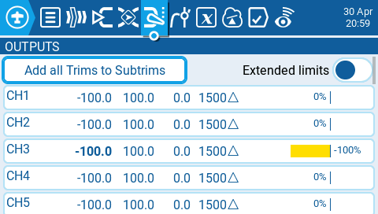
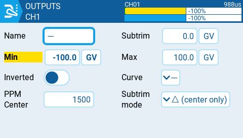

На екрані **Outputs** у **Model Settings** виконуються кінцеві налаштування даних керування (включаючи сабтрими, криві, кінцеві точки та значення центру) перед їх остаточною відправкою до RF-модуля. Саме тут налаштовуються центр каналу, ліміти (щоб запобігти заклинюванню сервоприводів) та напрямок виходу.

:::info
**Trim** (трим) — це тимчасове коригування керування польотом, яке зазвичай виконується під час роботи за допомогою перемикача тримера. **Subtrim** (сабтрим) — це напівпостійне коригування керування польотом, яке зазвичай налаштовується під час створення моделі в налаштуваннях виходів.
:::

Екран виходів показує всі налаштовані вихідні канали. Для кожного рядка виходу відображаються значення мінімального та максимального лімітів, сабтрим, центральна точка, режим сабтриму та монітор каналу. На сторінці виходів також доступні дві наведені нижче опції:

* **Add all Trims to Subtrims** — якщо вибрано, додає поточне значення триму до значення сабтриму для кожного налаштованого виходу. Після цього значення триму скидається до нуля.
* **Extended Limits** — якщо ввімкнено, збільшує мінімальний та максимальний діапазон для вихідних значень до -150 та 150. Розширені ліміти необхідні, якщо повний діапазон руху керуючої поверхні не може бути досягнутий зі стандартними лімітами.

Вибір рядка виходу надасть вам наступні опції:

* **Edit** — відкриває екран налаштування виходу.
* **Reset** — встановлює значення сабтриму назад на нуль. Значення триму не змінюється.
* **Copy Sticks to Subtrim** — додає поточне значення відхилення стіка як значення сабтриму.
* **Copy Trims to Subtrim** — додає поточне значення триму до значення сабтриму. Значення триму не змінюється.

Екран налаштування виходу має наступні параметри конфігурації:

* **Name** — ім'я для виходу, до 6 символів.
* **Subtrim** — значення сабтриму (макс. 100). Його також можна встановити як глобальну змінну, натиснувши кнопку "GV", а потім вибравши потрібну глобальну змінну з випадного меню.
* **Min** — мінімальний ліміт виходу. Зазвичай використовується для запобігання заклинюванню сервоприводів на моделях, які використовують сервоприводи для керуючих поверхонь. Цей рядок буде відображатися **жирним шрифтом і підсвічуватися**, якщо вхід для цього каналу знаходиться в нижній половині діапазону.
* **Max** — максимальний ліміт виходу. Зазвичай використовується для запобігання заклинюванню сервоприводів на моделях, які використовують сервоприводи для керуючих поверхонь. Цей рядок буде відображатися **жирним шрифтом і підсвічуватися**, якщо вхід для цього каналу знаходиться у верхній половині діапазону.
* **Inverted** — виберіть цю опцію, якщо хочете інвертувати вихідне значення.
* **Curve** — вкажіть користувацьку криву (якщо є), яку ви хочете використовувати для цього виходу. Дивіться розділ [Curves](../curves.md) для отримання додаткової інформації про криві, визначені користувачем.
* **PPM Center** — вкажіть значення ширини імпульсу для центрального значення вихідного каналу (від 1000 до 2000). Зміна цього параметра зсуне весь вихідний діапазон, включаючи верхній та нижній ліміти.
* **Subtrim mode** — визначає, як значення сабтриму впливає на мінімальні/максимальні вихідні значення. Є дві опції:
  * **Center Only** — зсувається лише центральне значення, а верхній та нижній ліміти не змінюються. Реакція стіка відрізняється у верхній та нижній половинах від середньої точки.
  * **Symmetrical** — верхній та нижній ліміти будуть зсуватися відповідно до зсуву центрального значення. Реакція стіка однакова по обидва боки від середньої точки.

---

Джерело: [EdgeTX User Manual 2.11](https://github.com/EdgeTX/edgetx-user-manual/blob/2.11/color-radios/model-settings/inputs-mixes-and-outputs/outputs.md), ліцензія [CC BY-SA 4.0](https://creativecommons.org/licenses/by-sa/4.0/). Український переклад підготовлений для dead.md.
