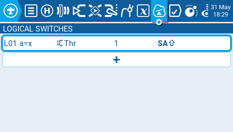
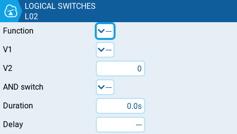

Логічні перемикачі (Logical Switches) — це віртуальні двопозиційні перемикачі, значення яких (ON/OFF або +100/-100) базуються на обчисленні (true/false) заданого логічного виразу. Після налаштування логічні перемикачі можна використовувати будь-де в EdgeTX, де можна призначити фізичний перемикач.

Сторінка **Logical Switches** у налаштуваннях моделі показує всі налаштовані логічні перемикачі, а також огляд їхніх параметрів.

Натискання кнопки **+** дозволить вам вибрати невикористаний логічний перемикач для налаштування.

Вибір налаштованого логічного перемикача відкриє наступні опції:

* **Edit** — відкриває сторінку налаштування для вибраного логічного перемикача.
* **Copy** — копіює вибраний логічний перемикач.
* **Paste** — вставляє скопійований логічний перемикач у вибраний. Примітка: це перезапише вибраний логічний перемикач.
* **Clear** — видаляє всі налаштування для вибраного логічного перемикача.

Після вибору редагування логічного перемикача вам будуть доступні такі параметри налаштування:

* **Func** — логічна функція, яку ви хочете використати. Дивіться розділ [Функції логічних перемикачів](logical-switches.md#logical_switches_judgment_conditions_and_logical_expressions) нижче для опису можливих функцій.
* **V1** — перша змінна у виразі для обчислення.
* **V2** — друга змінна у виразі для обчислення.
* **AND switch** — перемикач, який має бути активним, щоб дозволити обчислення логічного перемикача для активації.
* **Duration** — тривалість, протягом якої логічний перемикач залишатиметься активним (true) після виконання умов активації. Якщо встановлено 0.0, логічний перемикач залишатиметься активним (true).
* **Delay** — затримка між моментом виконання умов активації логічного перемикача та його переходом в активований стан (true).
* **Persistence** **(тільки для Sticky Switch)** — зберігає значення "липкого" перемикача (sticky switch) під час вимкнення пульта або зміни моделі, та відновлює збережене значення після увімкнення живлення або повторного вибору моделі.

### Функції логічних перемикачів 

У виразі a та b представляють джерела (стіки, перемикачі тощо), а x представляє константи (значення) для порівняння.

<table><thead><tr><th width="137">Вираз</th><th width="606">Опис</th></tr></thead><tbody><tr><td>a=x</td><td>True, коли джерело V1 точно дорівнює константі V2.</td></tr><tr><td>a~x</td><td>True, коли джерело V1 приблизно дорівнює константі V2.</td></tr><tr><td>a>x</td><td>True, коли джерело V1 більше за константу V2.</td></tr><tr><td>a&#x3C;x</td><td>True, коли джерело V1 менше за константу V2.</td></tr><tr><td>|a|>x</td><td>True, коли абсолютне значення джерела V1 більше за константу V2.</td></tr><tr><td>|a|&#x3C;x</td><td>True, коли абсолютне значення джерела V1 менше за константу V2.</td></tr><tr><td>AND</td><td>True, коли обидва джерела V1 та V2 є TRUE.</td></tr><tr><td>OR</td><td>True, коли будь-яке з джерел V1 або V2 є TRUE.</td></tr><tr><td>XOR</td><td>True, коли позиції джерел V1 та V2 не збігаються.</td></tr><tr><td>Edge</td><td>Короткочасно стає true, коли джерело V1 було активним протягом визначеного періоду часу, а потім деактивовано. Перше поле часу (T1) під V1 — це мінімальна тривалість активності, необхідна для того, щоб джерело V1 активувало логічний перемикач. Другий час (T2) — це максимальний дозволений час активності джерела V1 для активації логічного перемикача. Якщо для T2 встановлено --, логічний перемикач буде true незалежно від того, як довго V1 був активним. Якщо для T2 встановлено 3, і V1 активний більше 3 секунд, логічний перемикач не стане true після деактивації джерела. Якщо для T2 встановлено &#x3C;&#x3C;, логічний перемикач стане true, коли будуть виконані часові умови в T1, без деактивації джерела V1.</td></tr><tr><td>a=b</td><td>True, коли джерело V1 дорівнює джерелу V2.</td></tr><tr><td>a>b</td><td>True, якщо джерело V1 більше за джерело V2.</td></tr><tr><td>a&#x3C;b</td><td>True, якщо джерело V1 менше за джерело V2.</td></tr><tr><td>△>x</td><td>Короткочасно стає true щоразу, коли джерело V1 змінюється на величину, більшу за вказану константою V2. </td></tr><tr><td>|△|>x</td><td>Короткочасно стає true щоразу, коли абсолютне значення джерела V1 змінюється на величину, більшу за вказану константою V2.</td></tr><tr><td>Timer</td><td>Короткочасно стає true кожні xxx секунд. Аргумент V1 — це тривалість, протягом якої логічний перемикач є true (активним). Аргумент V2 — це час між активаціями логічного перемикача. Повторює цикл таймера, доки визначений перемикач є активним.</td></tr><tr><td>Stky (Sticky)</td><td>"Прилипає" (стає true) після того, як перемикач V1 стає активним (true), і залишається активним (true) незалежно від позиції V1, доки перемикач V2 не буде активовано (true), що "відліплює" або деактивує (false) логічний перемикач. Має опцію Persistence, яка дозволяє зберігати значення логічного перемикача під час циклів вимкнення/увімкнення живлення або при перемиканні на іншу модель і назад. </td></tr></tbody></table>

---

Джерело: [EdgeTX User Manual 2.11](https://github.com/EdgeTX/edgetx-user-manual/blob/2.11/color-radios/model-settings/logical-switches.md), ліцензія [CC BY-SA 4.0](https://creativecommons.org/licenses/by-sa/4.0/). Український переклад підготовлений для dead.md.
