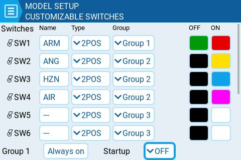

Традиційний 6-позиційний перемикач/елемент керування — це або група з 6 перемикачів, які працюють разом (де лише один може бути активним одночасно), або один поворотний перемикач, який має шість фізичних позицій (фіксацій). Деякі пульти новішого покоління надають можливість "Customizable Switch" (кастомізованих перемикачів), яка дозволяє визначати тип, групування та початковий стан перемикачів. Фізично вони виглядають як звичайний 6-позиційний перемикач, який можна побачити на старих дизайнах пультів, але вони набагато, _**набагато**_ гнучкіші.

:::info
Якщо вам дійсно потрібно, щоб кастомізовані перемикачі поводилися **точно** як традиційний перемикач 6POS, вам потрібно налаштувати шість кастомізованих перемикачів в одну групу, встановити для цієї групи значення "Always On", а Startup для групи встановити на перший перемикач. Тоді ви зможете використовувати, наприклад, GR1 замість 6POS.
:::

**Name:** Будь-яке трилітерне ім'я, яке ви бажаєте дати кожному кастомізованому перемикачу.

**Type:** Може бути встановлено в одне з наступних значень:

* **None** : фактично вимкнено
* **Toggle** : кастомізований перемикач "активний" лише під час натискання
* **2POS** : натискання перемикача змінюватиме його стан. Тобто OFF, натискання, ON, натискання, OFF...

**Group:** Тут ви вибираєте, як окремі перемикачі мають бути згруповані. Ви можете вибрати для них одну групу (за замовчуванням, Group 1), і тоді їх можна буде використовувати як традиційний перемикач 6POS. Або ви можете визначити їх в окремі групи (наприклад, як показано для SW1-SW3 та SW4-SW5 вище), або навіть зробити так, щоб деякі перемикачі взагалі не входили до жодної групи (наприклад, SW6, як показано вище). \
\
Ви можете використовувати різні групи як джерело для Inputs або Mixes за допомогою опції GR#, де # означає номер групи (наприклад, GR1, GR2).

Коли перемикачі згруповані, лише один перемикач у групі може бути активним одночасно. Крім того, ви можете вказати, що один перемикач у групі має бути завжди увімкненим — **"Always on"**.

**Startup:** Тут ви вказуєте початковий стан для кастомізованого перемикача 2POS, який не входить до групи, або для групи кастомізованих перемикачів. Ви можете вказати значення "Last" (запам'ятати останній стан, коли пульт було вимкнено або змінено модель) або стан вгору (відпущено) чи вниз (натиснуто).

**OFF / ON Colors (на сумісних пультах):** Деякі пульти підтримують налаштування кольору кастомізованих перемикачів. Якщо так, для кожного кастомізованого перемикача відображатимуться палітри кольорів OFF та ON (як показано нижче), і ви зможете вибрати бажаний колір для кожного стану. Чорний колір означає, що кастомізований перемикач не підсвічується.

---

Джерело: [EdgeTX User Manual 2.11](https://github.com/EdgeTX/edgetx-user-manual/blob/2.11/color-radios/model-settings/model-setup/customizable-switches.md), ліцензія [CC BY-SA 4.0](https://creativecommons.org/licenses/by-sa/4.0/). Український переклад підготовлений для dead.md.
