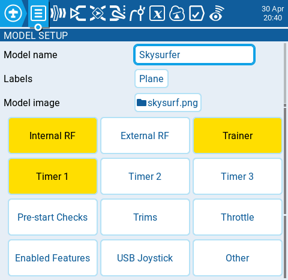

Сторінка **model setup** є сторінкою за замовчуванням для налаштувань моделі, і саме з неї ви починаєте конфігурацію вашої моделі. Вона містить наступні налаштування:

#### Model name

Введіть бажане ім'я для моделі. Максимальна кількість символів — 15.

#### Labels

Тут ви можете призначити мітку зі списку визначених вами міток. За замовчуванням мітка моделі буде **Unlabeled.** Більше інформації про створення міток можна знайти на сторінці [select-model.md](../../select-model.md).

#### Model image

При виборі іконки папки з'явиться вікно, яке дозволить вам вибрати файл зображення з папки зображень на вашій SD-карті.

:::info
Щоб уникнути проблем із продуктивністю, розмір зображення моделі не повинен перевищувати 192 x 114 пікселів. Для отримання додаткової інформації щодо вимог до зображень моделі, будь ласка, перегляньте частину **Images** у розділі [SD Card](../../radio-settings/sd-card.md).
:::

:::info
[https://www.skyraccoon.com/](https://www.skyraccoon.com/) має велике сховище безкоштовних файлів зображень, які можна використовувати з EdgeTX.
:::

:::info
Увімкнені RF Modules, Trainer та Timers відображатимуться підсвіченими на екрані Model Setup.
:::

---

Джерело: [EdgeTX User Manual 2.11](https://github.com/EdgeTX/edgetx-user-manual/blob/2.11/color-radios/model-settings/model-setup/README.md), ліцензія [CC BY-SA 4.0](https://creativecommons.org/licenses/by-sa/4.0/). Український переклад підготовлений для dead.md.
