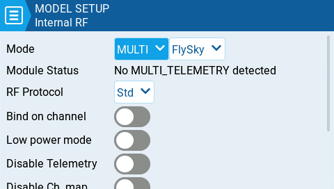
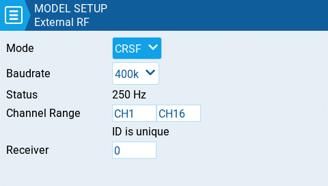

Налаштування конфігурації для сторінок Internal та External RF працюють однаково. Єдина відмінність полягає в тому, що розділ **Internal RF** призначений для налаштування вбудованого модуля, а розділ **External RF** — для налаштування RF-модуля у зовнішньому відсіку.

Модулі Internal / External RF є "активними" для моделі, коли кнопки жовті, і неактивними, коли вони білі.

#### Receiver number

Номер приймача (Receiver number) — це призначений користувачем номер для моделі, який надсилається на приймач під час бінду. Кожна модель повинна мати унікальний номер приймача. Однак моделі, що використовують різні протоколи, можуть мати однаковий номер приймача без жодних проблем. EdgeTX повідомить вас, чи є номер приймача унікальним, або чи він вже використовується, за допомогою тексту над полем номера.

:::warning
Якщо пульт використовується в режимі геймпада, як внутрішній, так і зовнішній RF-модулі мають бути вимкнені. Це призведе до підвищення продуктивності при підключенні до комп'ютера через USB.
:::

#### Mode Options

* **Off** - RF-модуль не використовується
* **PPM** - Pulse position modulation (імпульсно-позиційна модуляція), використовується багатьма універсальними JR-сумісними модулями.
  * **Telemetry** - Без телеметрії або MLink
  * **Channel Range** - Канали, які будуть використовуватися.
  * **PPM Frame** – Довжина кадру, довжина імпульсу та полярність PPM-кадру. Довжина кадру автоматично налаштовується на правильне значення при зміні кількості передаваних каналів. Однак це автоматично призначене значення можна змінити вручну.
* **XJT** -
  * **Protocol** - D16, B8, LR2
  * **Channel Range** - Канали, які будуть використовуватися.
  * **Failsafe Mode** - Доступно в протоколі D16. Приймач використовуватиме це налаштування, коли сигнал передавача не отримується (втрата сигналу).
    * **Not Set** - режим failsafe не встановлено.
    * **Hold** – Приймач утримує значення каналів у стані, який був останнім отриманий від передавача.
    * **No pulses** – PWM-імпульси не виводяться.
    * **Receiver** – Дотримується налаштувань failsafe, сконфігурованих на приймачі. Дотримуйтесь інструкцій, що постачаються з приймачем.
    * **Custom** – Приймач змінює значення каналів на задані користувачем значення.
      * **Custom Set** – Кожен канал може мати власне налаштування. Доступні варіанти: конкретне значення, hold та no pulses.
  * **Receiver Number** - призначений користувачем номер для моделі, який надсилається на приймач під час бінду
  * **Bind** - Переводить передавач у режим бінду. У цьому режимі передавач видаватиме короткий звуковий сигнал кожні 2,5 секунди.
  * **Range** . Переводить передавач у режим перевірки дальності. У цьому режимі відображається значення RSSI і лунає звуковий сигнал кожні 5 секунд.
* **DSM2**
  * **Protocol** - LP45, DSM2, DSMX
  * **Channel Range** - Канали, які будуть використовуватися.
  * **Receiver Number** - призначений користувачем номер для моделі, який надсилається на приймач під час бінду
  * **Bind** - Переводить передавач у режим бінду. У цьому режимі передавач видаватиме короткий звуковий сигнал кожні 2,5 секунди.
  * **Range** . Переводить передавач у режим перевірки дальності. У цьому режимі відображається значення RSSI і лунає звуковий сигнал кожні 5 секунд.
* **CRSF**
  * **Baud Rate** - швидкість, з якою обмінюються даними модуль передавача та пульт.
  * **Status** - Показує статус пакетної передачі (packet radio), налаштованої на модулі передавача.
  * **Channel Range** - Канали, які будуть використовуватися.
  * **Receiver Number** - призначений користувачем номер для моделі, який надсилається на приймач під час бінду
* **Multi** - Мультипротокольний модуль (Multiprotocol Module). Опції конфігурації є унікальними для кожного обраного протоколу. Опції конфігурації для мультипротокольного модуля описані тут: [https://www.multi-module.org/using-the-module/protocol-options](https://www.multi-module.org/using-the-module/protocol-options)
* **R9M**
  * **Mode** - FCC, EU, 868MHz, 915 MHZ
  * **Failsafe Mode** - Приймач використовуватиме це налаштування, коли сигнал передавача не отримується (втрата сигналу).
    * **Not Set** - режим failsafe не встановлено.
    * **Hold** – Приймач утримує значення каналів у стані, який був останнім отриманий від передавача.
    * **No pulses** – PWM-імпульси не виводяться.
    * **Receiver** – Дотримується налаштувань failsafe, сконфігурованих на приймачі. Дотримуйтесь інструкцій, що постачаються з приймачем.
    * **Custom** – Приймач змінює значення каналів на задані користувачем значення.
      * **Custom Set** – Кожен канал може мати власне налаштування. Доступні варіанти: конкретне значення, hold та no pulses.
  * **Receiver Number** - призначений користувачем номер для моделі, який надсилається на приймач під час бінду
  * **Bind** - Переводить передавач у режим бінду. У цьому режимі передавач видаватиме короткий звуковий сигнал кожні 2,5 секунди.
  * **Range** . Переводить передавач у режим перевірки дальності. У цьому режимі відображається значення RSSI і лунає звуковий сигнал кожні 5 секунд.
  * **RF Power** - Вихідна потужність модуля передавача. Опції змінюються залежно від обраного режиму.
* **R9M Access    Note:** Щоб режим **R9M ACCESS** був видимим у випадаючому списку режимів&#x6E;**,** послідовний порт AUX1 або AUX2 має бути налаштований як **External Module** на сторінці [Hardware](../../radio-settings/hardware.md).
  * **Channel Range** - Канали, які будуть використовуватися.
  * **Failsafe Mode** - Приймач використовуватиме це налаштування, коли сигнал передавача не отримується (втрата сигналу).
    * **Not Set** - режим failsafe не встановлено.
      * **Hold** – Приймач утримує значення каналів у стані, який був останнім отриманий від передавача.
      * **No pulses** – PWM-імпульси не виводяться.
      * **Receiver** – Дотримується налаштувань failsafe, сконфігурованих на приймачі. Дотримуйтесь інструкцій, що постачаються з приймачем.
      * **Custom** – Приймач змінює значення каналів на задані користувачем значення.
        * **Custom Set** – Кожен канал може мати власне налаштування. Доступні варіанти: конкретне значення, hold та no pulses
  * **Module -** _Будь ласка, зверніться до документації FrSky щодо цих налаштувань конфігурації_
    * Register
      * Range
      * Options
  * **Receiver No (Number)** - призначений користувачем номер для моделі, який надсилається на приймач під час бінду
  * **Bind** - Переводить передавач у режим бінду. У цьому режимі передавач видаватиме короткий звуковий сигнал кожні 2,5 секунди.
* **GHST** - ImmersionRC Ghost
  * **Channel Range** - Канали, які будуть використовуватися.
  * **Raw 12 bits** - увімкнути 12-бітний режим
* **SBUS**
  * **Channel Range** - Канали, які будуть використовуватися.
  * **Refresh Rate** - Частота оновлення в мілісекундах
    * **Inversion** - Normal, Non-inverted
* **FLYSKY**
  * **Protocol** - AFHDS3, AFHDS2A
  * **Module Status** - Статус модуля
  * **Type** - _Будь ласка, зверніться до документації FLYSKY щодо цих налаштувань конфігурації_
    * **Module Options**- _Будь ласка, зверніться до документації FLYSKY щодо цих налаштувань конфігурації_
  * **Channel Range** - Канали, які будуть використовуватися.
  * **Failsafe Mode** - Приймач використовуватиме це налаштування, коли сигнал передавача не отримується (втрата сигналу).
    * **Not Set** - режим failsafe не встановлено.
    * **Hold** – Приймач утримує значення каналів у стані, який був останнім отриманий від передавача.
    * **No pulses** – PWM-імпульси не виводяться.
    * **Receiver** – Дотримується налаштувань failsafe, сконфігурованих на приймачі. Дотримуйтесь інструкцій, що постачаються з приймачем.
    * **Custom** – Приймач змінює значення каналів на задані користувачем значення.
      * **Custom Set** – Кожен канал може мати власне налаштування. Доступні варіанти: конкретне значення, hold та no pulses.
  * **Receiver (number)** - призначений користувачем номер для моделі, який надсилається на приймач під час бінду
  * **Bind** - Переводить передавач у режим бінду. У цьому режимі передавач видаватиме короткий звуковий сигнал кожні 2,5 секунди.
* **LemonRx DSMP**
  * **Channel Range** - Канали, які будуть використовуватися.
  * **Bind** - Переводить передавач у режим бінду. У цьому режимі передавач видаватиме короткий звуковий сигнал кожні 2,5 секунди.
  * **Range** . Переводить передавач у режим перевірки дальності. У цьому режимі відображається значення RSSI і лунає звуковий сигнал кожні 5 секунд.

---

Джерело: [EdgeTX User Manual 2.11](https://github.com/EdgeTX/edgetx-user-manual/blob/2.11/color-radios/model-settings/model-setup/internal-external-rf.md), ліцензія [CC BY-SA 4.0](https://creativecommons.org/licenses/by-sa/4.0/). Український переклад підготовлений для dead.md.
