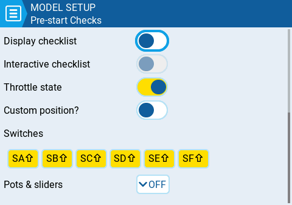

Щоразу, коли завантажується нова модель, EdgeTX виконуватиме передпольотні перевірки на основі налаштувань на цій сторінці. Якщо будь-яка з перевірок не пройдена, EdgeTX видасть користувачеві звукове та візуальне попередження, яке необхідно підтвердити перед використанням моделі. Можна налаштувати наступні передпольотні перевірки:

**Display checklist** - Коли вибрано цю опцію, під час завантаження моделі відображатиметься [файл нотаток моделі](https://github.com/EdgeTX/edgetx-user-manual/blob/2.11/edgetx-how-to/model-notes-and-checklists.md).

**Interactive checklist** - Ця опція використовується разом з опцією **Display checklist**. Коли вибрано цю опцію, будь-який рядок тексту у файлі контрольного списку, що починається з `=`, відображатиметься як чекбокс під час показу контрольного списку. Усі відображені чекбокси мають бути **відмічені** (вибрані), щоб закрити контрольний список.

**Throttle state** - Якщо вибрано, пульт перевірятиме, чи знаходиться газ на мінімальному значенні діапазону для джерела газу, налаштованого в меню [Throttle](throttle.md).

**Custom Position?** - Коли вибрано цю опцію, з'явиться числове поле, в якому можна налаштувати визначене користувачем значення для перевірки стану газу.

**Switches** - Цей розділ відображає всі перемикачі, налаштовані на пульті, і дозволяє вибрати, яке положення є правильним для перевірки стану перемикача. Вибір перемикача буде циклічно перемикати доступні положення або повністю вимкне перевірку для цього перемикача. Жовті перемикачі мають активовану перевірку положення. Білі перемикачі — деактивовані. Довге натискання (або дотик) **\[Enter]**, коли цей розділ виділено, встановить усі положення перемикачів відповідно до їхніх поточних фізичних положень.

**Pots & Sliders** - Коли активовано, ця опція перевіряє положення потенціометрів та слайдерів. Є три варіанти - OFF, ON та AUTO. Якщо у випадаючому меню вибрано ON або AUTO, з'являться кнопки для доступних потенціометрів та слайдерів.

* **OFF** - Положення потенціометрів та слайдерів не перевіряються.
* **ON** - Положення перевіряються відповідно до вручну налаштованих положень потенціометрів та слайдерів, які встановлені як активні (жовті). Щоб вручну встановити положення для перевірки, виберіть ON у випадаючому меню, встановіть потенціометри та слайдери в потрібне положення і активуйте їх, вибравши їх (стануть жовтими).
* **AUTO** - Положення перевіряються для активованих потенціометрів та слайдерів і порівнюються з останнім автоматично збереженим положенням перед тим, як пульт було вимкнено або змінено модель.

---

Джерело: [EdgeTX User Manual 2.11](https://github.com/EdgeTX/edgetx-user-manual/blob/2.11/color-radios/model-settings/model-setup/preflight-checks.md), ліцензія [CC BY-SA 4.0](https://creativecommons.org/licenses/by-sa/4.0/). Український переклад підготовлений для dead.md.
