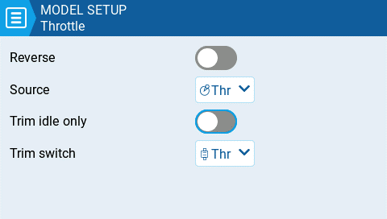

EdgeTX має можливість вибору певного джерела та тримера для газу моделі і надає наступні параметри конфігурації:

**Reverse:** Коли ввімкнено, ця опція змінює напрямок виходу налаштованого каналу газу на протилежний.

**Source:** Джерело, яке буде використовуватися для газу.

**Trim idle only**: Коли ввімкнено, тример газу впливатиме лише на нижню частину діапазону газу.

:::info
Наприклад, з увімкненим **Trim idle only**, стік газу в найнижчій точці може мати значення -80, центральна точка все одно залишатиметься 0, а найвища точка — 100. Якщо цю опцію вимкнено, стік газу в найнижчій точці може мати значення -80, однак центральна точка буде 20, а найвища точка — 100.
:::

**Trim switch:** Перемикач тримера, який буде використовуватися для тримування газу. Можна замінити перемикач тримера газу на перемикачі тримерів елеронів, керма напрямку або керма висоти.

---

Джерело: [EdgeTX User Manual 2.11](https://github.com/EdgeTX/edgetx-user-manual/blob/2.11/color-radios/model-settings/model-setup/throttle.md), ліцензія [CC BY-SA 4.0](https://creativecommons.org/licenses/by-sa/4.0/). Український переклад підготовлений для dead.md.
