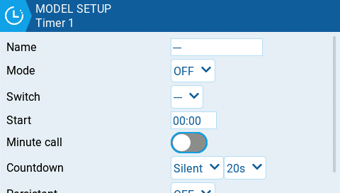

EdgeTX надає 3 таймери, які можна налаштувати індивідуально. Нижче наведено параметри конфігурації.

**Name:** Назва таймера

**Mode**:

* **OFF** - Таймер не використовується
* **ON** - Таймер працює постійно
* **Start** - Таймер запускається після активації налаштованого перемикача. Після запуску відліку часу таймер ігнорує положення перемикача.
* **Throttle** - Таймер запускається, коли стік газу піднято, а налаштований перемикач активовано. Таймер зупинить відлік, якщо положення газу буде опущено до мінімального значення або налаштований перемикач буде деактивовано.
* **Throttle %** - Таймер рахує пропорційно до рівня газу. Він рахує в реальному часі при повному газі та з половинною швидкістю при 50% газу.
* **Throttle Start** - Таймер запускається, коли стік газу піднято, а налаштований перемикач активовано. Після запуску таймер ігнорує положення газу і продовжуватиме відлік, доки перемикач не буде деактивовано.

:::info
**Throttle**, **Throttle %** та **Throttle Start** можуть запускатися перемикачем, потенціометром або значенням іншого каналу, а не лише стіком газу. Це вказується в полі **Source** розділу [throttle.md](throttle.md) у **Model Setup**
:::

**Switch** - Виберіть перемикач, який запускатиме таймер. Якщо перемикач не вибрано, таймер спрацьовуватиме лише на основі налаштованого режиму. Окрім перемикача, ви також можете вибрати трим, джерело телеметрії (спрацьовує при отриманні даних телеметрії з цього джерела) або фізичну активність (рух стіка або натискання кнопки) (позначається як **ACT**).

:::info
Елементи зі знаком "!" перед назвою тригера означають, що умова інвертована. Наприклад, "!SA-" означає "коли перемикач SA не знаходиться в середньому/центральному положенні (= вгорі або внизу)".
:::

**Start** - Час, що використовується для розширених функцій таймера. Значення за замовчуванням — 00:00, і якщо його залишити таким, таймер працює як секундомір, рахуючи вгору до зупинки. Якщо в цьому полі ввести інший час, з'явиться додаткове випадаюче меню **Direction**.

**Direction** - Якщо встановлено **Show Remaining**, лічильник працюватиме як таймер зворотного відліку — рахуючи від заданого часу до нуля, а потім сповіщаючи користувача. Якщо встановлено **Show Elapsed**, таймер працює як будильник, рахуючи від нуля до заданого часу, а потім сповіщаючи користувача.

**Minute Call** - Якщо вибрано, ви отримуватимете сповіщення кожну хвилину, як описано в параметрі **Count Down**.

**Count Down:**

* **Silent** - Жодних сповіщень не надходить, поки таймер не досягне нуля. Коли він досягне нуля, ви почуєте один звуковий сигнал.
* **Beeps** - Пульт видаватиме звуковий сигнал щосекунди, починаючи із зазначеного часу.
* **Voice** - Пульт вестиме зворотний відлік по секундах, починаючи із зазначеного часу.
* **Haptic** - Пульт вібруватиме щосекунди, починаючи із зазначеного часу.
* **Beeps & Haptic** - Пульт видаватиме звуковий сигнал і вібруватиме щосекунди, починаючи із зазначеного часу.
* **Voice & Haptic** - Пульт вестиме зворотний відлік і вібруватиме по секундах, починаючи із зазначеного часу.

**Persistent:**

* **Off** - Значення таймера скидається при перемиканні моделей або при вимкненні / увімкненні пульта.
* **Flight** - Значення таймера НЕ скидається при перемиканні моделей або при вимкненні / увімкненні пульта. Значення таймера скидається лише тоді, коли вибрано опцію **Reset flight** у меню [Reset telemetry ](../../reset-telemetry.md).
* **Manual Reset** - Значення таймера скидається лише тоді, коли його вибрано для скидання індивідуально (наприклад: Reset timer1) у меню [Reset telemetry ](../../reset-telemetry.md).

:::info
Постійне налаштування **Flight** можна встановити для кількох таймерів, і тоді ці таймери можна буде скинути одночасно за допомогою опції **Reset flight**.
:::

---

Джерело: [EdgeTX User Manual 2.11](https://github.com/EdgeTX/edgetx-user-manual/blob/2.11/color-radios/model-settings/model-setup/timer-1-2-3.md), ліцензія [CC BY-SA 4.0](https://creativecommons.org/licenses/by-sa/4.0/). Український переклад підготовлений для dead.md.
