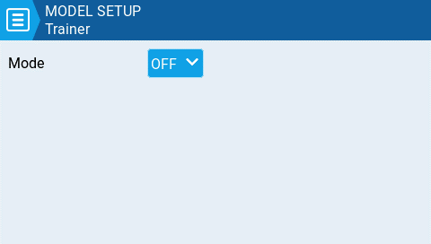

На екрані **Trainer** ви можете налаштувати режим та метод наскрізної передачі (passthrough) CPPM. Коли цю функцію увімкнено, вона дозволяє передавати сигнали CPPM з пульта в режимі _**Slave**_ на інший пульт у режимі Master, який потім передасть сигнал на підключену до нього модель. Наскрізна передача CPPM може використовуватися для кількох різних сценаріїв, таких як: підключення хедтрекера (head tracker), режим навчання Інструктор / Студент (Instructor / Student) та керування складними моделями, які вимагають більше вводів зі стіків, ніж доступно на стандартному передавачі.

**Master mode** — це режим для пульта, який буде підключений до моделі. На цьому пульті також необхідно налаштувати спеціальну/глобальну функцію (Trainer) для активації режиму наскрізної передачі. Коли режим наскрізної передачі активовано, сигнали CPPM з пульта в режимі _**Slave mode**_ будуть надсилатися на модель для керування.

**Slave mode** — це режим для пульта, який передаватиме свої значення CPPM на пульт у режимі _**Master mode,**_ які потім надсилаються на модель.

Нижче наведені можливі параметри налаштування:

* **Off** — режим Trainer не використовується для цієї моделі.
* **Master / Jack** — режим Master з використанням кабельного підключення.
* **Slave / Jack** — режим Slave з використанням кабельного підключення.
  * **Channel Range** — це діапазон каналів, які будуть надсилатися на пульт у режимі Master. Канал 10 є рекомендованим останнім каналом для використання.
  * **PPM Frame** — перше поле вказує довжину кадру PPM. Друге поле — це довжина зупинки/затримка між імпульсами. Випадний список призначений для вибору полярності сигналу. Довжина кадру автоматично коригується до правильного значення при зміні кількості передаваних каналів. Однак це автоматично призначене значення можна змінити вручну. _**Note**: У більшості випадків налаштування за замовчуванням_ не _потребують змін._
* **Master / Bluetooth** — режим Master з використанням Bluetooth-з'єднання (якщо встановлено в пульті).
* **Slave / Bluetooth** — режим Slave з використанням Bluetooth-з'єднання (якщо встановлено в пульті).
* **Master / Multi** — режим Master з використанням додаткового зовнішнього мультипротокольного модуля (Multi-protocol module) для підключення. Для отримання додаткової інформації про це налаштування див. [set-up-wireless-trainer-with-mpm.md](https://github.com/EdgeTX/edgetx-user-manual/blob/2.11/edgetx-how-to/set-up-wireless-trainer-with-mpm.md)

:::info
Подальші параметри налаштування для режиму Trainer можна знайти в налаштуваннях пульта (Radio Setup), [trainer.md](../../radio-settings/trainer.md)
:::

---

Джерело: [EdgeTX User Manual 2.11](https://github.com/EdgeTX/edgetx-user-manual/blob/2.11/color-radios/model-settings/model-setup/trainer.md), ліцензія [CC BY-SA 4.0](https://creativecommons.org/licenses/by-sa/4.0/). Український переклад підготовлений для dead.md.
