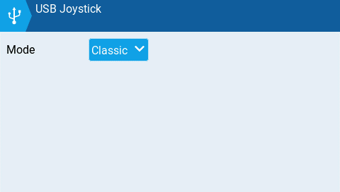
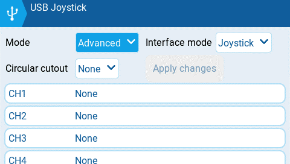
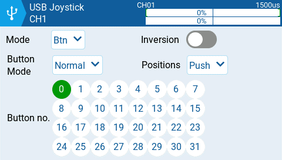
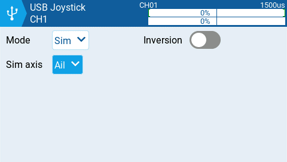

USB Joystick має два можливі режими: **Classic** та **Advanced**.

У режимі **Classic** налаштовані вихідні канали пульта надсилатимуться на цільовий пристрій у числовому порядку та призначатимуться на попередньо налаштовані осі та кнопки USB-контролера пристрою. Нижче наведено стандартне призначення каналів для Microsoft Windows.

:::info
Якщо пульт використовується як USB Joystick, як внутрішній, так і зовнішній RF-модулі мають бути вимкнені. За такого налаштування мікшер працюватиме на частоті 1000 Гц у режимі джойстика (що необхідно для учасників змагань у F.Sim). Крім того, час виконання мікшера також відображається на екрані статистики/налагодження. Це забезпечить підвищення продуктивності під час підключення до комп'ютера через USB.
:::

* Ch1 - Вісь X
* Ch 2 - Вісь Y
* Ch 3 - Вісь Z
* Ch4 - Обертання X
* Ch 5 - Обертання Y
* Ch 6 - Обертання Z
* Ch 7 - Диск (Dial)
* Ch 8 - Слайдер (Slider)
* CH 9 - Ch 32 - Кнопки 1 - 24

У режимі **Advanced** ви можете налаштувати такі параметри:

**Interface mode:** Вказує цільовому пристрою (пристрою, до якого ви підключаєте пульт), який тип пристрою ви підключаєте. Доступні варіанти: **Joystick**, **Gamepad**, **MultiAxis.**

:::info
**Примітка:** Наразі в MS Windows існує обмеження, через яке ваш пульт може визначатися лише як Joystick, незалежно від того, що вибрано в цьому параметрі. У MacOS, Linux та Android ця функція працює належним чином.
:::

**Circular cutout**: Для пар осей (X-Y, Z-rX): За замовчуванням діапазон пар осей є прямокутною областю. За допомогою цієї опції осі будуть обмежені круглою областю (як це зазвичай буває в геймпадах). Доступні варіанти: **None** або **X-Y, Z-rX** або **X-Y, rX-rY** або **X-Y, Z-rZ**

**Output channels 1-32**

**Mode**: Для кожного вихідного каналу ви можете вибрати режим, який хочете використовувати для цього каналу. Доступні варіанти: **None**, **Btn**, **Axis**, **Sim**.

**None** - Канал не використовується

**Btn** - Канал використовується для імітації кнопки. Опції налаштування включають:

* **Inversion** - Інвертує сигнал вихідного каналу. Доступні варіанти: **On** / **Off**
* **Button Mode** -
  * **Normal** - Кожна позиція багатопозиційного перемикача представлена кнопкою. Поточний стан перемикача представлений безперервним натисканням кнопки.
  * **Pulse** - Схоже на режим "Normal". Однак замість безперервного натискання кнопки воно представлене коротким натисканням.
  * **SWEmu** - Тумблер імітує кнопку. Перше натискання вмикає віртуальну кнопку, друге — вимикає.
  * **Delta** - Зміна вихідного каналу представлена 2 кнопками. Поки вихідне значення зменшується, натискається перша кнопка. Коли вихідне значення збільшується, натискається друга кнопка. Якщо змін немає, жодна кнопка не натискається.
  * **Companion** - Цю опцію слід вибирати під час використання пульта для керування симулятором у EdgeTX Companion. Вона дозволяє багатопозиційним перемикачам правильно працювати в симуляторі.
* **Positions** - Тип кнопки, яка буде імітуватися.
  * **Push -** призначатиметься лише на одну кнопку
  * **2POS - 8 POS** - призначатиметься на ту кількість кнопок, яку має перемикач (наприклад: 3POS призначатиметься на 3 кнопки).
* **Button No:** Номер кнопки, на який буде призначено вихідний сигнал і надіслано на цільовий пристрій.

**Axis -** Канал використовується для імітації осі та буде призначений на одну зі стандартних осей цільового пристрою.

* Варіанти осей: X, Y, Z, rotX (обертання x), rotY, rotZ

**Sim -** Канал використовується для імітації загальної осі симулятора і відображатиметься на цільовому пристрої як вибрана опція (наприклад: Thr)

* Варіанти осей Sim: **Ail**, **Ele**, **Rud**, **Thr**, **Acc**, **Brk**, **Steer**, **Dpad**

---

Джерело: [EdgeTX User Manual 2.11](https://github.com/EdgeTX/edgetx-user-manual/blob/2.11/color-radios/model-settings/model-setup/usb-joystick.md), ліцензія [CC BY-SA 4.0](https://creativecommons.org/licenses/by-sa/4.0/). Український переклад підготовлений для dead.md.
