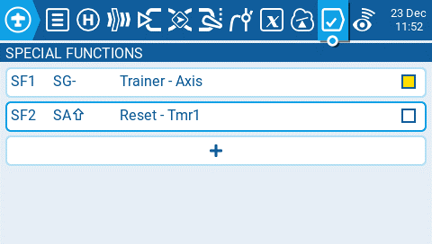

Розділ **Special Functions** у Model Setup, як випливає з назви, — це місце, де ви можете налаштувати спеціальні функції, включені до EdgeTX. Ці спеціальні функції додають додаткові можливості поза звичайним керуванням моделлю, такі як увімкнення режиму тренера, відтворення звуку, налаштування підсвічування пульта, регулювання гучності пульта тощо. На екрані спеціальних функцій ви побачите всі налаштовані спеціальні функції, а також деякі з налаштованих параметрів, такі як назва функції, перемикач активації, чи увімкнена функція, та інші параметри конфігурації.

Вибір кнопки **+** дозволить вам вибрати невикористану спеціальну функцію для налаштування, після чого з'явиться вікно конфігурації спеціальної функції. Дивіться розділ [налаштування спеціальних функцій](special-functions.md#configuring-special-functions) нижче для отримання інформації про налаштування нових спеціальних функцій.

Вибір вже налаштованої спеціальної функції надасть вам такі опції:

* **Edit** - Відкриває сторінку конфігурації спеціальної функції.
* **Copy** - Копіює вибрану спеціальну функцію.
* **Paste** - Вставляє скопійовану спеціальну функцію у вибрану спеціальну функцію. Примітка: це перезапише значення вибраної спеціальної функції скопійованою спеціальною функцією.
* **Insert** - Вставляє порожню спеціальну функцію над вибраною спеціальною функцією.
* **Clear** - Очищає всі налаштовані параметри з вибраної спеціальної функції.
* **Delete** - Видаляє вибрану спеціальну функцію.
* **Enable** - Вмикає спеціальну функцію.
* **Disable** - Вимикає спеціальну функцію.

### Configuring Special Functions

Усі спеціальні функції мають наведені нижче параметри конфігурації. Залежно від вибраної функції можуть бути додані додаткові параметри. Дивіться розділ **Функції** нижче для ознайомлення з цими додатковими параметрами.

* **Trigger** - Перемикач, який зробить спеціальну функцію активною.
* **Function** - Функція, яка буде використовуватися. Дивіться нижче опис функцій.
* **Enable** - Перемикач увімкнення/вимкнення функції. Щоб мати можливість активувати спеціальну функцію за допомогою перемикача, вона має бути увімкнена. Вимкнені спеціальні функції не працюватимуть незалежно від налаштованого положення перемикача.

### Functions

Нижче наведено всі доступні функції в EdgeTX, що вони роблять, а також які інші параметри конфігурації існують спеціально для цієї функції.

**Adjust** (Налаштування глобальної змінної) - Змінює значення вказаної глобальної змінної.

* **Global var** - Виберіть глобальну змінну, яку ви хочете налаштувати.
* **Mode** - Виберіть режим зміни глобальної змінної. Варіанти: **Constant, Mixer Source, Global var, Inc/Decrement**
  * **Constant** - Встановлює для вказаної глобальної змінної визначене постійне значення.
  * **Mixer Source** - Встановлює для вказаної глобальної змінної визначене значення джерела мікшера.
  * **Global Var** - Встановлює для вказаної глобальної змінної значення іншої визначеної глобальної змінної.
  * **Inc/Decrement** - Збільшує/зменшує вказану глобальну змінну на задану величину.

**Audio Amp Off** (на деяких пультах) - Вимикає аудіопідсилювач, щоб з динаміка не лунав жоден звук, включаючи дратівливий зворотний зв'язок або перешкоди.

**Backlight** - Регулює яскравість екрана пульта на основі джерела, визначеного у випадаючому списку значень. Яскравість обмежена значеннями On / Off, налаштованими у **Radio Setup -> Backlight Screen**.

**BgMusic** - Циклічно відтворює файл .wav, вибраний у полі значення, коли функцію увімкнено. Файл має знаходитися в папці SOUNDS/(language)/ на SD-карті.

**BgMusic II** - Тимчасово призупиняє відтворення файлу .wav, вказаного у **BgMusic**.

**Haptic** - Змушує пульт вібрувати (тактильний відгук), коли функцію увімкнено.

* **Value** - Тип патерну вібрації. Варіанти: 0 - 4.
* **Repeat** - Частота повторення патерну вібрації. Варіанти: **!1x** (не вібрувати під час запуску, навіть якщо перемикач активний), **1x** (завібрувати один раз), від **1s** до **60s** (вібрувати кожні xx секунд).

**Inst. Trim** (Миттєвий трим) - Встановлює всі трими на поточні значення їхніх відповідних стіків.

**Lua Script** - Виконує Lua-скрипт, визначений у полі значення. Lua-скрипт має знаходитися в папці `/SCRIPTS/FUNCTIONS/` на SD-карті. Lua-скрипти, які відображають інформацію на екрані, не можуть бути виконані за допомогою цієї спеціальної функції.

* **Value** - Файл LUA-скрипта для запуску з SD-карти.
* **Repeat** - Частота повторення Lua-скрипта. Варіанти: **ON** (повторювати нескінченно, поки активний перемикач) або **1x** (один раз).

**No Touch** - Вимикає сенсорний інтерфейс для пультів із сенсорним екраном.

**Override** (Перевизначення каналу) - Перевизначає вказаний канал заданим значенням.

* **CH** - Канал, який буде перевизначено.
* **Value** - Значення, яке замінить звичайне значення каналу. (Діапазон від -100 до +100).

**Play Sound** - Відтворює звук, вибраний у полі значення, під час активації.

* **Value** - Звук для відтворення. Можливі значення: **Beep1/2/3, Warn1/2, Cheep, Ratata, Tick, Siren, Ring, SciFi, Robot, Chirp, Tada, Crickt, AlmClk**. _Примітка: звуковий пакет на SD-карті не потрібен._
* **Repeat** - Частота повторення звуку. Варіанти: **!1x** (не відтворювати під час запуску, навіть якщо перемикач активний), **1x** (відтворити один раз), від **1s** до **60s** (відтворювати кожні xx секунд).

**Play Track** - Відтворює звуковий файл .wav, вибраний у полі значення, під час активації.

* **Value** - Звуковий файл .wav для відтворення з SD-карти.
* **Repeat** - Частота повторення треку. Варіанти: **!1x** (не відтворювати під час запуску, навіть якщо перемикач активний), **1x** (відтворити один раз), від **1s** до **60s** (відтворювати кожні xx секунд).

**Play Value** - Озвучує значення вибраного елемента в полі значення.

* **Value** - Джерело значення для озвучення. Це може бути вхід, стік, потенціометр, слайдер, трим, фізичний та логічний перемикач, значення каналу імпорту тренера, глобальна змінна, сенсор телеметрії або канал.
* **Repeat** - Частота повторення озвучення. Варіанти: **!1x** (не озвучувати під час запуску, навіть якщо перемикач активний), **1x** (озвучити один раз), від **1s** до **60s** (озвучувати кожні xx секунд).

**RacingMode** - Вмикає гоночний режим (низька затримка) для приймачів FrSky Archer RS. Гоночний режим також має бути увімкнений у налаштуваннях зовнішнього RF-модуля.

**Reset** (Скидання таймера) - Скидає таймер або телеметрію, вказані у значенні, до їхніх початкових значень.

* **Reset** - Варіанти: **Timer 1, Timer 2, Timer 3, Flight** та **Telemetry**. Дивіться [**Reset Telemetry**](../reset-telemetry.md) для отримання додаткової інформації про те, які дані скидаються для кожної опції.

**Screenshot** - Створює знімок екрана у вигляді файлу .bmp у папці SCREENSHOT на SD-карті.

**SD Logs** - Створює файл журналу .csv зі значеннями пульта та телеметрії у папці LOGS на SD-карті. Пульт створюватиме новий запис у файлі журналу на основі частоти, налаштованої в параметрі **Interval**. Варіанти значень: від **0.1s** до **25.5s**. Щоразу під час активації функції пульт створюватиме новий файл журналу за умови, що функція активована принаймні так само довго, як і налаштоване значення. **Примітка:** Запис журналу не розпочнеться, якщо на SD-карті менше 50 МБ вільного місця.

**Set** (Встановлення таймера) - Встановлює вказаний таймер на задане значення.

* **Timer** - Варіанти: **Timer 1, Timer 2, Timer 3**.
* **Value** - Діапазон від 00:00:00 до 08:59:59.

**SetFailsafe** - Встановлює користувацькі значення failsafe для вибраного модуля (Internal/External) відповідно до поточного положення стіків під час активації. Щоб ця опція працювала, режим Failsafe для RF-модуля має бути встановлений на **custom**.

**Set Main Screen** - Змінює поточний видимий екран на екран із визначеним номером.

* **Value** - Номер екрана, як визначено в [налаштуваннях екранів.](../screen-settings/)
* **Repeat** - Коли перемикач залишається активним, значення повторення визначає, як часто спеціальна функція змінюватиме екран на визначений. Варіанти: **!1x** (не змінювати під час запуску, навіть якщо перемикач активний), **1x** (змінити один раз), від **1s** до **60s** (змінювати кожні xx секунд). Це корисно, оскільки після активації перемикача користувач все ще може вручну перемикати екрани, а потім він повернеться до визначеного екрана через заданий проміжок часу.

**Trainer** - Вмикає режим тренера.

* **Value** - Визначає, які елементи керування будуть передані учню. Варіанти включають **Axis** (усі стіки / основні елементи керування), **Rud** (Rudder - кермо напрямку), **Ele** (Elevator - кермо висоти), **Thr** (Throttle - газ), **Ail** (Aileron - елерони) та **Chans** (усі канали).

**Vario** - Вмикає звуковий сигнал варіометра для підйому та спуску моделі.

**Volume** - Змінює гучність пульта. Джерело зміни вказується у випадаючому списку Volume.

---

Джерело: [EdgeTX User Manual 2.11](https://github.com/EdgeTX/edgetx-user-manual/blob/2.11/color-radios/model-settings/special-functions.md), ліцензія [CC BY-SA 4.0](https://creativecommons.org/licenses/by-sa/4.0/). Український переклад підготовлений для dead.md.
