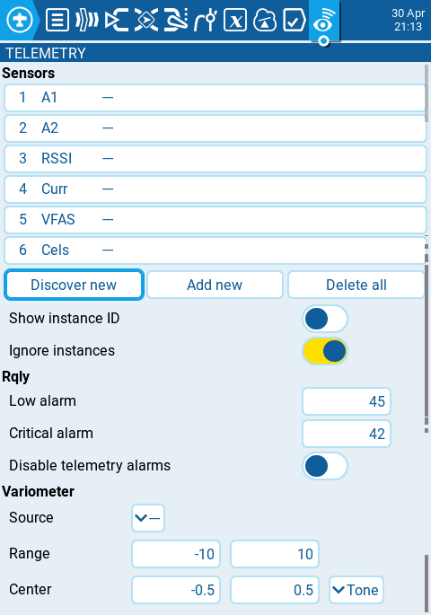

Телеметрія — це дані, які надходять від моделі до пульта з різних сенсорів. Ці сенсори можуть бути вбудовані в приймач або польотний контролер, або ж бути окремими сенсорами, такими як GPS, варіометр чи магнітометр. Отримані дані телеметрії можуть відображатися EdgeTX у віджетах, використовуватися для налаштування сповіщень (alarms) або голосових повідомлень.

### **Sensors**

Усі попередньо налаштовані сенсори перелічені тут. Сенсори, які підсвічені, отримували дані з моменту завантаження моделі або скидання значень телеметрії. Маленька кругла іконка блиматиме ліворуч від значення сенсора під час отримання оновлених даних. Значення сенсорів чорного кольору позначають сенсори, які отримують регулярні оновлення. Значення сенсорів червоного кольору більше не отримують регулярних оновлень. Дивіться розділ [Recognized Sensors](https://github.com/EdgeTX/edgetx-user-manual/blob/2.11/bw-radios/model-select/telemetry/common-telemetry-sensors.md) для перегляду списку сенсорів, що найчастіше використовуються в EdgeTX.

Під списком сенсорів доступні такі опції:

* **Discover New:** Якщо вибрати цю опцію, пульт шукатиме нові сенсори на моделі та автоматично їх налаштує.
* **Add New:** Якщо вибрати цю опцію, буде створено новий порожній сенсор, який потрібно налаштувати вручну.
* **Delete All:** Ця опція видалить усі попередньо налаштовані сенсори. _**Note**_: _Ця кнопка не буде видимою, якщо немає налаштованих сенсорів._
* **Show instance ID:**
* **Ignore Instances:** Ця опція запобігає передачі однакових даних телеметрії від кількох сенсорів.

Якщо ви виберете конкретний сенсор, ви отримаєте такі опції:

* **Edit**: Дозволяє редагувати параметри налаштування сенсора.
* **Copy**: Створює копію цього сенсора.
* **Delete**: Видаляє цей сенсор.

Дивіться сторінку [Sensor Configuration Options](sensor-configuration-options.md) для детального опису всіх параметрів конфігурації для налаштування або редагування сенсорів.

### **Rx-Stats**

Тут ви можете налаштувати пороги для сповіщень приймача (RX alarms). Назва Rx-Stats змінюватиметься (Rx-Stats, RSSI, Rqly, Sgnl) залежно від протоколу, який використовується з моделлю.

* **Low alarm** — порогове значення, при якому відтворюватиметься голосове повідомлення "RF signal low". Рекомендоване значення — 45.
* **Critical alarm** — порогове значення, при якому відтворюватиметься голосове повідомлення "RF signal critical". Рекомендоване значення — 42.
* **Disable telemetry alarms** — якщо увімкнено, голосові сповіщення не відтворюватимуться.

### **Variometer**

Варіометр визначає зміни висоти моделі. EdgeTX може сповіщати користувача про ці зміни висоти, видаючи звук, що підвищується або знижується за тональністю. Використовуйте меню **Variometer** на сторінці **Radio Setup**, щоб встановити фактичну частоту та гучність звуку, який відтворюватиметься. Для налаштування сповіщень варіометра існують такі опції.

:::info
Вам потрібно буде використати **Special Function** або **Global Function** типу **Vario**, щоб увімкнути цю функцію!
:::

* **Source** — вказує сенсор, який використовуватиметься як варіометр. Він вибирається з сенсорів телеметрії, доданих у розділі **Sensors**.
* **Range** — вказує діапазон підйому/спуску, який викликатиме зміну тональності звуку варіометра. Якщо швидкість підйому/спуску знаходиться в межах вказаного тут діапазону, тональність звуку змінюватиметься відповідно до цього значення. Коли вона виходить за межі вказаного тут діапазону, тональність звуку перестане змінюватися. Одиниці виміру — метри/секунду або фути/секунду залежно від налаштування **Units** на сторінці [Radio Setup](/docs/rc/edgetx-tx16s/radio-settings/radio-setup/).
* **Center** — вказує діапазон для ігнорування змін швидкості підйому/спуску. Коли швидкість підйому/спуску знаходиться в межах вказаного тут діапазону, тональність звуку не змінюватиметься.
* **Tone/Silent** — вказує, чи видавати звуковий сигнал, коли швидкість підйому/спуску знаходиться в межах діапазону, вказаного в **Center**.

---

Джерело: [EdgeTX User Manual 2.11](https://github.com/EdgeTX/edgetx-user-manual/blob/2.11/color-radios/model-settings/telemetry/README.md), ліцензія [CC BY-SA 4.0](https://creativecommons.org/licenses/by-sa/4.0/). Український переклад підготовлений для dead.md.
