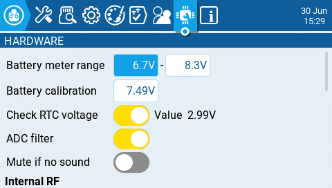
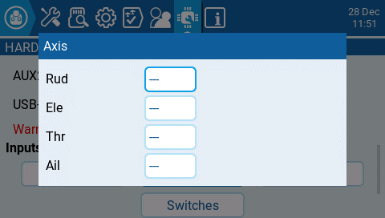
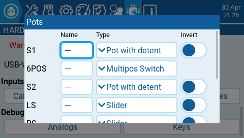
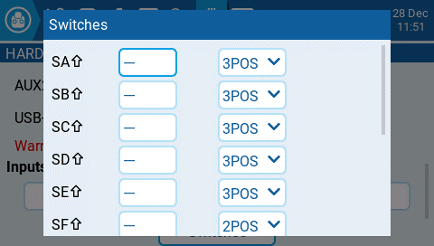
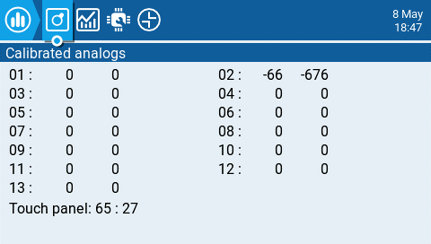
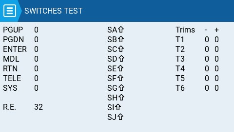

Екран **Hardware** — це місце, де ви налаштовуєте специфічні апаратні параметри вашого пульта. Він містить наступні опції конфігурації:

**Battery meter range** - встановлює максимальну та мінімальну напругу для індикатора батареї. Це значення слід встановлювати залежно від типу батареї, яку ви використовуєте.

**Battery Calibration** - встановіть це значення так, щоб воно відповідало фактичній напрузі батареї передавача.

**Check RTC voltage** - коли увімкнено, перевіряє батарею RTC (годинника реального часу) під час запуску та попереджає, якщо напруга батареї низька.

**ADC Filter** - вмикає або вимикає фільтр АЦП (ADC Filter). Цей фільтр також можна увімкнути/вимкнути для кожної моделі окремо в налаштуваннях моделі.

:::info
Фільтр АЦП (ADC filter) — це фільтр для пропорційних каналів (стіки, потенціометри, слайдери), який згладжує дрібні швидкі рухи, що виникають через шум в електроніці системи. Зазвичай цей фільтр має бути _вимкнений_ для моделей з польотними контролерами.
:::

**Mute if no sound: -** коли увімкнено, переводить передавач у беззвучний режим, доки не знадобиться відтворити звук. Це запобігає появі шумів від перешкод потужних TX-модулів у динаміках передавача.

### **Internal RF Type**

Виберіть тип модуля для внутрішнього відсіку. Варіанти: **Multi, XJT, ISRM, CRSF**. Якщо вибрано **CRSF**, ви також можете вибрати швидкість передачі даних (baud rate). Детальніше про baud rate можна прочитати [тут](https://www.expresslrs.org/2.0/quick-start/transmitters/tx-prep/).

### **External RF Sample Mode**

Варіанти: Normal та OneBit. Налаштування за замовчуванням **Normal** підходить для більшості користувачів. Лише користувачам пультів X9D+ та X7 може знадобитися режим **OneBit**.

:::info
Пульти X9D+ та X7 мають повільний інвертор, що викликає проблеми з прийомом швидких сигналів UART, призводячи до попереджень телеметрії та проблем з Lua-скриптами, які використовують протокол CRSF. Заміна резистора 10 кОм на платі могла б вирішити проблему, але це не завжди було ефективно. EdgeTX розробила режим OneBit Mode, який змінює поведінку вибірки UART, ігноруючи повільні передні фронти сигналу. Це дозволяє протоколу CRSF працювати на повній швидкості 400k baud rate без апаратних модифікацій пульта.
:::

### **Bluetooth**

:::info
_**Примітка:** Ця опція видима лише у кастомно скомпільованих версіях EdgeTX з увімкненим прапорцем **Bluetooth**._
:::

**Mode - режим, у якому використовуватиметься модуль Bluetooth. Варіанти:**

* **---** - Вимкнено
* **Telemetry** - використовується для надсилання даних телеметрії через Bluetooth.
* **Trainer** - використовується для режиму тренера через Bluetooth.

**Name -** ім'я, під яким буде видно пристрій Bluetooth.

**Іконка шестірні (Settings)** - при виборі покаже вам:

* **PIN Code** - PIN-код для пристрою Bluetooth у пульті (видимий лише в режимі **Telemetry**).
* **Local addr -** ідентифікаційна адреса пристрою Bluetooth у пульті.
* **Dist addr -** ідентифікаційна адреса пристрою Bluetooth, до якого підключено пульт.

### **Serial Port**

Відображає список доступних допоміжних послідовних портів (serial ports), які можна налаштувати та використовувати. Перелічені порти залежать від тих, що доступні в конкретному апаратному забезпеченні пульта. Наведені нижче порти є лише прикладом і можуть бути відсутні у вашому пульті.

* **AUX1** - перший доступний допоміжний послідовний порт, який можна налаштувати за допомогою наступних опцій:
  * **OFF** - вимкнено.
  * **Telem Mirror** - ті самі дані телеметрії, що надходять до зовнішнього відсіку модуля, надсилаються на послідовний порт.
  * **Telemetry In** - отримання даних телеметрії через послідовний порт.
  * **SBUS Trainer** - з'єднання пультів Інструктора та Учня через послідовний порт.
  * **LUA** - надсилання/отримання даних до/з Lua-скрипта.
  * **GPS** - отримання даних телеметрії GPS через послідовний порт.
  * **CLI** - надсилання команд на пульт через командний рядок.
  *   **External Module** - це дозволяє налаштовувати мод зовнішнього доступу (external access mod) під час роботи, а не через опцію компіляції. Спочатку налаштуйте апаратний порт (доступно лише на `AUX1`, оскільки `AUX2` не має TX DMA)\
      

      Потім можна вибрати модуль:\
      
  * **AUX2** - другий доступний допоміжний послідовний порт (залежно від обладнання), який має ті самі опції, що й AUX1, за винятком External Module.
  * **USB-VCP** - віртуальний COM-порт. Це одна з опцій, що пропонується при підключенні більшості пультів до ПК. Часто встановлюється на 'CLI' для пультів із внутрішніми RF-модулями ExpressLRS з метою оновлення прошивки.
* **Port Power** - вмикає або вимикає вихідне живлення на контактах живлення поруч із послідовними портами, які доступні на деяких пультах (наразі цю функцію має лише TX16S).

### Inputs

**Calibration** - для калібрування фізичних елементів керування пульта (стіків, потенціометрів, слайдерів та 6-позиційного перемикача). Пульт підказуватиме вам кроки калібрування.

:::info
Для калібрування стіків/осей використовуйте рухи вліво-вправо та вгору-вниз, а не кругові рухи! Крім того, застосовуйте нормальну силу натискання в крайніх точках. Надмірний тиск у крайніх точках призведе до неправильного калібрування стіка/осі.
:::

:::info
Якщо ваш пульт має 6-позиційний перемикач (не плутати з перемикачами, що налаштовуються — вони не потребують калібрування), процедура його калібрування полягає в послідовному натисканні кожної кнопки зліва направо з паузою в одну секунду між кожним натисканням, коли з'явиться запит на калібрування аналогових входів, таких як стіки/осі, потенціометри та слайдери.
:::

#### Кнопки Axis, Pots та Switches

Вибір однієї з кнопок Axis, Pots або Switches відкриє екран конфігурації. На цих екранах ви побачите всі фізичні елементи керування пульта, попередньо визначені EdgeTX. Тут ви можете додати 3-символьну мітку (label) до елемента керування, а також змінити його тип за потреби. Крім того, елементи керування, перелічені на екрані Pots, також можна налаштувати як інвертовані.

### Debug

Розділ Debug дозволяє тестувати та налагодити аналогові елементи керування та кнопки.

**Analogs**  - ці екрани покажуть вам дані для ваших аналогових елементів керування (стіки, слайдери, потенціометри, 6-позиційний перемикач) та сенсорного екрана вашого пульта. Існує чотири види: відкалібровані аналогові дані (Calibrated analog), відфільтровані сирі аналогові дані з відхиленням (Filtered Raw Analog with deviation), невідфільтровані сирі аналогові дані (Unfiltered raw analog), а також мінімум, максимум і діапазон (Min Max and range).

**Keys** - цей екран покаже вам цифрові дані для ваших кнопок, перемикачів, тримерів та поворотного енкодера (ролика).

---

Джерело: [EdgeTX User Manual 2.11](https://github.com/EdgeTX/edgetx-user-manual/blob/2.11/color-radios/radio-settings/hardware.md), ліцензія [CC BY-SA 4.0](https://creativecommons.org/licenses/by-sa/4.0/). Український переклад підготовлений для dead.md.
