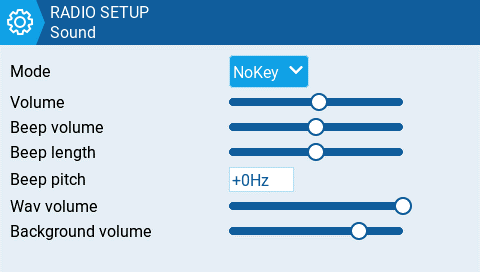
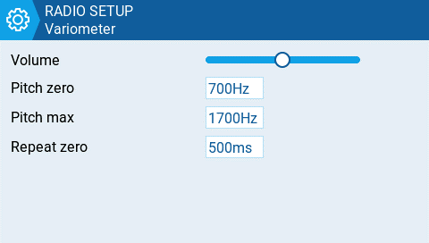
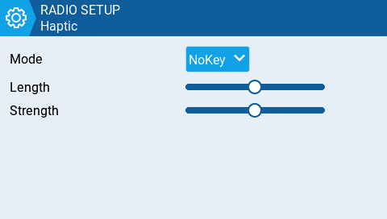
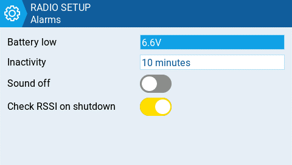
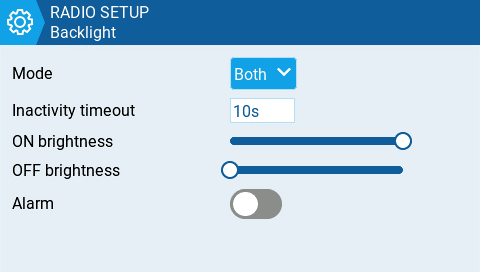
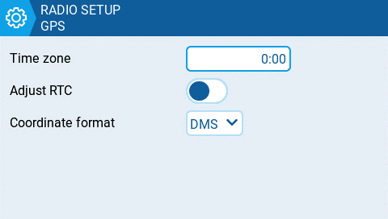
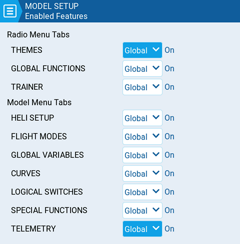
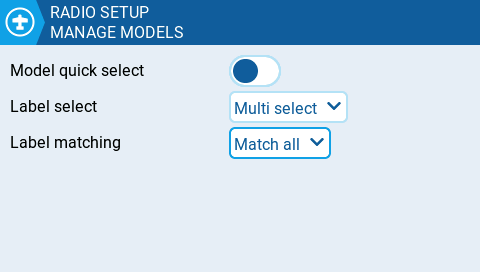

Вибір однієї з 6 кнопок на екрані **Radio Setup** переведе вас до одного з екранів додаткових налаштувань, наведених нижче.

Багато з додаткових налаштувань тут є зрозумілими самі по собі. Нижче будуть згадані лише ті налаштування, які потребують роз'яснення.

### Sound

**Mode** - налаштовує, коли відтворювати звуки.

* **All -** Пікає при натисканні кнопок і відтворює звуки при сповіщеннях або попередженнях.
* **No Key -** Немає звукових сигналів при натисканні кнопок або обертанні колеса прокрутки, але відтворює звуки при сповіщеннях або попередженнях. Також відтворює звуки, активовані спеціальними функціями.
* **Alarm -** Відтворює лише звуки тривоги або попереджень. Також відтворює звуки, активовані спеціальними функціями.
* **Quiet -** Жодних звукових сигналів або звуків не відтворюється.

**Volume**

Загальна гучність пульта.

**Wav volume**

Гучність для сповіщень, попереджень та звуків, які відтворюються за допомогою спеціальної функції **Play track**.

**Background volume**

Гучність для фонових файлів .wav (музики), які відтворюються за допомогою спеціальної функції **BGMusic**.

### Variometer

**Repeat Zero**

Час до повторення тону в мілісекундах.

:::info
Примітка: Щоб варіометр працював, його потрібно увімкнути за допомогою спеціальної або глобальної функції **Vario**. Дивіться розділ [Special Functions](../../model-settings/special-functions.md) для отримання додаткової інформації про те, як це налаштувати.
:::

### Haptic

**Mode** - налаштовує, коли пульт вібрує.

* **All -** Вібрує при натисканні кнопок та при сповіщеннях або попередженнях.
* **No Key -** Немає вібрації при натисканні кнопок або обертанні колеса прокрутки, але вібрує при сповіщеннях або попередженнях.
* **Alarm -** Вібрує лише для тривог або попереджувальних звуків.
* **Quiet -** Жодних вібрацій не відбувається.

### Alarms

#### Sound Off

Візуальне попередження "alarms disabled" відображається під час увімкнення передавача, якщо звуковий режим встановлено на **Quiet**.

#### Check RSSI on Shutdown

Перевіряє, чи приймач все ще підключений до пульта під час спроби вимкнення. Створює звукове та візуальне сповіщення, якщо такий виявлено.

### Backlight

**Mode**

* **Off** – Завжди вимкнено.
* **Keys** – Вмикається при натисканні кнопок.
* **Ctrl** – Вмикається при використанні стіків, перемикачів та крутилок.
* **Both** – Вмикається при використанні кнопок, стіків, перемикачів та крутилок.
* **ON** – Завжди увімкнено.

#### Time

Тривалість у секундах, протягом якої підсвічування увімкнене. Мінімальне значення — 5 секунд. Максимальне значення — 600 секунд.

#### Alarm

Підсвічування вмикається при появі тривог або попереджень.

### GPS

:::info
Налаштування конфігурації GPS стосуються лише випадків, коли GPS встановлено в самому пульті, а не GPS моделі.
:::

#### Time Zone

Зміщення часу відносно UTC для місця, де використовується пульт. Може бути налаштовано з кроком у 15 хвилин.

#### Adjust RTC

Коригує годинник реального часу передавача відповідно до часу, визначеного за допомогою GPS.

#### Coordinate Format

Формат координат GPS, який буде відображатися.

### Enabled Features

Розділ **Enabled Features** у **Radio Setup** дозволяє налаштувати _**Global**_ _**settings**_ (глобальні налаштування) для того, які вкладки будуть видимими в розділах **Radio Setup** та **Model Settings** в EdgeTX. Налаштування конфігурації для активної моделі відображатиметься праворуч від перемикача. Конфігурація моделі матиме пріоритет над глобальною конфігурацією.

:::info
_**Примітка:**_ Вимкнення вкладки лише приховує її та не змінює елементи, які вже налаштовані на цій вкладці.

**ВИНЯТОК:** Вимкнення вкладки Global / Special Functions призведе до деактивації налаштованих глобальних / спеціальних функцій для цієї моделі.
:::

### Manage Models

**Model quick select** - Впливає на екран **Manage Models**. Обидві опції вимагають спочатку вибрати потрібну модель за допомогою колеса прокрутки або короткого натискання.

* Коли OFF: коротке/довге натискання (короткий/довгий ENTER) на вибраній моделі відкриє меню, де ви можете натиснути "Select model", щоб зробити її активною.
* Коли ON: коротке натискання (короткий ENTER) на вибраній моделі одразу зробить її активною. Щоб викликати меню, зробіть довге натискання або довгий ENTER.

**Label select** - '**Multi select**' або '**Single select**' (**Multi select** є типовим). Якщо вибрано **Single select**, можна вибрати лише одну мітку.

**Label matching** - '**Match all**' або '**Match any**' (**Match all** є типовим). **Match all** — це поточна логіка: відображаються лише моделі, які мають усі вибрані мітки. **Match any** відображатиме моделі з будь-якою з вибраних міток.

**Favorites matching** - Доступно лише тоді, коли для **Label matching** вибрано '**Match any**'. Варіанти: '**Must match**' та '**Optional match**' (**Must match** є типовим). Застосовується лише тоді, коли '**Favorites**' є однією з вибраних міток. Якщо вибрано '**Must match**', відображатимуться лише моделі, які мають мітку **Favorites** ТА інші вибрані мітки. Якщо вибрано '**Optional match**', відображатимуться моделі, які відповідають мітці **Favorites** АБО будь-якій іншій з вибраних міток.

---

Джерело: [EdgeTX User Manual 2.11](https://github.com/EdgeTX/edgetx-user-manual/blob/2.11/color-radios/radio-settings/radio-setup/additional-radio-settings.md), ліцензія [CC BY-SA 4.0](https://creativecommons.org/licenses/by-sa/4.0/). Український переклад підготовлений для dead.md.
