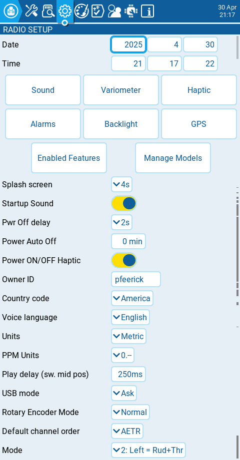

На екрані **Radio Setup** ви налаштовуєте базові параметри вашого пульта. Він містить наступні опції:

**Date** - Поточна дата. Ця дата використовується для файлів логів на SD-карті.

**Time** - Поточний час. Цей час використовується для файлів логів на SD-карті.

**Кнопки додаткових налаштувань** - Додаткові параметри конфігурації для вказаних розділів стають доступними при натисканні цих кнопок. Більше інформації про ці налаштування знаходиться на наступній сторінці - [Додаткові налаштування пульта](additional-radio-settings.md)

**Splash Screen** - Тривалість відображення заставки при увімкненні.

**Startup Sound** - Вмикає або вимикає звук під час запуску.

**Pwr Off delay** - Затримка між натисканням кнопки живлення та вимкненням пульта. Доступні варіанти: **0s, 0.5s, 1s, 2s, 3s, 4**s. _Рекомендується встановити затримку принаймні 1s, щоб запобігти вимкненню пульта у разі випадкового натискання кнопки._

**Power Auto Off** - Якщо увімкнено, пульт автоматично вимкнеться після заданого часу неактивності, за умови відсутності RF-модуля з активною телеметрією або активного підключення тренера.

**Power ON/OFF Haptic** - Якщо увімкнено, пульт використовуватиме вібромотор для подачі тактильного імпульсу під час увімкнення пульта (вказуючи, коли можна відпустити кнопку живлення) та під час вимкнення передавача.

**Owner ID** - Користувацький реєстраційний ID, який використовується лише для користувачів з модулями FrSky ISRM/ACCESS.

**Country code** - Використовується деякими RF-модулями для забезпечення дотримання місцевих нормативних вимог щодо радіочастот. Доступні варіанти: **America, Japan, Europe.**

**Voice language** - Мова голосового пакета. Це налаштування та папка голосового пакета на SD-карті повинні збігатися, щоб звуки відтворювалися.

**Units** - Одиниці вимірювання. Доступні варіанти: **metric** або **imperial**.

**PPM Units** - Рівень точності, з яким відображаються значення PPM. Доступні варіанти: **0.-, 0.0 або us** **(μs/мікросекунди).**

**Play delay** (sw. mid pos) - Мінімальний час у мілісекундах, протягом якого перемикач повинен знаходитися в середньому положенні, перш ніж активується спеціальна функція (Special Function). Це використовується для запобігання активації середнього положення на трипозиційному перемикачі під час перемикання з нижнього положення у верхнє.

**USB Mode** - Встановлює дію за замовчуванням, коли USB-кабель підключається до порту даних USB, а пульт увімкнений. Доступні варіанти: **Ask**, **Joystick**, **Storage** та **Serial**.

**Hats Mode:** як функціонуватимуть багатопозиційні перемикачі (hat switches) (_**тільки для NV14, EL18 та PL18/PL18EV**_).

* **Trims** **only**: Багатопозиційні перемикачі тримерів використовуватимуться лише для налаштування значень тримів.
* **Keys only**: Багатопозиційні перемикачі тримерів використовуватимуться для навігації по опціях меню (як описано нижче).
* **Switchable**: Функціональність багатопозиційних перемикачів тримерів можна змінювати між **Trims** та **Keys** "на льоту".

**Rotary Encoder Mode** - За замовчуванням встановлено **Normal**. Опція **Inverted** змінює напрямок обертання ролика на протилежний.

**Default Channel Order** - Порядок каналів за замовчуванням для нових моделей та екрана тренера. Літери означають: **A** = Aileron (Крен), **E** = Elevator (Тангаж), **T** = Throttle (Газ), **R** = Rudder (Рискання). Зміна цього налаштування не впливає на існуючі моделі.

**Mode** - Режим стіків, який використовуватиметься для передавача. Визначається тим, які дії виконує лівий стік. Доступні варіанти:

<table><thead><tr><th width="181">Опція</th><th width="148">Лівий стік H</th><th width="149">Лівий стік V</th><th width="133">Правий стік H</th><th>Правий стік V</th></tr></thead><tbody><tr><td>1: Left = Rud+Ele </td><td>Rudder (Рискання)</td><td>Elevator (Тангаж)</td><td>Aileron (Крен)</td><td>Throttle</td></tr><tr><td>2: Left = Rud+Thr</td><td>Rudder (Рискання)</td><td>Throttle</td><td>Aileron (Крен)</td><td>Elevator (Тангаж)</td></tr><tr><td>3: Left = Ail+Ele</td><td>Aileron (Крен)</td><td>Elevator (Тангаж)</td><td>Rudder (Рискання)</td><td>Throttle</td></tr><tr><td>4: Left = Ail+Thr</td><td>Aileron (Крен)</td><td>Throttle</td><td>Rudder (Рискання)</td><td>Elevator (Тангаж)</td></tr></tbody></table>

---

Джерело: [EdgeTX User Manual 2.11](https://github.com/EdgeTX/edgetx-user-manual/blob/2.11/color-radios/radio-settings/radio-setup/README.md), ліцензія [CC BY-SA 4.0](https://creativecommons.org/licenses/by-sa/4.0/). Український переклад підготовлений для dead.md.
