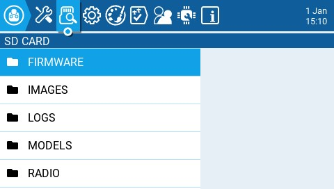
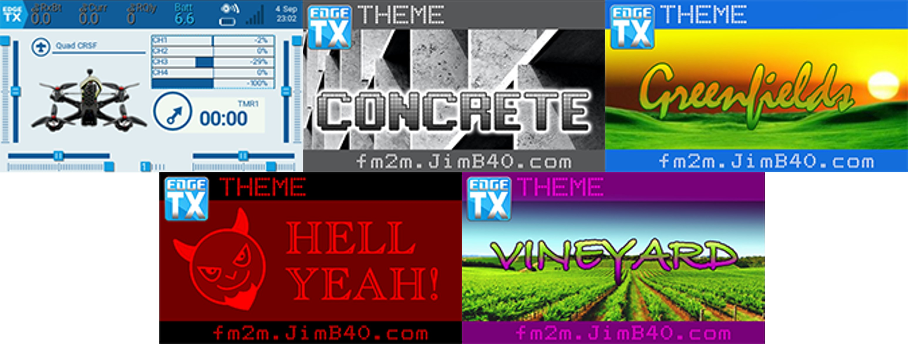

Екран **SD Card** показує вміст вашої SD-карти, дозволяє здійснювати навігацію по папках та взаємодіяти з файлами в них. Усі папки містять файл README.txt, який описує, який тип файлів належить до цієї папки. Після вибору файлу в одній із папок вам будуть запропоновані деякі з наведених нижче опцій, залежно від типу вибраного файлу:

* **Assign bitmap** — призначає вибраний файл зображення як зображення для поточної вибраної моделі.
* **Copy** — копіює вибраний файл.
* **Delete** — видаляє вибраний файл.
* **Execute** — виконує Lua-скрипт. Використовується для файлів із розширенням **.lua**
* **Flash \[target]** — прошиває вибраний файл прошивки у вибраний цільовий модуль. Приклади: Flash Bootloader, Flash Internal Multi.
* **Paste** — вставляє скопійований файл.
* **Play** — відтворює вибраний звуковий файл.
* **Rename** — перейменовує файл.
* **View text** — переглядає вибрані файли **.txt**, **.csv** та **.lua**.

Папки, перелічені на екрані SD-карти, є тими самими, які ви побачите під час підключення пульта до комп'ютера. Нижче наведено назви папок та пояснення для всіх папок, які постачаються зі стандартною SD-картою EdgeTX.

### FIRMWARE

Розміщуйте файли прошивок, які ви хочете прошити, у цій папці. За замовчуванням ця папка порожня (за винятком файлу readme.txt). При виборі файлу .bin вам буде запропоновано опцію прошити прошивку в певний модуль. Крім того, лише файли прошивок у цьому розташуванні будуть видимі з меню завантажувача (bootloader). Вибір файлу .frsk надасть вам опцію "Flash RX by int OTA".

### IMAGES

Розміщуйте ваші власні зображення моделей або заставкових екранів (splash screen) у цій папці. За замовчуванням ця папка порожня (за винятком файлу readme.txt). Вибір файлу зображення надасть вам опцію **Assign Bitmap**, яка призначає вибраний файл зображення як зображення для поточної вибраної моделі.

Ідеальний розмір зображення для _зображень моделей_, що використовуються як мініатюри на екрані **Model Manager**, становить 156x92 пікселів. Якщо ви плануєте використовувати віджет _**Model Info**_, ви можете збільшити розмір зображення до 192x114 пікселів для кращої візуальної якості при збільшеному розмірі. З міркувань продуктивності НЕ рекомендується використовувати зображення з вищою роздільною здатністю. Формат зображення має бути .png. Назва файлу зображення не повинна перевищувати 9 символів.

Ідеальний розмір зображення для _заставкових екранів (Splash Screen)_ — це фактичний розмір екрана пульта (480x272 пікселів для більшості пультів із кольоровим екраном). Формат зображення має бути .png. Назва файлу зображення має бути splash.png. Розміри екранів для підтримуваних пультів із кольоровим екраном можна знайти [тут](https://github.com/EdgeTX/edgetx-sdcard).

Користувачі можуть налаштувати власне зображення, яке відображатиметься під час вимкнення пульта, додавши власний файл `shutdown.png` до папки **IMAGES**.

:::info
Примітка: Хоча зображення більшого розміру працюватимуть, оскільки вони будуть масштабовані, вони займають більше пам'яті та призведуть до зниження продуктивності інтерфейсу користувача.
:::

:::info
Примітка: Максимальна кількість файлів зображень, які EdgeTX може коректно відобразити у випадному списку вибору зображень, становить 799. Тому максимальна кількість файлів у цій папці не повинна перевищувати 799.
:::

:::info
[https://www.skyraccoon.com/](https://www.skyraccoon.com/) має великий репозиторій безкоштовних файлів зображень, які можна використовувати з EdgeTX.
:::

### LOGS

Сюди записуються файли журналів (логів), які налаштовані у [спеціальній функції](../model-settings/special-functions.md) **SD Logs**. Ці файли можна переглянути за допомогою опції **View text**. За замовчуванням ця папка порожня (за винятком файлу readme.txt).

### MODELS

Тут зберігаються файли моделей, інформація про мітки (labels) та передпольотні чеклісти. Кожна модель матиме файл **model\[#].yml**, який містить усі налаштовані параметри. Крім того, існує файл **labels.yml**, який містить усю інформацію про мітки для ваших моделей.

Моделі, видалені через пульт, будуть переміщені до папки **DELETED**, яка знаходиться всередині цієї папки. Решта файлів моделей — це те, що буде видно на екрані **Model Select**.

Будь-які файли моделей, знайдені в цій папці, які не вказані у файлі **Models.yml** (якщо він використовується), будуть переміщені до папки **UNUSED**.

Якщо ви налаштували опцію **Display checklist** у налаштуваннях моделі, файл нотаток моделі розміщується в цій папці. Файл нотаток моделі має бути файлом .txt і повинен мати ТОЧНО таку саму назву, як і модель, для якої він призначений, наприклад: Mobula6.txt. Текст у файлі залишається на розсуд користувача.

### RADIO

Ця папка містить файл **radio.yml**. Цей файл містить усі дані конфігурації пульта. Якщо цей файл пошкоджений або відсутній, пульт перейде в режим **Emergency Mode** і створить новий файл radio.yml із налаштуваннями за замовчуванням.

:::info
Якщо файл radio.yml редагується вручну, тег **manuallyEdited:** має бути встановлений на **1** у файлі radio.yml, інакше пульт вважатиме його пошкодженим, перейде в режим **Emergency Mode** і створить новий файл radio.yml із налаштуваннями за замовчуванням. Оригінальний файл .yml буде збережено в папці.
:::

### SCREENSHOTS

Сюди записуються файли зображень скриншотів, які налаштовані у [спеціальній функції](../model-settings/special-functions.md) **Screenshot**. За замовчуванням ця папка порожня (за винятком файлу readme.txt).

### SCRIPTS

У цій папці та її підпапках розміщуються Lua-скрипти. За замовчуванням вона містить наведені нижче підпапки. Ви можете завантажити додаткові Lua-скрипти з [https://github.com/EdgeTX/lua-scripts](https://github.com/EdgeTX/lua-scripts).

* **Functions** — у цій папці мають бути розміщені функціональні Lua-скрипти, які можна активувати за допомогою [спеціальної функції](../model-settings/special-functions.md) **Lua Script**. За замовчуванням ця папка порожня (за винятком файлу readme.txt). Більше інформації про функціональні Lua-скрипти можна знайти тут: [Function Scripts](https://luadoc.edgetx.org/part\_i\_-\_script\_type\_overview/function\_scripts).
* **Mixes** — у цій папці мають бути розміщені Lua-скрипти мікшерів. За замовчуванням ця папка порожня (за винятком файлу readme.txt). Більше інформації про Lua-скрипти мікшерів можна знайти тут: [Custom Mixer Scripts](https://luadoc.edgetx.org/part\_i\_-\_script\_type\_overview/mix)
* **Tools** — містить Lua-скрипти, які доступні на екрані [Tools](tools.md).
* **Wizards** — містить Lua-скрипти майстрів (Wizard), які доступні на екрані [Tools](tools.md).

### SOUNDS

У цій папці розміщуються звукові пакети EdgeTX для вашого пульта. Звукові пакети залежать від мови та співвідносяться з опцією **Voice language** у **Radio Setup**. Вибір звукового файлу з цієї папки надасть вам опцію **Play**, яка відтворює вибраний звуковий файл.

Звукові пакети доступні для ручного завантаження за посиланням: [https://github.com/EdgeTX/edgetx-sdcard-sounds/releases](https://github.com/EdgeTX/edgetx-sdcard-sounds/releases). Також можна створювати власні звуки для використання в EdgeTX. Щоб ваші власні звуки могли відтворюватися в EdgeTX, переконайтеся, що вони відповідають таким критеріям:

* Назва файлу: 123456.wav (до 6 символів плюс .wav)
* Частота дискретизації (Sample Rate): 32 kHz (або 16 kHz, 8 kHz)
* Біт/семпл (Bits / Sample): 16 (або 8)
* Треки: 1, моно
* Кодек стиснення: PCM

:::info
Примітка: Максимальна кількість звукових файлів, які EdgeTX може коректно відобразити у випадному списку вибору звуку, становить 799. Тому максимальна кількість файлів у цій папці не повинна перевищувати 799.
:::

:::info
Демонстраційне відео про те, як створювати власні звуки, що працюватимуть з EdgeTX, можна переглянути тут: [https://www.youtube.com/watch?v=DqF7HUsFrnE](https://www.youtube.com/watch?v=DqF7HUsFrnE)
:::

### TEMPLATES

Тут зберігаються файли шаблонів моделей. За замовчуванням вона матиме такі підпапки:

* PERSONAL — якщо ви зберігаєте свої моделі як шаблони, вони зберігаються тут.
* SoarETX — колекція шаблонів для планерів від Jesper Frickmann.
* Wizard — прості шаблони моделей, які використовують Lua-скрипти майстрів (Wizard) для налаштування моделей.

### THEMES

Ця папка містить пакети тем для EdgeTX. SD-карта EdgeTX постачається з кількома автоматично встановленими пакетами тем.

 Ви можете завантажити та додати додаткові теми з: [https://github.com/EdgeTX/themes](https://github.com/EdgeTX/themes).

### WIDGETS

Тут зберігаються файли віджетів. Ви можете додавати додаткові віджети до цієї папки для використання з EdgeTX. Для отримання додаткової інформації про віджети, попередньо встановлені в EdgeTX, див. [Widgets](../screen-settings/widgets.md). Ви можете завантажити додаткові віджети з [https://github.com/EdgeTX/lua-scripts](https://github.com/EdgeTX/lua-scripts).

---

Джерело: [EdgeTX User Manual 2.11](https://github.com/EdgeTX/edgetx-user-manual/blob/2.11/color-radios/radio-settings/sd-card.md), ліцензія [CC BY-SA 4.0](https://creativecommons.org/licenses/by-sa/4.0/). Український переклад підготовлений для dead.md.
