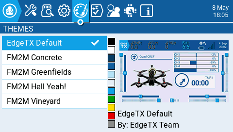
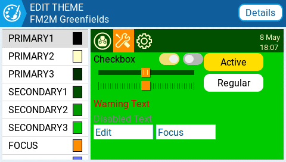
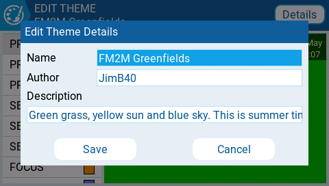
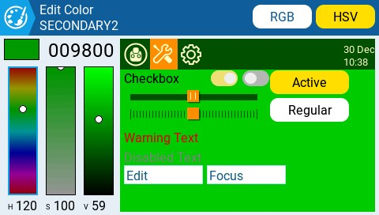

Екран **Theme** дозволяє застосовувати різні кольорові теми до вашого пульта. За замовчуванням SD-карта EdgeTX постачається з темами, показаними вище. Довге натискання на вибрану тему відкриє наступні опції:

* **Set Active** — встановлює вибрану тему як активну.
* **Edit** — відкриває редактор тем для редагування вибраної теми.
* **Duplicate** — створює копію вибраної теми.
* **Delete** — видаляє вибрану тему.

Вибір кнопки **Details** відкриє екран деталей редагування теми (Edit Theme Details). Тут ви можете відредагувати назву, автора та опис теми.

Щоб відредагувати тему в редакторі тем (**Theme Editor**), виберіть змінну кольору зі списку в лівій частині екрана. Після цього з'явиться екран **Edit Color**.

Виберіть колір за допомогою колірних шкал у лівій частині екрана. Ви можете вибирати між колірними шкалами RGB та HSV за допомогою кнопок у верхній правій частині екрана.

Коли ви отримаєте бажаний колір, натисніть на логотип теми у верхньому лівому куті, щоб повернутися на екран **Edit Theme** для вибору іншої змінної кольору для редагування. Після завершення натисніть на логотип теми, щоб вийти з редактора тем і зберегти зміни.

:::info
Ви можете знайти більше створених користувачами тем та додаткові ресурси для створення тем тут: [https://github.com/EdgeTX/themes](https://github.com/EdgeTX/themes)
:::

---

Джерело: [EdgeTX User Manual 2.11](https://github.com/EdgeTX/edgetx-user-manual/blob/2.11/color-radios/radio-settings/themes.md), ліцензія [CC BY-SA 4.0](https://creativecommons.org/licenses/by-sa/4.0/). Український переклад підготовлений для dead.md.
