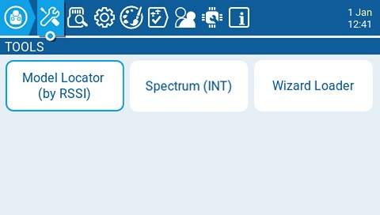
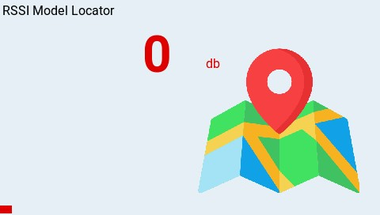
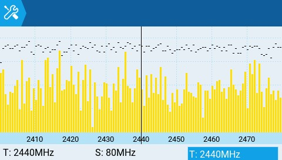
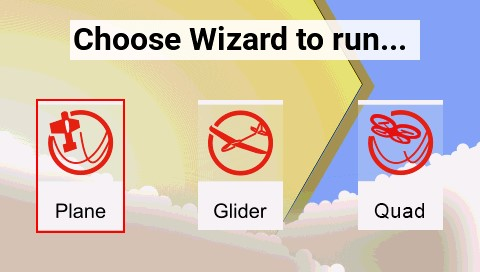
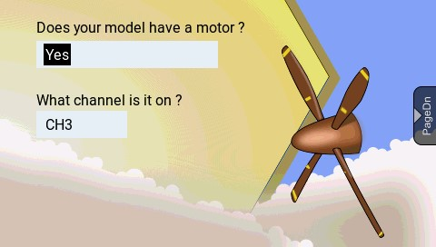

Сторінка **Tools** у Radio Settings — це місце, де ви можете вибрати інструменти на основі Lua-скриптів для виконання. Тут будуть перелічені Lua-скрипти, які знаходяться на SD-карті у папці **Tools**. Вибір інструмента запустить його у повноекранному режимі. За замовчуванням EdgeTX включає кілька інструментів. Інші інструменти також можна завантажити та додати на SD-карту. Наступні інструменти включені до стандартної SD-карти EdgeTX.

#### Model Locator (by RSSI)

Інструмент Model Locator допомагає знайти втрачену модель на основі RSSI (якщо він ще доступний). Віджет створює звукове відображення (у стилі варіометра) рівня RSSI від втраченої моделі. Віджет також відображатиме RSSI у вигляді видимої кольорової шкали (0-100%).

#### Spectrum (INT)

Інструмент Spectrum Analyzer показує потужність сигналів у діапазоні 2.4GHz. Він використовує внутрішній MULTI-Module як аналізатор спектра 2.4GHz.

На дисплеї відображаються частоти спектра 2.4GHz, від 2400MHz до 2480MHz. Вісь X (горизонтальна) показує частоту в MHz, а вісь Y (вертикальна) показує відносну потужність сигналу.

**T:** Частота в центрі графіка (фіксована на 2440MHz)\
**S:** Ширина смуги графіка (фіксована на 80MHz)\
**T:** Позиція курсора (вертикальна лінія)

Натискання **ENT** та прокручування вліво і вправо дозволяє змінити значення **T**, що перемістить вертикальну лінію для виділення певної частоти.

#### Wizard Loader

Інструмент Wizard Loader допомагає у налаштуванні нової моделі, запускаючи майстер налаштування для певного типу моделі. Після вибору типу моделі майстер проведе вас через серію підказок, а потім налаштує обрану модель на основі наданої інформації.

_**ПРИМІТКА: Майстер не створює нову модель, він лише налаштовує поточну вибрану модель. Спочатку ви повинні вручну створити нову модель, а потім запустити майстер. Якщо ви запустите цей майстер на вже налаштованій моделі, він перезапише налаштування вашої моделі!**_

:::info
Додаткові сумісні з EdgeTX Lua-скрипти можна завантажити за посиланням: [https://github.com/EdgeTX/lua-scripts](https://github.com/EdgeTX/lua-scripts)
:::

---

Джерело: [EdgeTX User Manual 2.11](https://github.com/EdgeTX/edgetx-user-manual/blob/2.11/color-radios/radio-settings/tools.md), ліцензія [CC BY-SA 4.0](https://creativecommons.org/licenses/by-sa/4.0/). Український переклад підготовлений для dead.md.
