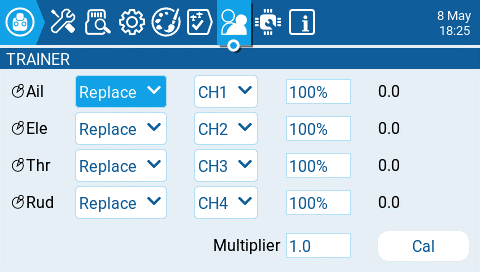

Екран **Trainer** у Radio Settings використовується для налаштування того, як пульт у режимі Master оброблятиме сигнали від пульта у режимі Slave.

Для кожного з чотирьох основних входів керування (Ail, Ele, Thr, Rud) можна налаштувати такі параметри (для кожного рядка, зліва направо).

* **Mode -** Як пульт у режимі Master оброблятиме сигнали від пульта у режимі Slave.
  * **OFF** - Використовуватимуться значення стіків з пульта у режимі Master — без вводу від пульта у режимі Slave.
  * **Add -** Додає значення стіків з обох пультів у режимах Master та Slave.
  * **Replace -** Замінює значення стіків пульта у режимі Master на значення стіків пульта у режимі Slave. (За замовчуванням)
* **Source channel** - Канал з пульта у режимі Slave, який призначено на вхід керування.
* **Weight** - Відсоток ходу стіка пульта у режимі Slave, який буде використовуватися. Використовуйте від'ємні значення для зміни напрямку стіка.
* **Cal (calibrate)**- Встановлює центральне значення стіка пульта у режимі Slave.
* **Multiplier** - Це значення змінює вагу (weight) всіх стіків одночасно.

:::info
Зазвичай використовується трим з пульта у режимі Master. Встановіть трими на пульті у режимі Slave по центру.
:::

:::info
Пульт у режимі Master — це той пульт, який прив'язується до приймача моделі.
:::

:::info
Віртуальний перемикач тренера (**Tnr**) можна вибрати як перемикач для активації спеціальної функції або кривої. Перемикач знаходиться у стані ON, коли зв'язок тренера активний.
:::

---

Джерело: [EdgeTX User Manual 2.11](https://github.com/EdgeTX/edgetx-user-manual/blob/2.11/color-radios/radio-settings/trainer.md), ліцензія [CC BY-SA 4.0](https://creativecommons.org/licenses/by-sa/4.0/). Український переклад підготовлений для dead.md.
