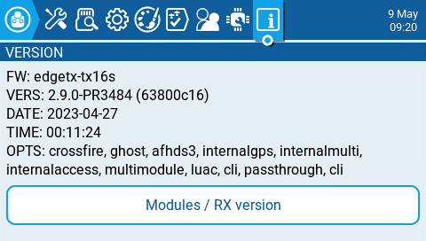
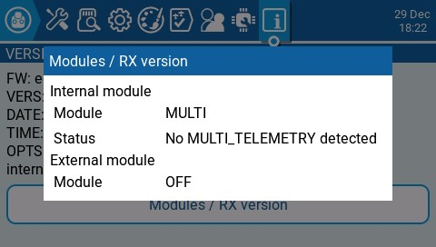

Екран **Version** відображає інформацію про поточну версію EdgeTX, яка використовується:

* **FW** - Назва прошивки
* **VERS** - Версія прошивки
* **DATE** - Дата компіляції прошивки
* **TIME** - Час компіляції прошивки
* **OPTS** - Опції збірки, які були увімкнені під час компіляції.

:::info
Повний список опцій збірки можна знайти тут: [https://github.com/EdgeTX/edgetx/wiki/Compilation-options](https://github.com/EdgeTX/edgetx/wiki/Compilation-options)
:::

Екран **Modules / RX Version** надає інформацію про активовані RX-модулі для поточної вибраної моделі.

---

Джерело: [EdgeTX User Manual 2.11](https://github.com/EdgeTX/edgetx-user-manual/blob/2.11/color-radios/radio-settings/version.md), ліцензія [CC BY-SA 4.0](https://creativecommons.org/licenses/by-sa/4.0/). Український переклад підготовлений для dead.md.
