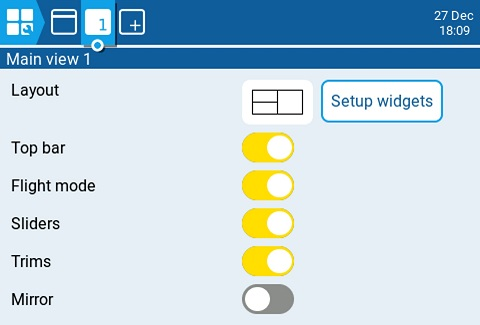
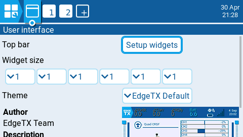
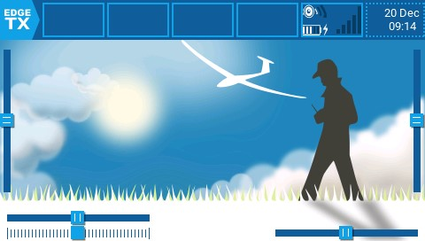
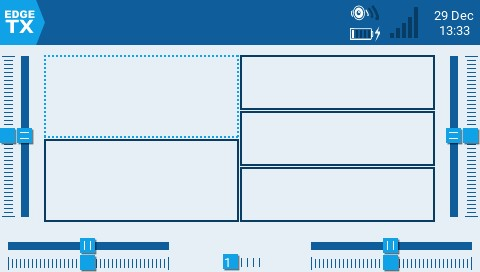

Розділ **Screen settings** в EdgeTX — це місце, де ви можете налаштувати ваші головні екрани (main views) та додати додаткові (загалом до 10). При виборі **Screen Settings** у головному навігаційному меню відкриється **Main view 1**. Якщо було додано інші головні екрани, ви можете вибрати їх за допомогою вкладок з номерами у верхній частині екрана, щоб змінити їхні налаштування. Усі вкладки головних екранів мають наступні параметри конфігурації та налаштовуються індивідуально:

* **Layout** — вибирає макет екрана для віджетів. Екран можна розділити максимум на дві колонки та до 4 рядків, з віджетом у кожній клітинці.
* **Setup Widgets** — див. [Налаштування віджетів (Setting up widgets)](#setting-up-widgets) нижче.
* **Top bar** — перемикає видимість верхньої панелі віджетів на вибраному головному екрані.
* **Flight mode** — перемикає видимість назви польотного режиму (якщо налаштовано) на вибраному головному екрані.
* **Sliders** — перемикає видимість панелей слайдерів на вибраному головному екрані.
* **Trims** — перемикає видимість панелей тримів на вибраному головному екрані.
* **Mirror** — перемикає віддзеркалення вибраного макета віджетів.

Натискання кнопки інтерфейсу користувача ліворуч від вкладки **Main view 1** відкриє екран конфігурації інтерфейсу користувача. Він містить наступні опції:

* Кнопка **Setup Widgets** для **Top bar** — налаштовує віджети, які відображатимуться на верхній панелі. Див. [**Налаштування віджетів (Setting up widgets)**](#setting-up-widgets) нижче для отримання інформації про те, як налаштовувати віджети.
* **Widget Size** — дозволяє налаштувати ширину зон віджетів, що відображатимуться на верхній панелі, за рахунок зменшення кількості можливих зон для віджетів.
* **Theme** — застосовує вибрану тему до EdgeTX. Попередній перегляд теми знаходиться під випадаючим списком. EdgeTX постачається з кількома встановленими темами. Додаткові теми для завантаження, а також інструкції зі створення власних тем можна знайти тут: [https://github.com/EdgeTX/themes](https://github.com/EdgeTX/themes)

### Налаштування віджетів (Setting up widgets) {#setting-up-widgets}

Натискання кнопки налаштування віджетів (setup widgets) відобразить головний екран або верхню панель із клітинками віджетів, обведеними штриховою лінією. Ви можете призначити віджет у клітинку, вибравши її, а потім обравши потрібний віджет із випадаючого меню. Після вибору віджета відкриються його параметри для подальшого налаштування. Описи віджетів та параметри конфігурації для віджетів, що входять до складу EdgeTX, наведені нижче.

:::info
Для віджетів верхньої панелі (top bar): віджети інформації про пульт (radio info), дати/часу (date/time) та внутрішнього GPS (internal GPS) будуть завантажені автоматично, якщо два праві слоти порожні під час завантаження моделі. Якщо ці віджети видалити вручну, вони не будуть завантажуватися повторно.
:::

---

Джерело: [EdgeTX User Manual 2.11](https://github.com/EdgeTX/edgetx-user-manual/blob/2.11/color-radios/screen-settings/README.md), ліцензія [CC BY-SA 4.0](https://creativecommons.org/licenses/by-sa/4.0/). Український переклад підготовлений для dead.md.
