:::info
Після налаштування віджета, довге натискання на нього відкриє дві опції меню: **Full screen** та налаштування **Widget**. Для деяких віджетів повноекранний режим пропонує додаткові функції. Щоб вийти з повноекранного режиму, довго натисніть кнопку RTN / Back.
:::

Нижче наведено описи та параметри конфігурації для віджетів, що входять до складу EdgeTX.

### BattAnalog

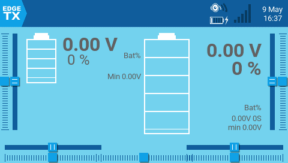

Відображає графічне представлення рівня заряду Lipo/Li-ion. Він автоматично визначає кількість банок акумулятора. Працює з телеметрією, де отримується лише загальна напруга акумулятора. Доступні параметри конфігурації:

* **Sensor** - Сенсор напруги акумулятора, який буде використовуватися.
* **Color** - Відкриває палітру для вибору кольору тексту.
* **Show\_Total\_Voltage** - Якщо увімкнено, показує загальну напругу акумулятора (замість розрахованої напруги на банку).
* **Lithium\_Ion** - Якщо увімкнено, змінює мінімальну напругу акумулятора, що використовується для розрахунку відсотка заряду, з 3.0 на 2.8.

### BattCheck

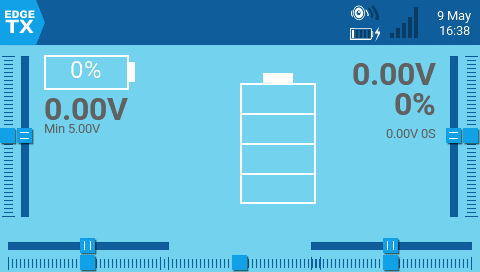

Відображає графічне представлення рівня заряду Lipo/Li-ion. Працює з телеметрією, де отримується напруга окремих банок, наприклад, із сенсором напруги FLVSS LiPo. Доступні параметри конфігурації:

* **Sensor** - Сенсор напруги акумулятора, який буде використовуватися.
* **Color** - Відкриває палітру для вибору кольору тексту.
* **Shadow** - Якщо увімкнено, додає тінь до тексту.
* **LowestCell** - Якщо увімкнено, показує лише напругу банки з найнижчим значенням (замість відображення напруги всіх банок).
* **Lithium\_Ion** - Якщо увімкнено, змінює мінімальну напругу акумулятора, що використовується для розрахунку відсотка заряду, з 3.0 на 2.8.

### Counter

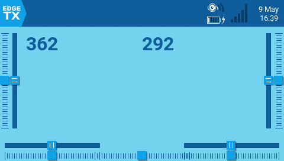

Лічильник, який поступово збільшує значення. Доступні параметри конфігурації:

* **Color** - Відкриває палітру для вибору кольору тексту.
* **Shadow** - Якщо увімкнено, додає тінь до тексту.

### **Event Demo**

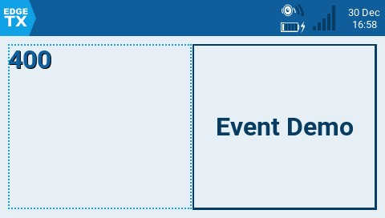

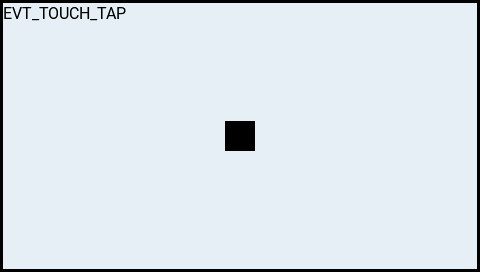

Демонструє обробку подій натискання кнопок та дотиків у повноекранному режимі. Лише для демонстраційних цілей. Доступні параметри конфігурації:

* **Size** - Змінює розмір поля у повноекранному режимі.

### **Flights**

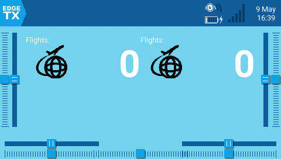

Підраховує кількість ваших польотів. Він надаватиме голосові сповіщення про початок і завершення польоту, а також про загальну кількість польотів для моделі.

Доступні параметри конфігурації:

* **switch** - Призначений перемикач Arm/Safe.
* **motor\_channel** - Канал для мотора.
* **min\_flight\_duration** - Мінімальна тривалість польоту, щоб він був зарахований.
* **text\_color** - Відкриває палітру для вибору кольору тексту.
* **debug** - Якщо увімкнено, показує інформацію про статус на віджеті.

_**Додаткові примітки щодо цього віджета:**_

Політ вважається успішним, якщо через 30 секунд газ мотора перевищує 25%, телеметрія активна (що вказує на підключення моделі), а перемикач безпеки (safe switch) увімкнено (ON). Політ вважається завершеним через 8 секунд після відключення акумулятора (визначається за відсутністю телеметрії) — попередження: НЕ використовуйте цей віджет, якщо модель використовує GV9 (кількість польотів зберігається у GV9 FM0)!

Віджет передбачає наступне: модель має мотор, мотор активовано на каналі 3 (можна змінити в налаштуваннях), є телеметрія з одним із перелічених сенсорів \[RSSI|RxBt|A1|A2|1RSS|2RSS|RQly], є перемикач безпеки (arm switch), а глобальна змінна GV9 вільна (тобто не використовується).

### Gauge

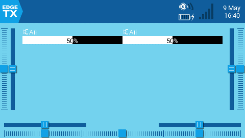

Показує гістограму для значення джерела. Доступні параметри конфігурації:

* **Source** - Джерело для шкали.
* **Min** - Мінімальне значення для шкали. Це значення відповідатиме 0%.
* **Max** - Максимальне значення для шкали. Це значення відповідатиме 100%.
* **Color** - Відкриває палітру для вибору кольору тексту та смуги шкали.

### **Gauge Rotary**

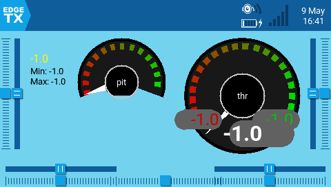

Налаштовувана шкала в аналоговому стилі зі стрілкою. Також показує мінімальне та максимальне значення, зчитані шкалою, за допомогою зеленої та червоної стрілок. Доступні параметри конфігурації:

* **Source** - Джерело для шкали.
* **Min** - Мінімальне (найнижче) значення шкали.
* **Max** - Максимальне (найвище) значення шкали.
* **HighasGreen** - **Enable** для сенсора, де високі значення є хорошими. **Disable** для сенсора, де низькі значення є хорошими.
* **Precision** - Точність числового значення для відображення у десяткових дробах.

### **Ghost**

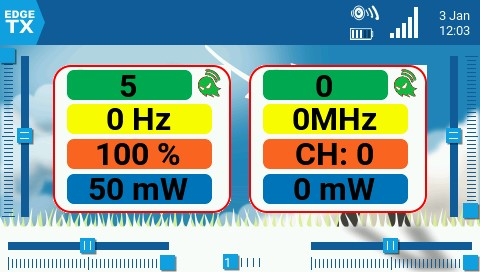

Віджет Ghost відображатиме дані телеметрії RF-приймача або відеопередавача залежно від налаштованого режиму.

У нормальному режимі віджет надає інформацію про RF Mode (RFMD), Frame Rate (FRATE), Link Quality (RQLY) та Transmit Power (TPWR).

У відеорежимі віджет надає інформацію про Video Band (VBAN), Video Frequency (VFRQ), Video channel (VCHAN) та Video Power (VPWR).

### **LibGUI Demo**

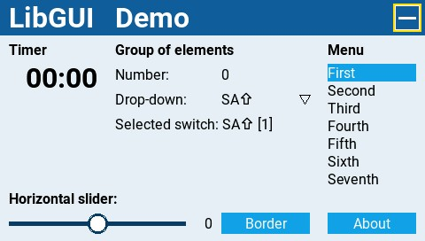

Цей віджет є демонстрацією бібліотеки LibGUI. Зазвичай ця бібліотека не запускається сама по собі. Натомість вона надає інтерактивні функції іншим Lua-скриптам, які її використовують. Віджет потрібно запускати у повноекранному режимі для демонстрації функціоналу бібліотеки.

### **Model info**

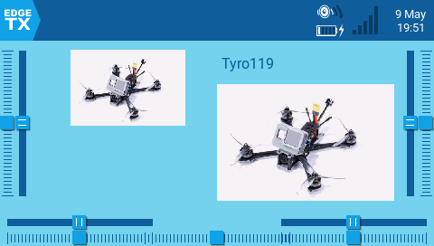

Відображає назву вибраної моделі та зображення (якщо налаштовано в параметрах моделі). Доступні параметри конфігурації:

* **Color** - Відкриває палітру для вибору кольору тексту назви.
* **Size** - Розмір тексту назви. Варіанти: STD (за замовчуванням), BOLD, XXS, XS, L, XL, XXL.
* **Fill background?** - Якщо увімкнено, додає суцільний колір фону до віджета.
* **BG Color** - Відкриває палітру для вибору кольору фону.
* **Use Theme Color** - Якщо увімкнено, замінює колір тексту на колір тексту налаштованої теми.

### **Outputs**

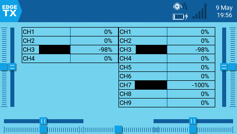

Показує вихідні значення каналів у вигляді гістограми. Кількість каналів, що відображаються, залежить від розміру віджета. Доступні параметри конфігурації:

* **First channel** - вибирає перший канал для відображення у віджеті.
* **Fill background** - Якщо увімкнено, додає суцільний колір фону до віджета.
* **BG Color** - Відкриває палітру для вибору кольору фону.
* **Text Color** - Відкриває палітру для вибору кольору тексту.
* **Color** - Відкриває палітру для вибору кольору смуг виходів.

### Serial Power Port Demo

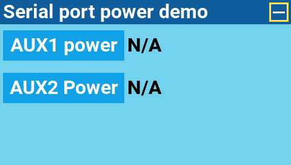

Демонстраційний віджет, який показує, як можна використовувати порт живлення. Його потрібно запускати у повноекранному режимі.

### **SOARETX**

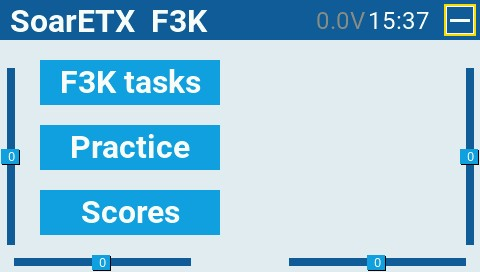

Версія інструменту SoarOTX для EdgeTX. Це пакет моделей планерів для пультів EdgeTX. Він містить Lua-скрипти для хронометражу та ведення рахунку, побудови графіків даних журналу (наприклад, графіків висоти) та конфігурації моделі.

Для отримання додаткової інформації про налаштування та використання цього віджета, будь ласка, перейдіть за посиланням [https://github.com/jfrickmann/SoarOTX/wiki/SoarETX-for-color-radios](https://github.com/jfrickmann/SoarOTX/wiki/SoarETX-for-color-radios).

Демонстрацію цього інструменту можна переглянути тут: [https://www.youtube.com/watch?v=5NSvxUNKM\_c](https://www.youtube.com/watch?v=5NSvxUNKM\_c)

### **Text**

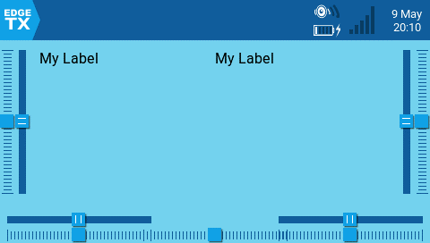

Відображає текстове поле, яке налаштовується користувачем. Доступні параметри конфігурації:

* **Text** - Текст для відображення.
* **Color** - Відкриває палітру для вибору кольору тексту.
* **Size** - Розмір тексту. Варіанти: STD (за замовчуванням), BOLD, XXS, XS, L, XL, XXL.
* **Shadow** - Якщо увімкнено, додає тінь до тексту.
* **Alignment** - Вирівнювання тексту в текстовому полі. Варіанти: Left, Center, Right.

### **Timer**

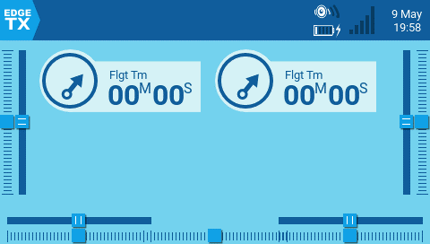

Відображає вибраний таймер. Немає інших параметрів конфігурації, окрім вибору таймера.

### **Timer2**

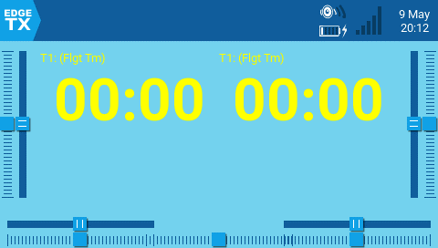

Відображає вибраний таймер із масштабуванням тексту таймера залежно від вибраного розміру віджета та має такі параметри конфігурації:

* **TextColor** - Відкриває палітру для вибору кольору тексту.
* **Timer** - Таймер для відображення.
* **use\_days** - Якщо увімкнено, показує дні, коли значення часу перевищує 24 години.

### **TxGPStest**

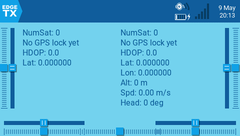

Відображає інформацію GPS у текстовому форматі. Параметри конфігурації відсутні.

### **Value**

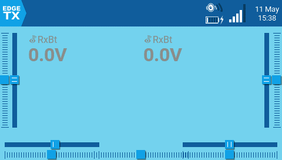

Відображає числове значення визначеного джерела у вигляді тексту. Доступні параметри конфігурації:

* **Source** - джерело для тексту, що відображатиметься.
* **Color** - Відкриває палітру для вибору кольору тексту. Користувач може вибирати між колірними моделями RGB та HSV. Ви також можете вибрати один із системних кольорів налаштованої теми.
* **Shadow** - Якщо увімкнено, додає тінь до тексту.
* **Align Label** - Вирівнює текст мітки. Варіанти: **Left**, **Center**, **Right**.
* **Align Value** - Вирівнює текст значення. Варіанти: **Left**, **Center**, **Right**.

### Value2

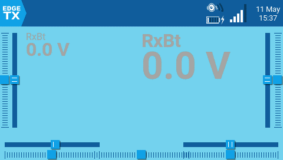

Відображає числове значення визначеного джерела телеметрії у вигляді тексту. Текст масштабуватиметься залежно від розміру вибраної сітки віджета. Віджет виявлятиме завершення польоту (коли телеметрія більше не отримується) і після цього відображатиме мінімальне та максимальне значення налаштованого сенсора телеметрії.

Доступні параметри конфігурації:

* **Source** - Джерело телеметрії для тексту, що відображатиметься.
* **Color** - Відкриває палітру для вибору кольору тексту. Користувач може вибирати між колірними моделями RGB та HSV. Ви також можете вибрати один із системних кольорів налаштованої теми.
* **PostFix** - Додає текстову мітку після налаштованої мітки назви телеметрії.

---

Джерело: [EdgeTX User Manual 2.11](https://github.com/EdgeTX/edgetx-user-manual/blob/2.11/color-radios/screen-settings/widgets.md), ліцензія [CC BY-SA 4.0](https://creativecommons.org/licenses/by-sa/4.0/). Український переклад підготовлений для dead.md.
