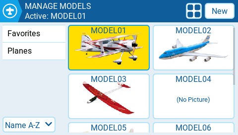
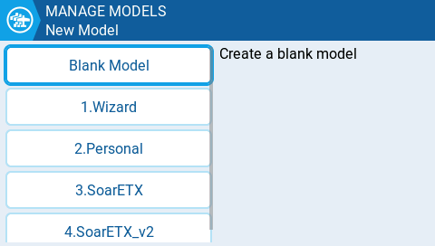
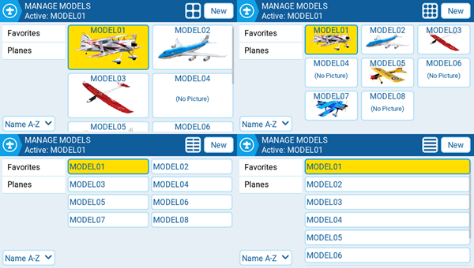

Екран **Manage Models** дозволяє створювати нові моделі, вибирати активну модель, створювати та застосовувати мітки моделей, а також створювати шаблони моделей.

### Вибір та керування існуючими моделями

Назва активної моделі буде виділена (у цьому випадку жовтим кольором) і відображатиметься на верхній панелі екрана. Подвійне натискання на активну модель відкриє наступні опції:

* **Duplicate model** — ця опція створює точну копію моделі з такою ж назвою. Зміни назви моделі або інших налаштувань потрібно робити на вкладці [Model Settings ](model-settings/).
* **Label Model** — якщо вибрати цю опцію, відобразяться всі налаштовані мітки, які можна буде вибрати для цієї моделі. Більше інформації про [Model Labels](#model-labels) наведено нижче.
* **Save as template** — ця опція зберігає копію моделі як шаблон моделі.

:::info
Зміни в моделях, збережених як шаблони, не оновлюють самі шаблони.
:::

Подвійне натискання на неактивну модель (не виділену) відкриє наступні опції:

* **Select model** — ця опція робить цю модель активною.
* **Duplicate model** — те саме, що описано вище.
* **Delete model** — ця опція переміщує модель до папки видалених на SD-карті. _Видалити можна лише ті моделі, які не є активними._
* **Label model** — те саме, що описано вище.
* **Save as template** — те саме, що описано вище.

### Створення нової моделі

Щоб створити нову модель, натисніть кнопку **New Model** у верхньому правому куті. Після цього вам будуть запропоновані наступні опції:

* **Blank Model** — створює порожню модель лише з налаштуваннями за замовчуванням.
* **Wizard** — запускає майстер створення нової моделі та створює модель відповідно до налаштувань у майстрі.
* **Personal** — ця опція дозволяє вибрати один зі збережених шаблонів моделей і створити його копію як нову модель.
* **SoarETX** — відображає попередньо налаштовані шаблони моделей для радіокерованих планерів.
* **SoarETX\_v2** — відображає оновлену версію (v2) попередньо налаштованих шаблонів моделей для радіокерованих планерів.

### Мітки моделей {#model-labels}

Мітки моделей дозволяють призначати кожній моделі одну або кілька міток. Після цього ви зможете фільтрувати моделі, що відображаються на екрані **Manage Models**, на основі вибраних міток. Це полегшує пошук для користувачів із великою кількістю налаштованих моделей. За замовчуванням автоматично створюються мітки **Favorites** та **Unlabeled**. Усі моделі вважаються **unlabeled** (без міток), доки до них не буде застосовано мітку.

### Фільтрація моделей за допомогою міток

Щоб відфільтрувати видимі моделі на основі їхніх міток, виберіть один або кілька фільтрів у лівій колонці. Це автоматично відфільтрує моделі, які не мають цих міток. Для отримання додаткової інформації про те, як працюють фільтри, або для налаштування розширених параметрів фільтрації, див.: [Additional Radio settings](radio-settings/radio-setup/additional-radio-settings.md)

### Призначення міток моделям

Щоб призначити мітку моделі, двічі торкніться моделі або натисніть **\[Enter]**, коли модель вибрана, а потім виберіть **Label Models**. Після цього відобразяться всі налаштовані мітки, і для цієї моделі можна буде вибрати одну або кілька з них. Мітки, застосовані до моделі, будуть позначені іконкою _**check**_.

### Створення нових міток моделей

Щоб створити нову мітку моделі, натисніть кнопку **New** у нижньому лівому куті екрана. З'явиться спливаюче вікно **Enter Label**, де ви зможете ввести бажану назву мітки. Натисніть **Save**, щоб зберегти нову мітку.

### Редагування міток моделей

Довге натискання \[Enter] або довгий тап на потрібній мітці відкриє меню з наступними опціями:

* Rename Label — змінює назву мітки
* Delete Label — видаляє мітку зі списку міток та з усіх моделей, яким вона призначена.
* Move Up — розміщує мітку вище у списку
* Move Down - - розміщує мітку нижче у списку

### Сортування моделей

Випадне меню під списком міток призначене для сортування відфільтрованих моделей. Моделі можна сортувати наступним чином:

* Name A-Z
* Name Z-A
* Least Used
* Most Used

### Вибір макета для списку моделей

На сторінці Manage Models доступні 4 макети для списку моделей:

* Велике зображення (2x2) — макет за замовчуванням
* Мале зображення (3x3)
* Лише назва, 2 колонки (2x6)
* Лише назва, 1 колонка (1x6)

Макет можна змінити, натискаючи кнопку **Layout** (поруч із кнопкою **New**), яка циклічно перемикає доступні макети.

---

Джерело: [EdgeTX User Manual 2.11](https://github.com/EdgeTX/edgetx-user-manual/blob/2.11/color-radios/select-model.md), ліцензія [CC BY-SA 4.0](https://creativecommons.org/licenses/by-sa/4.0/). Український переклад підготовлений для dead.md.
